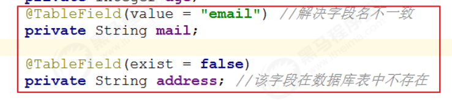

# Mybatis-Plus

快速开始

对于Mybatis整合MP友三种方法,Mybatis+MP,Spring+Mybatis+MP,Spring Boot+Mybatis+MP

Mybatis+MP实现查询User:

1.将UserMapper继承BaseMapper,将拥有BaseMapper中的所有方法

2.使用MP中的MybatisSqlSessionFactoryBuilder进程构建

3.表找不到时

## CRUD

```java
package cn.kiri.map;

import cn.kiri.mp.mapper.UserMapper;
import cn.kiri.mp.pojo.User;
import org.junit.Test;
import org.junit.runner.RunWith;
import org.springframework.beans.factory.annotation.Autowired;
import org.springframework.boot.test.context.SpringBootTest;
import org.springframework.test.context.junit4.SpringJUnit4ClassRunner;
import org.springframework.test.context.junit4.SpringRunner;

//@RunWith(SpringJUnit4ClassRunner.class)
@RunWith(SpringRunner.class)
@SpringBootTest
public class TestUserMapper {
    @Autowired
    private UserMapper userMapper;

    @Test
    public void testInsert(){
        User user=new User();
        user.setEmail("1");
        user.setAge(20);
        user.setUserName("啊");
        user.setName("aaa");
        user.setPassword("11112222");
        int result = this.userMapper.insert(user);//数据库受影响的行数,不是自增长后的id
        System.out.println("result:"+result);
        //获取自增长后的id值,自增长后的id值会回填到user对象中
        System.out.println("id:"+user.getId());
    }
}
```

修改MP支持的id策略

```java
package cn.kiri.mp.pojo;

import com.baomidou.mybatisplus.annotation.IdType;
import com.baomidou.mybatisplus.annotation.TableId;
import com.baomidou.mybatisplus.annotation.TableName;
import lombok.AllArgsConstructor;
import lombok.Data;
import lombok.NoArgsConstructor;
@Data
@NoArgsConstructor
@AllArgsConstructor
@TableName("tb_user")
public class User {
    @TableId(type= IdType.AUTO)//修改id策略
    private Long id;
    private String userName;
    private String password;
    private String name;
    private Integer age;
    private String email;
}
```

### @TableField注解

解决问题:

1.对象中的属性名和字段名不一致的问题(非驼峰)

2.对象中的属性字段在表中不存在的问题

3.对象中的属性不返回其内容

