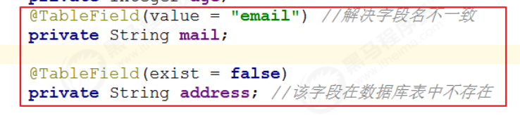
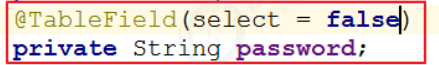

# Mybatis-Plus

快速开始

对于Mybatis整合MP友三种方法,Mybatis+MP,Spring+Mybatis+MP,Spring Boot+Mybatis+MP

Mybatis+MP实现查询User:

1.将UserMapper继承BaseMapper,将拥有BaseMapper中的所有方法

2.使用MP中的MybatisSqlSessionFactoryBuilder进程构建

3.表找不到时

## CRUD

```java
package cn.kiri.map;

import cn.kiri.mp.mapper.UserMapper;
import cn.kiri.mp.pojo.User;
import org.junit.Test;
import org.junit.runner.RunWith;
import org.springframework.beans.factory.annotation.Autowired;
import org.springframework.boot.test.context.SpringBootTest;
import org.springframework.test.context.junit4.SpringJUnit4ClassRunner;
import org.springframework.test.context.junit4.SpringRunner;

//@RunWith(SpringJUnit4ClassRunner.class)
@RunWith(SpringRunner.class)
@SpringBootTest
public class TestUserMapper {
    @Autowired
    private UserMapper userMapper;

    @Test
    public void testInsert(){
        User user=new User();
        user.setEmail("1");
        user.setAge(20);
        user.setUserName("啊");
        user.setName("aaa");
        user.setPassword("11112222");
        int result = this.userMapper.insert(user);//数据库受影响的行数,不是自增长后的id
        System.out.println("result:"+result);
        //获取自增长后的id值,自增长后的id值会回填到user对象中
        System.out.println("id:"+user.getId());
    }
}
```

修改MP支持的id策略

```java
package cn.kiri.mp.pojo;

import com.baomidou.mybatisplus.annotation.IdType;
import com.baomidou.mybatisplus.annotation.TableId;
import com.baomidou.mybatisplus.annotation.TableName;
import lombok.AllArgsConstructor;
import lombok.Data;
import lombok.NoArgsConstructor;
@Data
@NoArgsConstructor
@AllArgsConstructor
@TableName("tb_user")
public class User {
    @TableId(type= IdType.AUTO)//修改id策略
    private Long id;
    private String userName;
    private String password;
    private String name;
    private Integer age;
    private String email;
}
```

### @TableField注解

解决问题:

1.对象中的属性名和字段名不一致的问题(非驼峰)

2.对象中的属性字段在表中不存在的问题

3.对象中的属性不参与查询



字段不加入查询字段



### 根据id更新

```java
@Test
    public void testUpdateById(){
        User user=new User();
        user.setId(1L);//条件,根据id更新(变量声明为long的时候 后面要加L或者l,float要加F或f)
        user.setAge(19);
        user.setPassword("666");
        int result = this.userMapper.updateById(user);
        System.out.println("result"+result);
    }
```

### 根据条件更新

```java
@Test
    public void testUpdate(){
        User user=new User();
        user.setAge(20);
        user.setPassword("888");
        QueryWrapper<User> wrapper=new QueryWrapper<>();
        wrapper.eq("user_name","zhangsan");//匹配user_name=zhangsan的用户数据
        //根据条件做更新
        int result = this.userMapper.update(user, wrapper);
    }
    
    
    
    @Test
    public void testUpdate2(){

        UpdateWrapper<User> wrapper=new UpdateWrapper<>();
        wrapper.set("age",21).set("password","99999")
                .eq("user_name","zhangsan");//匹配user_name=zhangsan的用户数据
        //根据条件做更新
        int result = this.userMapper.update(null, wrapper);
    }
```

### 删除操作

```java
@Test
    public void testDeleteById(){
        int result = this.userMapper.deleteById(6L);
        System.out.println("result:"+result);
    }
```

```java
@Test
    public void testDeleteByMap(){
        Map<String,Object> map =new HashMap<>();
        map.put("user_name","lisi");
        map.put("password","99999");
        //根据map删除数据,多条件之间是and关系
        int result = this.userMapper.deleteByMap(map);
        System.out.println("result:"+result);
    }
```

```java
@Test
    public void testDelete(){
        /*
        用法一:
        QueryWrapper<User> wrapper = new QueryWrapper<>();
        wrapper.eq("user_name", "lisi").eq("password","123456");*/
        //用法二(推荐):
        User user=new User();
        user.setPassword("123456");
        user.setName("王五");
        QueryWrapper<User> wrapper=new QueryWrapper<>(user);
        //根据包装条件做删除
        int delete = this.userMapper.delete(wrapper);
        System.out.println("result:"+delete);
    }
```

批量删除

```java
@Test
    public void testDeleteBatchIds(){
        int reslut = this.userMapper.deleteBatchIds(Arrays.asList(7, 8));
        System.out.println("result:"+reslut);
    }
```

### 查询操作

MP提供了多种查询操作,包括根据id查询,批量查询,插叙你单条数据,查询列表,分页查询等操作.

```java
@Test
public void testSelectById(){
    //根据id查询数据
    User user=this.userMapper.selectById(2);
    System.out.println("result = "+user);
}
    @Test
    public void testSelectBatchIds(){
        List<User> users = this.userMapper.selectBatchIds(Arrays.asList(4, 5));
        for (User user : users) {
            System.out.println(user);
        }
    }
@Test
    public void testSelectOne(){
        QueryWrapper<User> wrapper=new QueryWrapper<>();
        //查询条件设置
        wrapper.eq("user_name","zhaoliu");
        User user = this.userMapper.selectOne(wrapper);
        System.out.println(user);
    }
@Test
    public void testSelectCount(){
        QueryWrapper<User> wrapper=new QueryWrapper<>();
        wrapper.eq("password","123456");
        Integer count = this.userMapper.selectCount(wrapper);
        System.out.println(count);
    }
@Test
    public void testSelectList(){
        QueryWrapper<User> wrapper=new QueryWrapper<>();
        wrapper.gt("age",20);//条件:年龄大于20岁的用户
        List<User> users = this.userMapper.selectList(wrapper);
        for (User user : users) {
            System.out.println(user);
        }
    }
```

selectOne查询到多条会报错

selectPage

配置分页插件

```java
package cn.itcast.mp;
import com.baomidou.mybatisplus.extension.plugins.PaginationInterceptor;
import org.mybatis.spring.annotation.MapperScan;
import org.springframework.context.annotation.Bean;
import org.springframework.context.annotation.Configuration;
@Configuration
@MapperScan("cn.itcast.mp.mapper") //设置mapper接口的扫描包
public class MybatisPlusConfig {
/**
* 分页插件
*/
@Bean
public PaginationInterceptor paginationInterceptor() {
return new PaginationInterceptor();
}
}
```

```java
@Test
public void testSelectPage() {
QueryWrapper<User> wrapper = new QueryWrapper<User>();
wrapper.gt("age", 20); //年龄大于20岁
Page<User> page = new Page<>(1,1);
//根据条件查询数据
IPage<User> iPage = this.userMapper.selectPage(page, wrapper);
System.out.println("数据总条数：" + iPage.getTotal());
System.out.println("总页数：" + iPage.getPages());
List<User> users = iPage.getRecords();
for (User user : users) {
System.out.println("user = " + user);
}
}
```

## 基本配置

在MP中有大量的配置，其中有一部分是Mybatis原生的配置，另一部分是MP的配置，详情：https://mybatis.plus/config/

P27