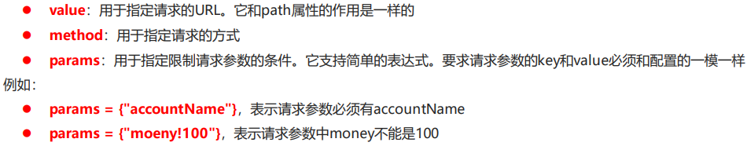

# Spring

# Spring的IoC和DI

Spring是分层的 Java SE/EE应用 full-stack 轻量级开源框架，以 IoC（Inverse Of Control：反转控制）和 AOP（Aspect Oriented Programming：面向切面编程）为内核。

提供了展现层 SpringMVC 和持久层 Spring JDBCTemplate 以及业务层事务管理等众多的企业级应用技术 ，还能整合开源世界众多著名的第三方框架和类库，逐渐成为使用最多的Java EE 企业应用开源框架。

优势:方便解耦,简化开发;AOP编程的支持;声明式事务的支持;方便程序的测试;方便集成各种优秀框架;降低JavaEE API的使用难度;Java源码是经典学习范例

Spring体系结构


Spring程序开发步骤


1.导入Spring开发的基本包坐标

2.编写Dao接口和实现类

3.创建Spring核心配置文件

4.在Spring配置文件中配置UserDaoImpl

5.使用Spring的API获得Bean实例

## Spring快速入门

```java
@Test
public void test1(){
ApplicationContext applicationContext = new ClassPathXmlApplicationContext("applicationContext.xml");
UserDao userDao = (UserDao) applicationContext.getBean("userDao");
userDao.save();
}
```

## Bean配置文件

### bean标签的基本配置

用于配置对象交由Spring来创建

默认情况下他调用的是类中的无参构造函数,如果没有无参构造函数则不能创建成功

基本属性: id :bean实例在Spring容器中的唯一标识

class :bean的全限定名称

### bean标签范围配置

scope:指对象的作用范围,取值如下:


### Bean实例化三种方法

无参构造方法实例化(重点)

工厂静态方法实例化

工厂实例方法实例化

### Bean依赖注入入门

创建UserService,UserSevice内部在调用UserDao的save()方法

```java
public class UserServiceImpl implements UserService {
@Override
public void save() {
ApplicationContext applicationContext = new 
ClassPathXmlApplicationContext("applicationContext.xml");
UserDao userDao = (UserDao) applicationContext.getBean("userDao");
userDao.save();
}
}

```

将UserServiceImpl的创建权交给Spring

```xml
<bean id="userService" class="com.zjh.service.impl.UserServiceImpl"/>
```

从Spring容器中获得UserService进行操作

```java
ApplicationContext applicationContext = new 
ClassPathXmlApplicationContext("applicationContext.xml");
UserService userService = (UserService) applicationContext.getBean("userService");
userService.save();
```


### Bean依赖注入概念方式


方式

set方法:

在UserServiceImpl中添加setUserDao方法

```java
public class UserServiceImpl implements com.zjh.service.UserService {
    private UserDao userDao;

    public void setUserDao(UserDao userDao) {
        this.userDao = userDao;
    }

    public void save() {
        userDao.save();
    }
}
```

配置Spring容器调用set方法进行注入

```xml
<bean id="userService" class="com.zjh.service.impl.UserServiceImpl">
        <property name="userDao" ref="userDao"></property>
    </bean>
```


构造方法注入:

创建有参构造

```java
public class UserServiceImpl implements com.zjh.service.UserService {

    private UserDao userDao;

    public UserServiceImpl(UserDao userDao) {
        this.userDao = userDao;
    }

    public UserServiceImpl() {
    }
    /*public void setUserDao(UserDao userDao) {
        this.userDao = userDao;
    }*/

    public void save() {
        userDao.save();
    }
}
```

配置Spring容器调用有参构造时进行注入

```xml
<bean id="userService" class="com.zjh.service.impl.UserServiceImpl">
        <constructor-arg name="userDao" ref="userDao"></constructor-arg>
    </bean>
```

构造注入:name表示构造方法形参列表的参数名

set注入:name表示UserServiceImpl的set方法属性名去掉set第一个首字母小写


集合:

```xml
    <bean id="userDao" class="com.zjh.dao.impl.UserDaoImpl">
        <property name="stringList">
            <list>
                <value>aaaa</value>
                <value>bbbb</value>
                <value>cccc</value>
            </list>
        </property>
        <property name="userMap">
            <map>
                <entry key="u1" value-ref="user1"/>
                <entry key="u2" value-ref="user2"/>
            </map>
        </property>
        <property name="properties">
            <props>
                <prop key="p1">ppp1</prop>
                <prop key="p2">ppp2</prop>
            </props>
        </property>
    </bean>
    <bean id="user1" class="com.zjh.domain.User">
        <property name="name" value="tom"/>
        <property name="addr" value="beijing"/>
     </bean>
    <bean id="user2" class="com.zjh.domain.User">
        <property name="name" value="lucy"/>
        <property name="addr" value="tianjin"/>
    </bean>
```

### import标签

实际开发中,Spring的配置内容非常多,就导致Spring配置很繁杂且体积很大,所以,可以将部分配置拆解到其他配置问件中,而在Spring主配置文件通过import标签进行加载

```mxl
<import resource="applicationContext-xxx.xml"/>
```

### 总结


## Spring相关API

### ApplicationContext的实现类


### getBean()方法使用

```java
ApplicationContext applicationContext = new 
ClassPathXmlApplicationContext("applicationContext.xml");
UserService userService1 = (UserService) 
applicationContext.getBean("userService");
UserService userService2 = applicationContext.getBean(UserService.class);
```

容器中某类型的对象有多个的时候用id形式,只存在一个用获取某类型的方式(不需要强转)

重点API

```java
ApplicationContext app = new ClasspathXmlApplicationContext("xml文件")
app.getBean("id")
app.getBean(Class)
```

# IoC和DI注解开发

## Spring配置数据源

### 数据源连接池作用

数据源(连接池)是提高程序性能出现的

事先实例化数据源,初始化部分连接资源

使用连接资源时从数据源中获取

使用完毕后将连接资源归还给数据源

常见数据源(连接池):DBCP,C3P0,BoneCP,Druid等

### 数据源开发步骤

导入数据源的坐标和数据库驱动坐标

创建数据源对象

设置数据源的基本连接数据

使用数据源获取连接资源和归还连接资源

```java
public class DataSourceTest {


    @Test
    //测试手动创建c3p0数据源
    public void test1() throws PropertyVetoException, SQLException {
        ComboPooledDataSource dataSource=new ComboPooledDataSource();
        dataSource.setDriverClass("com.mysql.cj.jdbc.Driver");
        dataSource.setJdbcUrl("jdbc:mysql://127.0.0.1:3306/test?useUnicode=true&characterEncoding=utf8&autoReconnect=true&allowMultiQueries=true&useSSL=false&serverTimezone=UTC");
        dataSource.setUser("root");
        dataSource.setPassword("123456");
        Connection connection = dataSource.getConnection();
        System.out.println(connection);
        connection.close();
    }

    @Test
    //测试手动创建druid数据源
    public void test2() throws PropertyVetoException, SQLException {
        DruidDataSource dataSource=new DruidDataSource();
        dataSource.setDriverClassName("com.mysql.cj.jdbc.Driver");
        dataSource.setUrl("jdbc:mysql://127.0.0.1:3306/test?useUnicode=true&characterEncoding=utf8&autoReconnect=true&allowMultiQueries=true&useSSL=false&serverTimezone=UTC");
        dataSource.setUsername("root");
        dataSource.setPassword("123456");
        DruidPooledConnection connection = dataSource.getConnection();
        System.out.println(connection);
        connection.close();
    }
}
```

```xml
<dependency>
            <groupId>mysql</groupId>
            <artifactId>mysql-connector-java</artifactId>
            <version>8.0.25</version>
        </dependency>
        <dependency>
            <groupId>com.mchange</groupId>
            <artifactId>c3p0</artifactId>
            <version>0.9.5.2</version>
        </dependency>
        <dependency>
            <groupId>com.alibaba</groupId>
            <artifactId>druid</artifactId>
            <version>1.1.12</version>
        </dependency>
```

```java
@Test
    //测试手动创建c3p0数据源(加载配置文件形式)
    public void test3() throws PropertyVetoException, SQLException {
        //读取配置文件
        ResourceBundle rb = ResourceBundle.getBundle("jdbc");
        String driver=rb.getString("jdbc.driver");
        String url=rb.getString("jdbc.url");
        String username=rb.getString("jdbc.username");
        String password=rb.getString("jdbc.password");
        //创建数据源对象 设置连接参数
        ComboPooledDataSource dataSource=new ComboPooledDataSource();
        dataSource.setDriverClass(driver);
        dataSource.setJdbcUrl(url);
        dataSource.setUser(username);
        dataSource.setPassword(password);
        Connection connection = dataSource.getConnection();
        System.out.println(connection);
        connection.close();
    }
```

```properties
jdbc.driver=com.mysql.cj.jdbc.Driver
jdbc.url=jdbc:mysql://localhost:3306/test?useUnicode=true&characterEncoding=utf8&autoReconnect=true&allowMultiQueries=true&useSSL=false&serverTimezone=UTC
jdbc.username=root
jdbc.password=123456
```

### Spring配置数据源

```xml
<?xml version="1.0" encoding="UTF-8"?>
<beans xmlns="http://www.springframework.org/schema/beans"
       xmlns:xsi="http://www.w3.org/2001/XMLSchema-instance"
       xsi:schemaLocation="http://www.springframework.org/schema/beans http://www.springframework.org/schema/beans/spring-beans.xsd">
<bean id="dataSource" class="com.mchange.v2.c3p0.ComboPooledDataSource">
    <property name="driverClass" value="com.mysql.cj.jdbc.Driver"></property>
    <property name="jdbcUrl" value="jdbc:mysql://localhost:3306/test?useUnicode=true&amp;characterEncoding=utf8&amp;autoReconnect=true&amp;allowMultiQueries=true&amp;useSSL=false&amp;serverTimezone=UTC"></property>
    <property name="password" value="123456"></property>
    <property name="user" value="root"></property>
</bean>
</beans>
```

```java
@Test
    //测试Spring容器产生数据源对象
    public void test4() throws SQLException {
        ApplicationContext app=new ClassPathXmlApplicationContext("applicationContext.xml");
        DataSource dataSource = app.getBean(DataSource.class);
        Connection connection = dataSource.getConnection();
        System.out.println(connection);
        connection.close();
    }
```


## Spring注解开发

### Spring原始注解


```java
//userDaoImpl
//<bean id="userDao" class="com.zjh.dao.Impl.UserDaoImpl"></bean>
//@Component("userDao")
@Repository("userDao")
public class UserDaoImpl implements UserDao {
    public void save(){
        System.out.println("save running...");
    }
}
```

```java
//userServiceImpl
//<bean id="userService" class="com.zjh.service.impl.UserServiceImpl">
//@Component("userService")
@Service("userService")
public class UserServiceImpl implements UserService {
    //<property name="userDao" ref="userDao"></property>
    @Autowired
    @Qualifier("userDao")
    private UserDao userDao;
    public void setUserDao(UserDao userDao) {
        this.userDao = userDao;
    }
    @Override
    public void save() {
        userDao.save();
    }
}
```

```java
//userController
public class UserController {
    public static void main(String[] args) {
        ApplicationContext applicationContext=new ClassPathXmlApplicationContext("applicationContext.xml");
        UserService userService = applicationContext.getBean(UserService.class);
        userService.save();
    }
}
```

```xml
//applicationContext.xml
<!--配置组件扫描-->
    <context:component-scan base-package="com.zjh"/>
```

```java
//UserServiceImpl
@Service("userService")
public class UserServiceImpl implements UserService {
    //<property name="userDao" ref="userDao"></property>
    @Autowired  //按照数据类型从Spring容器中进行匹配的
    //@Qualifier("userDao")
    private UserDao userDao;
    @Override
    public void save() {
        userDao.save();
    }
}
```

包扫描机制:由Spring扫描到的组件(由`@Component`注解标记的类)，会由Spring自动设置`Bean Id`，值为将**类名首字母小写**的名称，例如组件类的名称是`UserDao`，则配置的Bean的id是`userDao`，如果需要自定义Bean，那么可以直接在注解中设置，比如`@Component("id")`

```java
//<bean id="userService" class="com.zjh.service.impl.UserServiceImpl">
//@Component("userService")
@Service("userService")
public class UserServiceImpl implements UserService {
    //<property name="userDao" ref="userDao"></property>
    /*@Autowired  //按照数据类型从Spring容器中进行匹配的
    @Qualifier("userDao")//是按照id值从容器中进行匹配,但是注意此处要结合Autowired一起用*/
    @Resource(name="userDao")//@Resource相当于@Qualifier+@Autowired
    private UserDao userDao;
    @Override
    public void save() {
        userDao.save();
    }
}
```


### 新注解


```java
//标志该类是Spring的核心配置类
@Configuration
/*<!--配置组件扫描-->
    <context:component-scan base-package="com.zjh"/>*/
@ComponentScan("com.zjh")
//<context:property-placeholder location="classpath:jdbc.properties"/>
@PropertySource("classpath:jdbc.properties")
public class SpringConfiguration {
    @Value("${jdbc.driver}") 
    String driver;
    @Value("${jdbc.url}")
    String url;
    @Value("${jdbc.username}")
    String username;
    @Value("${jdbc.password}")
    String password;
    @Bean("dataSource")//Spring会将当前方法的返回值以指定名称存储到Spring容器中
    public DataSource getDataSource() throws PropertyVetoException {
        ComboPooledDataSource dataSource=new ComboPooledDataSource();
        dataSource.setDriverClass(driver);
        dataSource.setJdbcUrl(url);
        dataSource.setUser(username);
        dataSource.setPassword(password);
        return dataSource;
    }
}
```

(将配置文件内容全变成注解)

@import({xxx.class,xxx.class})

```java
public class UserController {
    public static void main(String[] args) {
//        ApplicationContext applicationContext=new ClassPathXmlApplicationContext("applicationContext.xml");
        ApplicationContext app = new AnnotationConfigApplicationContext(SpringConfiguration.class);
        UserService userService = app.getBean(UserService.class);
        userService.save();
    }
}
```

## Spring整合Junit


解决方案:让SpringJunit负责创建Spring容器,但是需要将配置文件的名称告诉它,将需要进行测试Bean直接在测试类中进行注入

### 集成步骤

1.导入Spring集成Junit的坐标

2.使用@Runwith注解替换原来的运行期

3.使用@ContextConfiguration指定配置文件或配置类

4.使用@Autowired注入需要测试的对象

5.创建测试方法进行测试

```java
@RunWith(SpringJUnit4ClassRunner.class)
//加载spring核心配置文件
//@ContextConfiguration(value = {"classpath:applicationContext.xml"})
//加载spring核心配置类
@ContextConfiguration(classes = {SpringConfiguration.class})
```

```java
//使用Autowired注入需要测试的对象
public class SpringJunitTest {
@Autowired
private UserService userService;
}
```

# SpringMVC(模型+视图+控制器)

## Spring集成web环境

```java
@WebServlet("/userServlet")
public class UserServlet extends HttpServlet {
    @Override
    protected void doGet(HttpServletRequest request, HttpServletResponse response) throws ServletException, IOException {
        ApplicationContext applicationContext=new ClassPathXmlApplicationContext("applicationContext.xml");
        UserService userService = applicationContext.getBean(UserService.class);
        userService.save();
    }

    @Override
    protected void doPost(HttpServletRequest request, HttpServletResponse response) throws ServletException, IOException {
        this.doGet(request, response);
    }
}
```


```java
//监听器
@Override
    public void contextInitialized(ServletContextEvent sce) {
        /* This method is called when the servlet context is initialized(when the Web application is deployed). */
        ApplicationContext applicationContext=new ClassPathXmlApplicationContext("applicationContext.xml");
        //将Spring的应用上下文对象存储到ServletContext域中
        ServletContext servletContext = sce.getServletContext();
        servletContext.setAttribute("app",applicationContext);
        System.out.println("111");
    }
```

```java
//servlet
@WebServlet("/userServlet")
public class UserServlet extends HttpServlet {
    @Override
    protected void doGet(HttpServletRequest request, HttpServletResponse response) throws ServletException, IOException {
        //ApplicationContext applicationContext=new ClassPathXmlApplicationContext("applicationContext.xml");
        ServletContext servletContext = request.getServletContext();
        ApplicationContext app = (ApplicationContext) servletContext.getAttribute("app");
        UserService userService = app.getBean(UserService.class);
        userService.save();
    }

    @Override
    protected void doPost(HttpServletRequest request, HttpServletResponse response) throws ServletException, IOException {
        this.doGet(request, response);
    }
}
```

webListener的xml不写死

```java
//Listener
@Override
    public void contextInitialized(ServletContextEvent sce) {
        /* This method is called when the servlet context is initialized(when the Web application is deployed). */     
        ServletContext servletContext = sce.getServletContext();
        //读取web.xml中的全局参数
        String contextConfigLocation = servletContext.getInitParameter("contextConfigLocation");
        ApplicationContext applicationContext=new ClassPathXmlApplicationContext(contextConfigLocation);
        //将Spring的应用上下文对象存储到ServletContext域中
        servletContext.setAttribute("app",applicationContext);
        System.out.println("111");
    }
```

```xml
//web.xml
<!--    全局初始化参数-->
    <context-param>
        <param-name>contextConfigLocation</param-name>
        <param-value>applicationContext.xml</param-value>
    </context-param>
```

app解耦

```java
//utils
public class WebApplicationContextUtils {
    public static ApplicationContext getWebApplicationContext(ServletContext servletContext){
        return (ApplicationContext) servletContext.getAttribute("app");
    }
}
```

```java
//servlet
@Override
    protected void doGet(HttpServletRequest request, HttpServletResponse response) throws ServletException, IOException {
        //ApplicationContext applicationContext=new ClassPathXmlApplicationContext("applicationContext.xml");
        ServletContext servletContext = request.getServletContext();
        //ApplicationContext app = (ApplicationContext) servletContext.getAttribute("app");
        ApplicationContext app = WebApplicationContextUtils.getWebApplicationContext(servletContext);
        UserService userService = app.getBean(UserService.class);
        userService.save();
    }
```


导坐标

```xml
<!-- pom.xml-->
<dependency>
    <groupId>org.springframework</groupId>
    <artifactId>spring-web</artifactId>
    <version>5.0.5.RELEASE</version>
</dependency>
```

```xml
<!-- web.xml-->
<!--    全局初始化参数-->
    <context-param>
        <param-name>contextConfigLocation</param-name>
        <param-value>classpath:applicationContext.xml</param-value>
    </context-param>
<!--    配置监听器-->
    <listener>
        <listener-class>org.springframework.web.context.ContextLoaderListener</listener-class>
    </listener>
```

```java
//servlet
@WebServlet("/userServlet")
public class UserServlet extends HttpServlet {
    @Override
    protected void doGet(HttpServletRequest request, HttpServletResponse response) throws ServletException, IOException {
        //ApplicationContext applicationContext=new ClassPathXmlApplicationContext("applicationContext.xml");
        ServletContext servletContext = request.getServletContext();
        //ApplicationContext app = (ApplicationContext) servletContext.getAttribute("app");
        //ApplicationContext app = WebApplicationContextUtils.getWebApplicationContext(servletContext);

        ApplicationContext app = WebApplicationContextUtils.getWebApplicationContext(servletContext);
        UserService userService = app.getBean(UserService.class);
        userService.save();
    }
```

步骤

1.配置ContextLoaderListener监听器

2.使用WebApplicationContextUtiles获得应用上下文

## SpringMVC


### 快速入门步骤

1.导入SpringMVC相关坐标

2.配置SpringMVC核心控制器DispathcerServlet

3.创建Controller类和视图页面

4.使用注解配置Controller类中业务方法的映射地址

5.配置SpringMVC核心文件Spring-mvc.xml

6.客户端发起请求测试


导坐标

```xml
        <dependency>
            <groupId>javax.servlet</groupId>
            <artifactId>javax.servlet-api</artifactId>
            <version>3.0.1</version>
            <scope>provided</scope>
        </dependency>
        <dependency>
            <groupId>javax.servlet.jsp</groupId>
            <artifactId>javax.servlet.jsp-api</artifactId>
            <version>2.2.1</version>
            <scope>provided</scope>
        </dependency>
        <dependency>
            <groupId>org.springframework</groupId>
            <artifactId>spring-web</artifactId>
            <version>5.0.5.RELEASE</version>
        </dependency>
        <dependency>
            <groupId>org.springframework</groupId>
            <artifactId>spring-webmvc</artifactId>
            <version>5.0.5.RELEASE</version>
        </dependency>
```

web.xml配置SpringMVC核心控制器

```xml
<!--配置SpringMVC的前端控制器-->
<servlet>
    <servlet-name>DispatcherServlet</servlet-name>
    <servlet-class>org.springframework.web.servlet.DispatcherServlet</servlet-class>
    <init-param>
        <param-name>contextConfigLocation</param-name>
        <param-value>classpath:spring-mvc.xml</param-value>
    </init-param>
    <load-on-startup>1</load-on-startup>
</servlet>
<servlet-mapping>
    <servlet-name>DispatcherServlet</servlet-name>
    <url-pattern>/</url-pattern>
</servlet-mapping>
```

```java
//Controller和业务方法
@Controller
public class UserController {
    @RequestMapping("/quick")
    public String save(){
        System.out.println("Controller save running...");
        return "success.jsp";
    }
}
```

```jsp
<%--视图页面jsp--%>
<%@ page contentType="text/html;charset=UTF-8" language="java" %>
<html>
<head>
    <title>Title</title>
</head>
<body>
<h1>Success</h1>
</body>
</html>
```

```xml
<!-- Spring-mvc.xml-->
<?xml version="1.0" encoding="UTF-8"?>
<beans xmlns="http://www.springframework.org/schema/beans"
       xmlns:xsi="http://www.w3.org/2001/XMLSchema-instance"
       xmlns:context="http://www.springframework.org/schema/context"
       xsi:schemaLocation="http://www.springframework.org/schema/beans http://www.springframework.org/schema/beans/spring-beans.xsd
        http://www.springframework.org/schema/context http://www.springframework.org/schema/context/spring-context.xsd">

<!--    Controller的组件扫描-->
    <context:component-scan base-package="com.zjh.controller"/>

</beans>
```

### SpringMVC流程图


### SpringMVC注解解析

@RequestMapping

作用:用于建立请求URL和处理请求方法之间的对应关系

位置

类上:请求URL的第一级访问目录,此处不写的话就相当于应用的根目录,resources下的jsp资源返回需要改成


否则是去寻找/user/success.jsp

方法上:请求URL的第二季访问目录,与类上的使用@RequestMapping标注的一级目录一起组成访问虚拟路径



params={"money!=100"}


视图解析器


指定前缀后缀

作用:


### SpringMVC总结

相关插件

前端控制器:DispatcherServlet(重点)

处理器映射器:HandlerMapping

处理器适配器:HandlerAdapter

处理器:Handler

视图解析器:View Resolver

视图:View

注解和配置

请求映射注解:@RequestMapping(重点)

视图解析器配置:


# SpringMVC的请求和响应

## SpringMVC的数据响应

### SpringMVC的数据响应方式

1.页面跳转:直接返回字符串,通过ModelAndView对象返回

2.回写数据:直接返回字符串,返回对象或集合

页面跳转

返回字符串形式:

直接返回字符串:此种方式会将返回的字符串与视图解析器的前后缀拼接后跳转


返回ModelAndView对象:


参数可以注入,spring框架提供,可以直接使用


只使用Model


不常用,尽量使用框架

回写数据

直接返回字符串:

1.通过SpringMVC框架注入的response对象，使用response.getWriter().print(“hello world”) 回写数 据，此时不需要视图跳转，业务方法返回值为void。


2.将需要回写的字符串直接返回,但此时需要通过@ResponseBody注解告知SPringMVC框架,方法返回的字符串不是跳转是直接在http响应体中返回(重点,重点,重点)


```java
//使用jackson进行转换
@RequestMapping(value = "/quick9",method = RequestMethod.GET)
    @ResponseBody
    public String save9() throws IOException {
        User user=new User();
        user.setName("lisi");
        user.setAddr("aaa");
        //使用json的转换工具,将对象转换成json格式字符串再返回
        ObjectMapper objectMapper=new ObjectMapper();
        String json = objectMapper.writeValueAsString(user);
        return json;
    }
```

```xml
<!--jackson坐标-->
<dependency>
            <groupId>com.fasterxml.jackson.core</groupId>
            <artifactId>jackson-core</artifactId>
            <version>2.9.0</version>
        </dependency>
        <dependency>
            <groupId>com.fasterxml.jackson.core</groupId>
            <artifactId>jackson-databind</artifactId>
            <version>2.9.0</version>
        </dependency>
        <dependency>
            <groupId>com.fasterxml.jackson.core</groupId>
            <artifactId>jackson-annotations</artifactId>
            <version>2.9.0</version>
        </dependency>
```

另

```java
@RequestMapping(value = "/quick10",method = RequestMethod.GET)
@ResponseBody
//期望SpringMVC自动将User转换成json格式的字符串
public User save10() throws IOException {
    User user=new User();
    user.setName("阿巴阿巴");
    user.setAddr("aaa");
    return user;
}
```

```xml
<!--springmvc    配置处理器映射器-->
        <bean class="org.springframework.web.servlet.mvc.method.annotation.RequestMappingHandlerAdapter">
            <property name="messageConverters">
                <list>
                    <bean class="org.springframework.http.converter.json.MappingJackson2HttpMessageConverter"/>
                </list>
            </property>
        </bean>
```

在方法上添加@ResponseBody就可以返回json格式的字符串，但是这样配置比较麻烦，配置的代码比较多， 因此，我们可以使用mvc的注解驱动代替上述配置。

```xml
<?xml version="1.0" encoding="UTF-8"?>
<beans xmlns="http://www.springframework.org/schema/beans"
       xmlns:xsi="http://www.w3.org/2001/XMLSchema-instance"
       xmlns:mvc="http://www.springframework.org/schema/mvc"
       xmlns:context="http://www.springframework.org/schema/context"
       xsi:schemaLocation="http://www.springframework.org/schema/beans http://www.springframework.org/schema/beans/spring-beans.xsd
       http://www.springframework.org/schema/mvc http://www.springframework.org/schema/mvc/spring-mvc.xsd
       http://www.springframework.org/schema/context http://www.springframework.org/schema/context/spring-context.xsd">


<!--    mvc的注解驱动-->
    <mvc:annotation-driven/>
```

SpringMVC三大组件:处理器映射器,处理器适配器,视图解析器

使用自动加载 RequestMappingHandlerMapping（处理映射器）和 RequestMappingHandlerAdapter（ 处 理 适 配 器 ），可用在Spring-xml.xml配置文件中使用 替代注解处理器和适配器的配置。 同时使用默认底层就会集成jackson进行对象或集合的json格式字符串的转换。


## SpringMVC获得请求数据

### 获得请求参数

客户端请求参数的格式是:name=value&name=value.....

服务端要获得请求的参数,有时还需要进行数据的封装,SpringMVC可以接受如下类型的参数:基本类型参数,POHJO类型参数,数组类型参数,集合类型参数

### 获得基本类型参数

Controller中的业务方法的参数名称要与请求参数的name一致,参数值会自动映射匹配


### 获得POJO类型参数

Controller中的业务方法的POJO参数的属性名与请求参数的name一致,参数值会自动映射匹配


### 获得数组类型参数


Controller中的业务方法数组名称与请求参数的name一致,参数值会自动映射匹配

### 获得集合类型参数

获得集合参数时,要将集合参数包装到一个POJO中才可以

ajax.jsp


spring-mvc


controller


### 请求数据乱码问题

在web.xml配置

```xml
<!--    配置全局过滤的filter-->
    <filter>
        <filter-name>CharacterEncodingFilter</filter-name>
        <filter-class>org.springframework.web.filter.CharacterEncodingFilter</filter-class>
        <init-param>
            <param-name>encoding</param-name>
            <param-value>utf-8</param-value>
        </init-param>
    </filter>
    <filter-mapping>
        <filter-name>CharacterEncodingFilter</filter-name>
        <url-pattern>/*</url-pattern>
    </filter-mapping>
```

### 参数绑定注解@requestParam(重要)

当情趣的参数名称与Controller的业务方法参数名称不一致时,就需要通过@RequestParam注解显示的绑定

```java
@RequestMapping(value = "/quick16",method = RequestMethod.GET)
@ResponseBody
public void save16(@RequestParam(value = "name") String username) throws IOException {
    System.out.println(username);
}
```

```java
@RequestMapping(value = "/quick16",method = RequestMethod.GET)
@ResponseBody
public void save16(@RequestParam(value = "name",required = false) String username) throws IOException {
    System.out.println(username);
}
```

```java
@RequestMapping(value = "/quick16",method = RequestMethod.GET)
@ResponseBody
public void save16(@RequestParam(value = "name",defaultValue = "111") String username) throws IOException {
    System.out.println(username);
}
```

参数总结:

value:与请求参数名称

required:此处指定的请求参数是否必须包括,默认是truw,提交时如果没有此参数则报错

defaultValue:当没有指定请求参数时,则使用指定的默认值赋

### 获得Restful风格的参数

Restful是一种软件架构风格、设计风格，而不是标准，只是提供了一组设计原则和约束条件。主要用于客户端和服务 器交互类的软件，基于这个风格设计的软件可以更简洁，更有层次，更易于实现缓存机制等。

Restful风格的请求是使用“url+请求方式”表示一次请求目的的，HTTP 协议里面四个表示操作方式的动词如下：

GET:用于获取资源

POST:用于新建资源

PUT:用于更新资源

DELETE:用于删除资源


上述url地址/user/1中的1就是要获得的请求参数,在SpringMVC中可以使用占位符进行参数绑定,地址/user/1可以写成/user/{id},占位符{id}对应的就是1的值,在业务方法中我们可以使用@PathVariable注解进行占位符的匹配获取工作

```java
//localhost:8080/user/quick17/zhangsan
@RequestMapping(value = "/quick17/{username}")
@ResponseBody
public void save17(@PathVariable(value = "username")String username) throws IOException {
    System.out.println(username);
}
```

### Spring自定义类型转换器

• SpringMVC 默认已经提供了一些常用的类型转换器，例如客户端提交的字符串转换成int型进行参数设置。 

• 但是不是所有的数据类型都提供了转换器，没有提供的就需要自定义转换器，例如：日期类型的数据就需要自 定义转换器。

自定义类型转换器的开发步骤:

1.定义转换器类实现Converter接口

2.在配置文件中声明转换器

3.<annotation-driven>中引用转换器

### Spring获得Servlet相关API

SpringMVC支持使用原始ServletAPI对象作为控制器方法的参数进行注入,常用的对象如下:

HttpServletRequest,HttpServletResponse,HttpSession


### 获得请求头

使用@RequestHeader可以获得请求头信息,相当于web阶段学习的request.getHeader(name)

注解属性:value请求头名称   required是否必须携带请求头


@CookieValue可以获得指定Cookie的值

属性:value指定cookie的名称   required是否必须携带cookie

### 文件上传

文件上传客户端三要素

表单项type="file"

表单的提交方式是post

表单的enctype属性是多部分表单形式,集enctype="multipart/form-data"


上传原理:当form表单修改为多部份表单时,request.getParameter()将失效,enctype="application/x-www-form-urlencoded"时,form表单的正文内容格式是:key=value&key=value&key=value

当form表单的enctype取值为Mutilpart/form-data时,请求正文内容就变成多部份形式:


#### 步骤

1.导入fileupload和io坐标(pom.xml)


2.配置文件上传解析器(spring-mvc.xml)


3.编写文件上传代码


多文件上传


#### 总结

MVC实现数据请求方式

基本类型参数,POJO类型参数,数组类型参数,集合类型参数

MVC获取数据细节

中文乱码问题,@RequestParam和@PathVariable,自定义类型转换器,获得ServletxiangguanAPI,@RequestHeader和@CookieValue,文件上传

# JDBCTemplate了解

## Spring JDBCTemplate基本使用

### JDBCTemplate概述

它是spring框架中提供的一个对象，是对原始繁琐的Jdbc API对象的简单封装。spring框架为我们提供了很多的操作 模板类。例如：操作关系型数据的JdbcTemplate和HibernateTemplate，操作nosql数据库的RedisTemplate，操 作消息队列的JmsTemplate等等。

### 开发步骤

1.导入Spring-jdbc和Spring-tx坐标

2.创建数据库表和实体

3.创建jdbcTemplate对象

4.执行数据库操作

```xml
<!--pom导坐标 -->
<dependency>
    <groupId>org.springframework</groupId>
    <artifactId>spring-jdbc</artifactId>
    <version>5.0.5.RELEASE</version>
</dependency>
<dependency>
    <groupId>org.springframework</groupId>
    <artifactId>spring-tx</artifactId>
    <version>5.0.5.RELEASE</version>
</dependency>
```

```java
@Test
//测试JdbcTemplate开发步骤
public void test1() throws PropertyVetoException {
    //创建数据源对象
    ComboPooledDataSource dataSource=new ComboPooledDataSource();
    dataSource.setDriverClass("com.mysql.cj.jdbc.Driver");
    dataSource.setJdbcUrl("jdbc:mysql://localhost:3306/test");
    dataSource.setUser("root");
    dataSource.setPassword("123456");
    JdbcTemplate jdbcTemplate = new JdbcTemplate();
    //设置数据源对象 知道数据库位置
    jdbcTemplate.setDataSource(dataSource);
    //执行操作
    int row = jdbcTemplate.update("insert into account value (?,?)", "tom", 5000);
    System.out.println(row);
}
```

# Spring练习

## 环境搭建

1.创建工程(Project&Module)

2.导入静态页面(jsp)

3.导入需要坐标(pom.xml)

4.导入包结构(controller,service,dao,domain,utils)

5.导入数据库脚本(test.sql)

6.创建POJO类

7.创建配置文件(applicationContext.xml、spring-mvc.xml、jdbc.properties、log4j.properties)

## 角色列表的展示步骤

