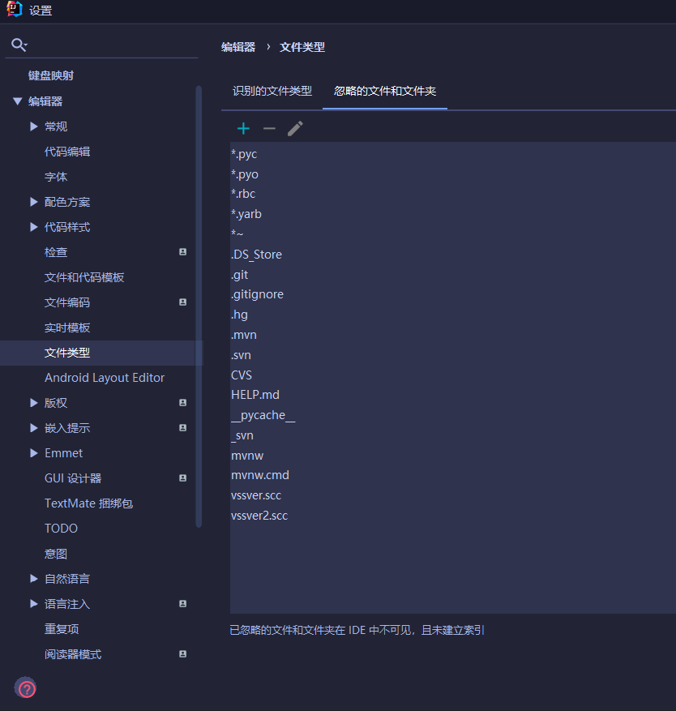
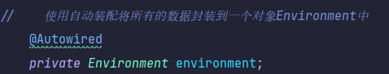
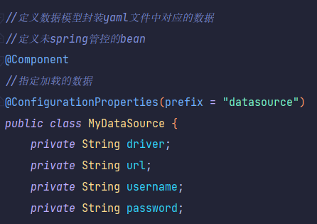

# Springboot基础

Springboot是简化Spring应用的初始搭建以及开发过程

特点:自动配置,起步依赖

## SpringBoot快速入门


1.根据向导进行联网快速制作

2.基于JDK8以上版本制作

3.SpringBoot程序需要使用何种功能通过勾选选择技术,也可以手工添加对应的要使用的技术

4.运行SpringBoot程序通过运行Application程序入口进行

阿里云版:Custom:http://start.aliyun.com

添加需要忽略的文件或文件夹



### 解析

#### parent

SpringBoot程序要继承spring-boot-starter-parent,其中定义了若干个依赖管理,继承parent模块可以避免多个依赖使用相同技术时出现依赖版本冲突,继承parent的形式也可以采用引入依赖的形式实现效果

#### starter

定义当前项目使用的所有依赖坐标,达到减少依赖配置的目的

使用任意坐标时,仅写GAV中的G和A,V由SpringBoot提供,除非SpringBoot未提供对应版本V,如发生坐标错误,再指定Version(小心版本冲突)

#### 引导类


SpringBoot程序启动还是创建了一个Spring容器对象。这个类在SpringBoot程序中是所有功能的入口，称这个类为引导类

#### 内嵌tomcat


内嵌Tomcat服务器是SpringBoot辅助功能之一,内嵌Tomcat工作原理是将Tomcat服务器作为对象运行，并将该对象交给Spring容器管理,变更内嵌服务器思想是去除现有服务器，添加全新的服务器

内置服务器:tomcat,jetty,undertow

## 补REST开发

REST表现形式状态转换

| 请求方式         | 含义                                 |
| ---------------- | ------------------------------------ |
| GET（SELECT）    | 从服务器取出资源（一项或多项）       |
| POST（CREATE）   | 在服务器新建一个资源                 |
| PUT（UPDATE）    | 在服务器更新资源（更新完整资源）     |
| PATCH（UPDATE）  | 在服务器更新资源， PATCH更新个别属性 |
| DELETE（DELETE） | 从服务器删除资源                     |


描述模块的名称通常用复数,加s的格式描述,表示此类资源

根据REST风格对资源进行访问称为RESTful

**<u>@RestController类注解,等同于@Controller与@ResponseBody两个注解组合功能</u>**

@GetMapping @PostMapping @PutMapping @DeleteMapping


## 基础配置

https://docs.spring.io/spring-boot/docs/current/reference/html/application-properties.html#application-properties


直接在application.properties中配置

springboot提供三种配置文件格式:properties,yml,yaml

用yml

优先级:properties>yml>yaml

不同配置文件中相同配置按照加载优先级相互覆盖,不同配置文件中不同配置全部保留

### yml格式

1. 大小写敏感
2. 属性层级关系使用多行描述，**每行结尾使用冒号结束**
3. 使用缩进表示层级关系，同层级左侧对齐，只允许使用空格（不允许使用Tab键）
4. 属性值前面添加空格（属性名与属性值之间使用冒号+空格作为分隔）
5. #号 表示注释


**数据前面要加空格与冒号隔开**

```yaml
boolean: TRUE  						#TRUE,true,True,FALSE,false，False均可
float: 3.14    						#6.8523015e+5  #支持科学计数法
int: 123       						#0b1010_0111_0100_1010_1110    #支持二进制、八进制、十六进制
null: ~        						#使用~表示null
string: HelloWorld      			#字符串可以直接书写
string2: "Hello World"  			#可以使用双引号包裹特殊字符
date: 2018-02-17        			#日期必须使用yyyy-MM-dd格式
datetime: 2018-02-17T15:02:31+08:00  #时间和日期之间使用T连接，最后使用+代表时区
```

### yaml数据读取

yaml中保存的单个数据，可以使用Spring中的注解直接读取，使用@Value可以读取单个数据，属性名引用方式：<b>${一级属性名.二级属性名……}</b>


一个进行\t是字符串转义字符,一个未转义

使用引号包裹的字符串,其中的转义字符可以生效

#### 读取全部数据




#### 读取对象数据

```yaml
#创建类,用于封装下面的数据
#由spring帮我们加载数据到对象中,一定要告诉spring加载这组信息
#使用时候从spring中直接获取信息使用
datasource:
  driver: com.mysql.cj.jdbc.Driver
  url: jdbc:mysql://127.0.0.1:3306/springboot_db?useUnicode=true&characterEncoding=utf8&autoReconnect=true&allowMultiQueries=true&useSSL=false&serverTimezone=UTC
  username: root
  password: 123456
```



(定义封装类)


## 整合第三方技术

### 整合JUnit

1.导入测试对应的starter

2.测试类用@SpringBootTest修饰

3.使用自动装配的形式添加要测试的对象

4.测试类如果存在于引导类所在包或者子包中无需指定引导类

5.测试类如果不存在于引导类所在的包或者子包中需要通过classes属性指定引导类

@SpringBootTest(classes = Springboot04JunitApplication.class)

### 整合MyBatis-Plus

导坐标

```xml
<dependency>
    <groupId>com.baomidou</groupId>
    <artifactId>mybatis-plus-boot-starter</artifactId>
    <version>3.4.3</version>
</dependency>
```

1.导入MyBatis对应starter

2.数据库连接相关信息转换成配置

3.数据库SQL映射需要添加@Mapper(一定要添加)被容器识别到

4.使用第三方技术无法通过勾选确定时,需要手工添加坐标

表名定义规则和实体类相对应需要做配置:

```yaml
mybatis-plus:
  global-config:
    db-config:
      table-prefix: tbl_		#设置所有表的通用前缀名称为tbl_
```

### 整合Druid(德鲁伊)

导坐标

```xml
<dependencies>
    <dependency>
        <groupId>com.alibaba</groupId>
        <artifactId>druid</artifactId>
        <version>1.1.16</version>
    </dependency>
</dependencies>
```

配置数据源

```yaml
spring:
  datasource:
    druid:
      driver-class-name: com.mysql.cj.jdbc.Driver
      url: jdbc:mysql://localhost:3306/ssm_db?serverTimezone=UTC
      username: root
      password: 123456
```

1.导入starter

2.根据Druid提供的配置方式进行配置

### 总结

整合第三方技术通用方式:到starter,根据提供的配置格式,配置非默认值对应的配置项

## Lombok

java类库,提供了一组注解,简化POJO实体类的开发,SpringBoot默认集成了lombok技术,导坐标即可

```xml
<dependencies>
    <!--lombok-->
    <dependency>
        <groupId>org.projectlombok</groupId>
        <artifactId>lombok</artifactId>
    </dependency>
</dependencies>
```

常用注解:@Data  

完成一个实体类对应的getter，setter，toString，equals，hashCode等操作的快速添加

## MP拦截器

**定义MP拦截器并将其设置为Spring管控的bean**

实现分页

创建MP的拦截器栈,初始化分页拦截器,添加新的拦截器继续add

```JAVA
@Configuration
public class MPConfig {
    @Bean
    public MybatisPlusInterceptor mybatisPlusInterceptor(){
        MybatisPlusInterceptor interceptor = new MybatisPlusInterceptor();
        interceptor.addInnerInterceptor(new PaginationInnerInterceptor());
        return interceptor;
    }
}
```

```java
@Test
void testGetPage(){
    IPage page = new Page(3,5);
    bookDao.selectPage(page,null);
}
```

## mybatis按条件查询

```java
@Test
void testGetBy(){
    QueryWrapper<Book> qw=new QueryWrapper<>();
    qw.like("name","Spring");
    bookDao.selectList(qw);
}
```

```java
@Test
    void testGetBy2(){
        LambdaQueryWrapper<Book> lqw=new LambdaQueryWrapper<>();
        lqw.like(Book::getName,"Spring");
        bookDao.selectList(lqw);
    }
```

```java
//当传入的查询内容为null时,默认不进行查询
@Test
void testGetBy2(){
    LambdaQueryWrapper<Book> lqw=new LambdaQueryWrapper<>();
    String name=null;
    lqw.like(name != null ,Book::getName,name);
    bookDao.selectList(lqw);
}
```

## Mybatis-Plus业务层接口快速开发

```java
public interface IBookService extends IService<Book> {
    //添加非通用操作API接口
}
```

```java
@Service
public class BookServiceImpl extends ServiceImpl<BookDao, Book> implements IBookService {
    @Autowired
    private BookDao bookDao;
	//添加非通用操作API
}
```

## 细节总结

特点:自动配置,起步依赖

SpringBootApplication扫描的是当前包及其子包

**<u>@RestController类注解,等同于@Controller与@ResponseBody两个注解组合功能</u>**

yml占位符

```yml
port: ${myPort:88} #默认值88,有myPort成为80
myPort: 80
```

springboot读取yml

@Value注解

```yml
student:
	lastName: zjh
```

```java
@RestController
public class TestController {
    @Value("${student.lastName}")
    private String lastName;
}
```

@ConfigurationProperties注解

在类上添加注解@Componet和@Configuration(prefix = "配置前缀")

注意成员变量一定要提供set/get方法,加@Component

```
@Configuration(prefix = "配置前缀")
类
@Autowired
private 类名 变量名
```


junit单元测试

测试类结构要和启动类结构一致

@SpringBootTest注解(可以在括号内部指定启动类的字节码对象)内部函数写@Test

测试service

```java
@Autowired
private service类名 变量名;
```

# web开发

## 静态资源访问

SpringBoot默认的静态资源路径匹配为/**,如resources/static/index.html访问/index.html

resources/static/pages/index.html访问/pages/login.html

修改路径:application.yml中

```yml
spring:
	mvc:
		static-path-pattern: /res/**  #修改访问路径
	web:
		resources:
			static-locations: classpath:/zjhstatic/   #修改目录 多个用- xxx回车- xxx
```

## 设置请求映射规则@RequestMapping

@GetMapping @PostMapping @PutMapping @DeleteMapping

我们期望让请求的资源路径为**/test/testParams**的**GET**请求,并且请求参数中**具有code参数**的请求能够被testParams方法处理。则可以写如下代码

~~~~java
@Controller
@RequestMapping("/test")
public class TestController {
    @RequestMapping(value = "/testParams",method = RequestMethod.GET,params = "code")
    public String testParams(){
        System.out.println("testParams处理了请求");
        return "/success.jsp";
    }
}
~~~~

​	如果是要求**不能有code**这个参数可以把改成如下形式

~~~~java
@Controller
@RequestMapping("/test")
public class TestController {
    @RequestMapping(value = "/testParams",method = RequestMethod.GET,params = "!code")
    public String testParams(){
        System.out.println("testParams处理了请求");
        return "/success.jsp";
    }
}
~~~~

​	如果要求有code这参数，并且这参数值必须**是某个值**可以改成如下形式

~~~~java
@Controller
@RequestMapping("/test")
public class TestController {
    @RequestMapping(value = "/testParams",method = RequestMethod.GET,params = "code=sgct")
    public String testParams(){
        System.out.println("testParams处理了请求");
        return "/success.jsp";
    }
}
~~~~

​	如果要求有code这参数，并且这参数值必须**不是某个值**可以改成如下形式	

~~~~java
@Controller
@RequestMapping("/test")
public class TestController {
    @RequestMapping(value = "/testParams",method = RequestMethod.GET,params = "code!=sgct")
    public String testParams(){
        System.out.println("testParams处理了请求");
        return "/success.jsp";
    }
}
~~~~

我们可以使用**consumes**属性来对**Content-Type**这个请求头进行一些限制。


#### 范例一

​	我们期望让请求的资源路径为**/test/testConsumes**的POST请求,并且请求头中的Content-Type头必须为 **multipart/from-data** 的请求能够被testConsumes方法处理。则可以写如下代码

~~~~java
    @RequestMapping(value = "/testConsumes",method = RequestMethod.POST,consumes = "multipart/from-data")
    public String testConsumes(){
        System.out.println("testConsumes处理了请求");
        return "/success.jsp";
    }
~~~~

#### 范例二

​	如果我们要求请求头Content-Type的值必须**不能为某个multipart/from-data**则可以改成如下形式：

~~~~java
    @RequestMapping(value = "/testConsumes",method = RequestMethod.POST,consumes = "!multipart/from-data")
    public String testConsumes(){
        System.out.println("testConsumes处理了请求");
        return "/success.jsp";
    }
~~~~

## 获取请求参数

RestFul风格的接口一些参数是在请求路径上的。类似： /user/1  这里的1就是id。

​	如果我们想获取这种格式的数据可以使用**@PathVariable**来实现。

范例一

​	要求定义个RestFul风格的接口，该接口可以用来根据id查询用户。请求路径要求为  /user  ，请求方式要求为GET。

​	而请求参数id要写在请求路径上，例如  /user/1   这里的1就是id。

​	我们可以定义如下方法，通过如下方式来获取路径参数：

~~~~java
@Controller
public class UserController {

    @RequestMapping(value = "/user/{id}",method = RequestMethod.GET)
    public String findUserById( @PathVariable("id")Integer id){
        System.out.println("findUserById");
        System.out.println(id);
        return "/success.jsp";
    }
}
~~~~

范例二

​	如果这个接口，想根据id和username查询用户。请求路径要求为  /user  ，请求方式要求为GET。

​	而请求参数id和name要写在请求路径上，例如  /user/1/zs   这里的1就是id，zs是name

​	我们可以定义如下方法，通过如下方式来获取路径参数：

~~~~java
@Controller
public class UserController {
    @RequestMapping(value = "/user/{id}/{name}",method = RequestMethod.GET)
    public String findUser(@PathVariable("id") Integer id,@PathVariable("name") String name){
        System.out.println("findUser");
        System.out.println(id);
        System.out.println(name);
        return "/success.jsp";
    }
}

~~~~

### 获取请求体中的json格式参数

spring boot的web启动器已经默认导入了jackson依赖不需要额外导入依赖

如果请求体传递过来的数据是一个User集合转换成的json

~~~~java
    @RequestMapping(value = "/users",method = RequestMethod.POST)
    public String insertUsers(@RequestBody List<User> users){
        System.out.println("insertUsers");
        System.out.println(users);
        return "/success.jsp";
    }
~~~~

#### required

​	代表是否必须，默认值为true也就是必须要有对应的参数。如果没有就会报错。

​	如果对应的参数可传可不传则可以把去设置为fasle

```java
public String testRquestParam(@RequestParam(value = "id",required = false) Integer uid,@RequestParam("name") String name, @RequestParam("likes")String[] likes)
```

如果对应的参数没有，我们可以用defaultValue属性设置默认值。

```java
public String testRquestParam(@RequestParam(value = "id",required = false,defaultValue = "777") Integer uid,@RequestParam("name") String name, @RequestParam("likes")String[] likes)
```

## 跨域请求

浏览器出于安全的考虑,受用XMLHttpRequest对象发起HTTP请求时ixu遵守同源策略,否则就是跨域的HTTP请求,默认情况下是被禁止的,同源策略要求原相同才能正常进行通信,即协议,域名,端口号完全一致

### CORS解决跨域请求

#### @CrossOrigin

跨域的方法或者是controller上加

### 使用WebMvcConfigurer的addCorsMappings方法配置CorsInterceptor

## 拦截器

### 1.1 应用场景

​	如果我们想在多个Handler方法执行之前或者之后都进行一些处理，甚至某些情况下需要拦截掉，不让Handler方法执行。那么可以使用SpringMVC为我们提供的拦截器。


### 1.2 拦截器和过滤器的区别

​	过滤器是在Servlet执行之前或者之后进行处理。而拦截器是对Handler（处理器）执行前后进行处理。

如图：


### 1.3 创建并配置拦截器

#### ①创建类实现HandlerInterceptor接口

~~~~java
public class MyInterceptor implements HandlerInterceptor {
}
~~~~

#### ②实现方法

~~~~java
public class MyInterceptor implements HandlerInterceptor {
    
    //在handler方法执行之前会被调用
    public boolean preHandle(HttpServletRequest request, HttpServletResponse response, Object handler) throws Exception {
        System.out.println("preHandle");
        //返回值代表是否放行，如果为true则放行，如果为fasle则拦截，目标方法执行不到
        return true;
    }

    public void postHandle(HttpServletRequest request, HttpServletResponse response, Object handler, ModelAndView modelAndView) throws Exception {
        System.out.println("postHandle");
    }

    public void afterCompletion(HttpServletRequest request, HttpServletResponse response, Object handler, Exception ex) throws Exception {
        System.out.println("afterCompletion");
    }
}
~~~~

#### ③配置拦截器

~~~~xml
    <!--配置拦截器-->
    <mvc:interceptors>
        <mvc:interceptor>
            <!--
                    配置拦截器要拦截的路径
                    /*    代表当前一级路径，不包含子路径
                    /**   代表当前一级路径和多级路径，使用的更多

                    例如：
                        /test/*   这种会拦截下面这种路径/test/add  /test/delete
                                  但是拦截不了多级路径的情况例如  /test/add/abc  /test/add/abc/bcd
                        /test/**  这种可以拦截多级目录的情况，无论    /test/add还是/test/add/abc/bcd 都可以拦截
            -->
            <mvc:mapping path="/**"/>
            <!--配置排除拦截的路径-->
            <!--<mvc:exclude-mapping path="/"/>-->
            <!--配置拦截器对象注入容器-->
            <bean class="com.sangeng.interceptor.MyInterceptor"></bean>
        </mvc:interceptor>
    </mvc:interceptors>
~~~~


### 1.4 拦截器方法及参数详解

- preHandle方法会在Handler方法执行之前执行，我们可以在其中进行一些前置的判断或者处理。
- postHandle方法会在Handler方法执行之后执行，我们可以在其中对域中的数据进行修改，也可以修改要跳转的页面。
- afterCompletion方法会在最后执行，这个时候已经没有办法对域中的数据进行修改，也没有办法修改要跳转的页面。我们在这个方法中一般进行一些资源的释放。

~~~~java
    /**
     * 在handler方法执行之前会被调用
     * @param request 当前请求对象
     * @param response 响应对象
     * @param handler 相当于是真正能够处理请求的handler方法封装成的对象，对象中有这方法的相关信息
     * @return 返回值代表是否放行，如果为true则放行，如果为fasle则拦截，目标方法执行不到
     * @throws Exception
     */
    public boolean preHandle(HttpServletRequest request, HttpServletResponse response, Object handler) throws Exception {
        System.out.println("preHandle");
        //返回值代表是否放行，如果为true则放行，如果为fasle则拦截，目标方法执行不到
        return true;
    }
~~~~

~~~~java
    /**
     * postHandle方法会在Handler方法执行之后执行
     * @param request 当前请求对象
     * @param response 响应对象
     * @param handler 相当于是真正能够处理请求的handler方法封装成的对象，对象中有这方法的相关信息
     * @param modelAndView handler方法执行后的modelAndView对象，我们可以修改其中要跳转的路径或者是域中的数据
     * @throws Exception
     */
    public void postHandle(HttpServletRequest request, HttpServletResponse response, Object handler, ModelAndView modelAndView) throws Exception {
        System.out.println("postHandle");
    }
~~~~

~~~~java
    /**
     * afterCompletion方法会在最后执行
     * @param request 当前请求对象
     * @param response 响应对象
     * @param handler 相当于是真正能够处理请求的handler方法封装成的对象，对象中有这方法的相关信息
     * @param ex 异常对象
     * @throws Exception
     */
    public void afterCompletion(HttpServletRequest request, HttpServletResponse response, Object handler, Exception ex) throws Exception {
        System.out.println("afterCompletion");
    }
~~~~


### 1.5 案例-登录状态拦截器

#### 1.5.1需求

​	我们的接口需要做用户登录状态的校验，如果用户没有登录则跳转到登录页面，登录的情况下则可以正常访问我们的接口。

#### 1.5.2 分析

​	怎么判断是否登录？

​			登录时往session写入用户相关信息，然后在其他请求中从session中获取这些信息，如果获取不到说明不是登录状态。

​	很多接口都要去写判断的代码，难道在每个Handler中写判断逻辑？

​			用拦截器，在拦截器中进行登录状态的判断。

​	登录接口是否应该进行拦截？

​			不能拦截

​	静态资源是否要进行拦截？

​			不能拦截

#### 1.5.3 步骤分析

​	①登录页面，请求发送给登录接口

​	②登录接口中，校验用户名密码是否正确（模拟校验即可，先不查询数据库）。

​				如果用户名密码正确，登录成功。把用户名写入session中。

​	 ③定义其他请求的Handler方法

​	 ④定义拦截器来进行登录状态判断

​	 			如果能从session中获取用户名则说明是登录的状态，则放行

​				 如果获取不到，则说明未登录，要跳转到登录页面。

#### 1.5.4 代码实现

##### 1.5.4.1 登录功能代码实现

###### 	①编写登录页面

~~~~html
<!DOCTYPE html>
<html lang="en">
<head>
    <meta charset="UTF-8">
    <title>Title</title>
</head>
<body>
    <form method="post" action="/login">
        用户名：<input type="text" name="username">
        密码：<input type="password" name="password">
        <input type="submit">
    </form>
</body>
</html>
~~~~

###### 	②编写登录接口

​	接口中，校验用户名密码是否正确（模拟校验即可，先不查询数据库）。如果用户名密码正确，登录成功。把用户名写入session中。

~~~~java
@Controller
public class LoginController {

    @PostMapping("/login")
    public String longin(String username, String password, HttpSession session){
        //往session域中写入用户名用来代表登录成功
        session.setAttribute("username",username);
        return "/WEB-INF/page/success.jsp";
    }
}

~~~~


##### 1.5.4.2 登录状态校验代码实现

###### ①定义拦截器

~~~~java
public class LoginInterceptor implements HandlerInterceptor {
}
~~~~

###### ②重写方法，在preHandle方法中实现状态校验 

~~~~java
public class LoginInterceptor implements HandlerInterceptor {

    public boolean preHandle(HttpServletRequest request, HttpServletResponse response, Object handler) throws Exception {
        //从session中获取用户名，判断是否存在
        HttpSession session = request.getSession();
        String username = (String) session.getAttribute("username");
        if(StringUtils.isEmpty(username)){
            //如果获取不到说明未登录 ，重定向跳转到登录页面
            String contextPath = request.getServletContext().getContextPath();
            response.sendRedirect(contextPath+"/static/login.html");
        }else{
            //如果获取到了，说明之前登录过。放行。
            return true;
        }
        return false;
    }
}
~~~~

###### ③配置拦截器

- ​	登录相关接口不应该拦截
- ​	静态资源不拦截

~~~~xml
    <mvc:interceptors>
        <mvc:interceptor>
            <!--要拦截的路径-->
            <mvc:mapping path="/**"/>
            <!--排除不拦截的路径-->
            <mvc:exclude-mapping path="/static/**"></mvc:exclude-mapping>
            <mvc:exclude-mapping path="/WEB-INF/page/**"></mvc:exclude-mapping>
            <mvc:exclude-mapping path="/login"></mvc:exclude-mapping>
            <bean class="com.sangeng.interceptor.LoginInterceptor"></bean>
        </mvc:interceptor>
    </mvc:interceptors>
~~~~


### 1.6 多拦截器执行顺序

​	如果我们配置了多个拦截器，拦截器的顺序是**按照配置的先后顺序**的。

​	这些拦截器中方法的执行顺序如图（**preHandler都返回true的情况下**）：


​	如果**拦截器3的preHandle方法返回值为false**。执行顺序如图：


- ​	只有所有拦截器都放行了，postHandle方法才会被执行。
- ​	只有当前拦截器放行了，当前拦截器的afterCompletion方法才会执行。