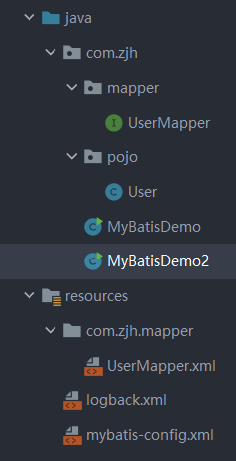

## 查询练习

### 基础查询(select)

```mysql
-- 删除stu表
drop table if exists stu;
-- 创建stu表
CREATE TABLE stu (
 id int, -- 编号
 name varchar(20), -- 姓名
 age int, -- 年龄
 sex varchar(5), -- 性别
 address varchar(100), -- 地址
 math double(5,2), -- 数学成绩
 english double(5,2), -- 英语成绩
 hire_date date -- 入学时间
);
-- 添加数据
INSERT INTO stu(id,NAME,age,sex,address,math,english,hire_date) 
VALUES 
(1,'马运',55,'男','杭州',66,78,'1995-09-01'),
(2,'马花疼',45,'女','深圳',98,87,'1998-09-01'),
(3,'马斯克',55,'男','香港',56,77,'1999-09-02'),
(4,'柳白',20,'女','湖南',76,65,'1997-09-05'),
(5,'柳青',20,'男','湖南',86,NULL,'1998-09-01'),
(6,'刘德花',57,'男','香港',99,99,'1998-09-01'),
(7,'张学右',22,'女','香港',99,99,'1998-09-01'),
(8,'德玛西亚',18,'男','南京',56,65,'1994-09-02');
SELECT * from stu;
-- 基础查询
-- 查询name age两列
SELECT name,age from stu;
-- 查询所有列的数据，列名的列表可以用*替代，不要使用
select * from stu;
-- 查询地址信息
select address from stu;
-- 去除重复数据
select DISTINCT address from stu;
-- 查询姓名数学英语成绩
SELECT name,math as 数学成绩,english as 英语成绩 from stu;
```

### 条件查询(where  like)

```mysql
-- 1.查询年龄大于20岁的学员信息
SELECT * from stu where age>20;
-- 2.查询年龄大于等于20岁的学员信息
SELECT * from stu where age >=20;
-- 3.查询年龄大于等于20岁 并且 年龄 小于等于 30岁 的学员信息
SELECT * from stu where age>=20 and age<=30;
-- 4.查询入学日期在'1998-09-01' 到 '1999-09-01'  之间的学员信息
SELECT * from stu where hire_date BETWEEN '1998-09-01' and '1999-09-01';
-- 5. 查询年龄等于18岁的学员信息
SELECT * from stu where age=18;
-- 6. 查询年龄不等于18岁的学员信息
SELECT * from stu where age!=18;
SELECT * from stu where age<>18;
-- 7. 查询年龄等于18岁 或者 年龄等于20岁 或者 年龄等于22岁的学员信息
SELECT * from stu WHERE age=18 or age=20 or age=22;
SELECT * from stu WHERE age in(18,20,22);
-- 8. 查询英语成绩为 null的学员信息 
-- 注意： null值的比较不能使用 = != 。需要使用 is  is not
SELECT * from stu where english is null; 
```

```mysql
-- 模糊查询 like =====================
/*
	通配符：
	 (1)_:代表单个任意字符
	 (2)%:代表任意个数字符
*/

-- 1. 查询姓'马'的学员信息
SELECT * from stu where name like '马%';
-- 2. 查询第二个字是'花'的学员信息   
SELECT * from stu where name like '_花%';
-- 3. 查询名字中包含 '德' 的学员信息
SELECT * from stu where name like '%德%';

```

### 排序查询(order by)

```mysql
/*
	排序查询：
		* 语法：SELECT 字段列表 FROM 表名  ORDER BY 排序字段名1 [排序方式1],排序字段名2 [排序方式2] …;
		* 排序方式：
				* ASC：升序排列（默认值）
				* DESC：降序排列
*/
-- 1.查询学生信息，按照年龄升序排列 
select * from stu order by age ;
-- 2.查询学生信息，按照数学成绩降序排列
select * from stu order by math desc ;
-- 3.查询学生信息，按照数学成绩降序排列，如果数学成绩一样，再按照英语成绩升序排列
select * from stu order by math desc , english asc ;
```

### 聚合查询

| 函数名      | 功能                             |
| ----------- | -------------------------------- |
| count(列名) | 统计数量（一般选用不为null的列） |
| max(列名)   | 最大值                           |
| min(列名)   | 最小值                           |
| sum(列名)   | 求和                             |
| avg(列名)   | 平均值                           |

```mysql
-- 统计班级一共有多少个学生
SELECT count(id) from stu;
SELECT count(english) from stu;
SELECT count(*) from stu;
-- 查询数学成绩的最高分
SELECT max(math) from stu;
-- 查询数学成绩的最低分
SELECT min(math) from stu;
-- 查询数学成绩的总分
SELECT sum(math) from stu;
-- 查询数学成绩的平均分
select avg(math) from stu;
-- 查询英语成绩的最低分
select min(english) from stu;
```

### 分组查询

```mysql
SELECT 字段列表 FROM 表名 [WHERE 分组前条件限定] GROUP BY 分组字段名 [HAVING 分组后条件过滤];
```

### 分页查询

```mysql
SELECT 字段列表 FROM 表名 LIMIT  起始索引 , 查询条目数;
```

## 约束练习

### 非空约束

```sql
-- 创建表时添加非空约束
CREATE TABLE 表名(
   列名 数据类型 NOT NULL,
   …
); 
-- 建完表后添加非空约束
ALTER TABLE 表名 MODIFY 字段名 数据类型 NOT NULL;
--删除约束
ALTER TABLE 表名 MODIFY 字段名 数据类型;
```

### 唯一约束unique

```mysql
-- 创建表时添加唯一约束
CREATE TABLE 表名(
   列名 数据类型 UNIQUE [AUTO_INCREMENT],
   -- AUTO_INCREMENT: 当不指定值时自动增长
   …
); 
CREATE TABLE 表名(
   列名 数据类型,
   …
   [CONSTRAINT] [约束名称] UNIQUE(列名)
); 
-- 建完表后添加唯一约束
ALTER TABLE 表名 MODIFY 字段名 数据类型 UNIQUE;
-- 删除约束
ALTER TABLE 表名 DROP INDEX 字段名;
```

### 主键约束 primary key

主键是一行数据的唯一标识，要求非空且唯一，一般我们都会给每张表添加一个主键列用来唯一标识数据

```mysql
-- 创建表时添加主键约束
create table 表名(
	列名 数据类型 primary key auto_increment,
    ...
);
CREATE TABLE 表名(
   列名 数据类型,
   CONSTRAINT [约束名称] PRIMARY KEY(列名)
); 
-- 建完表后添加主键约束
alter table 表名 add primary key(字段名);
-- 删除约束
alter table 表名 drop primary key;
```

### 默认约束 default

保存数据时，未指定则采用默认值

```mysql
-- 创建表时添加默认约束
create table 表名(
	列名 数据类型 default 默认值,
    ...
);
-- 建完表后添加
alter table 表名 alter 列名 set default 默认值;
-- 删除约束
alter table 表名 alter 列名 drop default;
```

### 外键约束  foreign key


```mysql
-- 创建表时添加外键约束
create table 表名(
	列名 数据类型,
    ...
    constraint [外键名称] foreign key (外键列名) references 主表(注表列名)
);
-- 建完表后添加外键约束
alter table 表名 add constraint 外键名称 foreign key (外键字段名称) references 主表名称(主表列名称);
-- 删除外键约束
alter table 表名 drop foreign key 外键名称;
```

```mysql
drop table if exists emp;
drop table if exists dept;
create table dept(
id int PRIMARY key auto_increment,
dep_name varchar(20),
addr varchar(20)
);
create table emp(
id int PRIMARY key auto_increment,
name varchar(20),
age int,
dep_id int,
CONSTRAINT fk_emp_dept foreign key(dep_id) REFERENCES dept(id)
);
-- 添加部门
insert into dept(dep_name,addr)values
('研发部','广州'),('销售部','深圳');

-- 添加员工,dep_id 表示员工所在的部门
INSERT INTO emp (NAME, age, dep_id) VALUES 
('张三', 20, 1),
('李四', 20, 1),
('王五', 20, 1),
('赵六', 20, 2),
('孙七', 22, 2),
('周八', 18, 2);
select * from emp;
-- 删除外键
alter table emp drop FOREIGN key fk_emp_dept;
-- 建表后添加外键
alter table emp add CONSTRAINT fk_emp_dept FOREIGN key(dep_id) REFERENCES dept(id);
```

## 数据库设计

表关系

### 一对多

在多的一方建立外键，指向一的一方的主键


### 多对多

一个商品对应多个订单，一个订单对应多个商品

实现方式：建立第三张中间表，中间表至少包含两个外键，分别关联两方主键


### 一对一

一对一关系多用于表拆分，将一个实体中经常使用的字段放一张表，不经常使用的字段放另一张表，用于提升查询性能

实现方式：在任意一方加入外键，关联另一方主键，并且设置外键为唯一(UNIQUE)


## 多表查询

```mysql
DROP TABLE IF EXISTS emp;
DROP TABLE IF EXISTS dept;


# 创建部门表
	CREATE TABLE dept(
        did INT PRIMARY KEY AUTO_INCREMENT,
        dname VARCHAR(20)
    );

	# 创建员工表
	CREATE TABLE emp (
        id INT PRIMARY KEY AUTO_INCREMENT,
        NAME VARCHAR(10),
        gender CHAR(1), -- 性别
        salary DOUBLE, -- 工资
        join_date DATE, -- 入职日期
        dep_id INT,
        FOREIGN KEY (dep_id) REFERENCES dept(did) -- 外键，关联部门表(部门表的主键)
    );
	-- 添加部门数据
	INSERT INTO dept (dNAME) VALUES ('研发部'),('市场部'),('财务部'),('销售部');
	-- 添加员工数据
	INSERT INTO emp(NAME,gender,salary,join_date,dep_id) VALUES
	('孙悟空','男',7200,'2013-02-24',1),
	('猪八戒','男',3600,'2010-12-02',2),
	('唐僧','男',9000,'2008-08-08',2),
	('白骨精','女',5000,'2015-10-07',3),
	('蜘蛛精','女',4500,'2011-03-14',1),
	('小白龙','男',2500,'2011-02-14',null);	
```

```mysql
-- 查询
select * from emp , dept where emp.dep_id = dept.did;	
```

### 内连接查询

```mysql
-- 隐式内连接
select 字段列表 from 表1,表2... where 条件;
-- 显式内连接
select 字段列表 from 表1 inner join 表2 on 条件
```

### 外连接查询

```mysql
-- 左外连接
select 字段列表 from 表1 left outer join 表2 on 条件;
-- 右外连接
select 字段列表 from 表1 right outer join 表2 on 条件;
```

>左外连接：相当于查询A表所有数据和交集部分数据
>
>右外连接：相当于查询B表所有数据和交集部分数据

* 查询emp表所有数据和对应的部门信息（左外连接）

  ```sql
  select * from emp left join dept on emp.dep_id = dept.did;
  ```

  执行语句结果如下：

  

  结果显示查询到了左表（emp）中所有的数据及两张表能关联的数据。

* 查询dept表所有数据和对应的员工信息（右外连接）

  ```sql
  select * from emp right join dept on emp.dep_id = dept.did;
  ```

  执行语句结果如下：

  

  结果显示查询到了右表（dept）中所有的数据及两张表能关联的数据。

  要查询出部门表中所有的数据，也可以通过左外连接实现，只需要将两个表的位置进行互换：

  ```sql
  select * from dept left join emp on emp.dep_id = dept.did;
  ```

  ### 子查询

  概念

  ==查询中嵌套查询，称嵌套查询为子查询。==

  什么是查询中嵌套查询呢？我们通过一个例子来看：

  **需求：查询工资高于猪八戒的员工信息。**

  来实现这个需求，我们就可以通过二步实现，第一步：先查询出来 猪八戒的工资

  ```sql
  select salary from emp where name = '猪八戒'
  ```

   第二步：查询工资高于猪八戒的员工信息

  ```sql
  select * from emp where salary > 3600;
  ```

  第二步中的3600可以通过第一步的sql查询出来，所以将3600用第一步的sql语句进行替换

  ```sql
  select * from emp where salary > (select salary from emp where name = '猪八戒');
  ```

  这就是查询语句中嵌套查询语句。

  ## 事务

  ### 概述

  > 数据库的事务（Transaction）是一种机制、一个操作序列，包含了==一组数据库操作命令==。
  >
  > 事务把所有的命令作为一个整体一起向系统提交或撤销操作请求，即这一组数据库命令==要么同时成功，要么同时失败==。
  >
  > 事务是一个不可分割的工作逻辑单元。

  这些概念不好理解，接下来举例说明，如下图有一张表

  

  张三和李四账户中各有100块钱，现李四需要转换500块钱给张三，具体的转账操作为

  * 第一步：查询李四账户余额
  * 第二步：从李四账户金额 -500
  * 第三步：给张三账户金额 +500

  现在假设在转账过程中第二步完成后出现了异常第三步没有执行，就会造成李四账户金额少了500，而张三金额并没有多500；这样的系统是有问题的。如果解决呢？使用事务可以解决上述问题

  

  从上图可以看到在转账前开启事务，如果出现了异常回滚事务，三步正常执行就提交事务，这样就可以完美解决问题。

  ### 语法

  * 开启事务

    ```sql
    START TRANSACTION;
    或者  
    BEGIN;
    ```

  * 提交事务

    ```sql
    commit;
    ```

  * 回滚事务

    ```sql
    rollback;
    ```


  ### 代码验证

  * 环境准备

    ```sql
    DROP TABLE IF EXISTS account;
    
    -- 创建账户表
    CREATE TABLE account(
    	id int PRIMARY KEY auto_increment,
    	name varchar(10),
    	money double(10,2)
    );
    
    -- 添加数据
    INSERT INTO account(name,money) values('张三',1000),('李四',1000);
    ```

    

  * 不加事务演示问题

    ```sql
    -- 转账操作
    -- 1. 查询李四账户金额是否大于500
    
    -- 2. 李四账户 -500
    UPDATE account set money = money - 500 where name = '李四';
    
    出现异常了...  -- 此处不是注释，在整体执行时会出问题，后面的sql则不执行
    -- 3. 张三账户 +500
    UPDATE account set money = money + 500 where name = '张三';
    ```

    整体执行结果肯定会出问题，我们查询账户表中数据，发现李四账户少了500。

    

  * 添加事务sql如下：

    ```sql
    -- 开启事务
    BEGIN;
    -- 转账操作
    -- 1. 查询李四账户金额是否大于500
    
    -- 2. 李四账户 -500
    UPDATE account set money = money - 500 where name = '李四';
    
    出现异常了...  -- 此处不是注释，在整体执行时会出问题，后面的sql则不执行
    -- 3. 张三账户 +500
    UPDATE account set money = money + 500 where name = '张三';
    
    -- 提交事务
    COMMIT;
    
    -- 回滚事务
    ROLLBACK;
    ```

    上面sql中的执行成功进选择执行提交事务，而出现问题则执行回滚事务的语句。以后我们肯定不可能这样操作，而是在java中进行操作，在java中可以抓取异常，没出现异常提交事务，出现异常回滚事务。

  ### 事务的四大特征

  * 原子性（Atomicity）: 事务是不可分割的最小操作单位，要么同时成功，要么同时失败

  * 一致性（Consistency） :事务完成时，必须使所有的数据都保持一致状态

  * 隔离性（Isolation） :多个事务之间，操作的可见性

  * 持久性（Durability） :事务一旦提交或回滚，它对数据库中的数据的改变就是永久的

  > ==说明：==
  >
  > mysql中事务是自动提交的。
  >
  > 也就是说我们不添加事务执行sql语句，语句执行完毕会自动的提交事务。
  >
  > 可以通过下面语句查询默认提交方式：
  >
  > ```java
  > SELECT @@autocommit;
  > ```
  >
  > 查询到的结果是1 则表示自动提交，结果是0表示手动提交。当然也可以通过下面语句修改提交方式
  >
  > ```sql
  > set @@autocommit = 0;
  > ```

# JDBC  (Java DataBase Connectivity)

```java
package zjhjdbc;
import java.sql.Connection;
import java.sql.Driver;
import java.sql.DriverManager;
import java.sql.Statement;
//JDBC快速入门
public class JDBCDemo {
    public static void main(String[] args) throws Exception {
        //1.注册驱动
        //Class.forName("com.mysql.jdbc.Driver");
        //2.获取连接
        String url="jdbc:mysql://127.0.0.1:3306/db(weblianxi)";
        String username="root";
        String password="123456";
        Connection conn = DriverManager.getConnection(url, username, password);
        //3.定义sql
        String sql="update stu set age=10 where id=1";
        //4.获取执行sql的对象Statement
        Statement stmt=conn.createStatement();
        //5.执行sql
        int count = stmt.executeUpdate(sql);//受影响的行数
        //6.处理结果
        System.out.println(count);
        //7.释放资源
        stmt.close();
        conn.close();
    }
}
```

## API详解

### DriverManager

注册驱动

MySQL 5之后的驱动包，可以省略注册驱动的步骤

url

语法：jdbc:mysql://ip地址(域名):端口号/数据库名称?参数键值对1&参数键值对2…

本机端口可不写

警告删除:在url后面加?useSSL=false

### Connection

* 开启事务 ： BEGIN; 或者 START TRANSACTION;
* 提交事务 ： COMMIT;
* 回滚事务 ： ROLLBACK;

### Statement

DDL,DML同mysql操作

```java
/**
  * 执行DML语句
  * @throws Exception
  */
@Test
public void testDML() throws  Exception {
    //1. 注册驱动
    //Class.forName("com.mysql.jdbc.Driver");
    //2. 获取连接：如果连接的是本机mysql并且端口是默认的 3306 可以简化书写
    String url = "jdbc:mysql:///db1?useSSL=false";
    String username = "root";
    String password = "1234";
    Connection conn = DriverManager.getConnection(url, username, password);
    //3. 定义sql
    String sql = "update account set money = 3000 where id = 1";
    //4. 获取执行sql的对象 Statement
    Statement stmt = conn.createStatement();
    //5. 执行sql
    int count = stmt.executeUpdate(sql);//执行完DML语句，受影响的行数
    //6. 处理结果
    //System.out.println(count);
    if(count > 0){
        System.out.println("修改成功~");
    }else{
        System.out.println("修改失败~");
    }
    //7. 释放资源
    stmt.close();
    conn.close();
}
```

```java
/**
  * 执行DDL语句
  * @throws Exception
  */
@Test
public void testDDL() throws  Exception {
    //1. 注册驱动
    //Class.forName("com.mysql.jdbc.Driver");
    //2. 获取连接：如果连接的是本机mysql并且端口是默认的 3306 可以简化书写
    String url = "jdbc:mysql:///db1?useSSL=false";
    String username = "root";
    String password = "1234";
    Connection conn = DriverManager.getConnection(url, username, password);
    //3. 定义sql
    String sql = "drop database db2";
    //4. 获取执行sql的对象 Statement
    Statement stmt = conn.createStatement();
    //5. 执行sql
    int count = stmt.executeUpdate(sql);//执行完DDL语句，可能是0
    //6. 处理结果
    System.out.println(count);

    //7. 释放资源
    stmt.close();
    conn.close();
}
```

### ResultSet

> boolean  next()
>
> * 将光标从当前位置向前移动一行 
> * 判断当前行是否为有效行
>
> 方法返回值说明：
>
> * true  ： 有效航，当前行有数据
> * false ： 无效行，当前行没有数据

> xxx  getXxx(参数)：获取数据
>
> * xxx : 数据类型；如： int getInt(参数) ；String getString(参数)
> * 参数
>   * int类型的参数：列的编号，从1开始
>   * String类型的参数： 列的名称 

```java
package zjhjdbc;

import org.junit.Test;

import java.sql.Connection;
import java.sql.DriverManager;
import java.sql.Statement;

public class ResultSet {
    //DQL
    @Test
    public void testResultSet() throws Exception {
        String url="jdbc:mysql://127.0.0.1:3306/db(weblianxi)?useSSL=false";
        String username="root";
        String password="123456";
        Connection conn = DriverManager.getConnection(url, username, password);
        //3.定义sql
        String sql="select * from stu";
        //4.获取statement对象
        Statement stmt = conn.createStatement();
        //5.执行sql
        java.sql.ResultSet resultSet = stmt.executeQuery(sql);
        //6.处理结果
        //6.1光标向下移动一行,并且判断当前行是否有数据
        while(resultSet.next()){
            //6.2获取数据
            int id = resultSet.getInt(1);//括号可填"id"
            String name = resultSet.getString(2);//括号可填"name"
            double age = resultSet.getDouble(3);//括号可填"age"
            System.out.println(id);
            System.out.println(name);
            System.out.println(age);
            System.out.println("----------------------");
        }
        //7.释放资源
        resultSet.close();
        stmt.close();
        conn.close();
    }
}
```


```java
package zjhjdbc;

import org.junit.Test;
import pojo.Stu;

import java.sql.Connection;
import java.sql.DriverManager;
import java.sql.Statement;
import java.util.ArrayList;
import java.util.List;

public class ResultSet {

@Test
public void testResultSet() throws Exception {
    String url="jdbc:mysql://127.0.0.1:3306/db(weblianxi)?useSSL=false";
    String username="root";
    String password="123456";
    Connection conn = DriverManager.getConnection(url, username, password);
    //3.定义sql
    String sql="select * from stu";
    //4.获取statement对象
    Statement stmt = conn.createStatement();
    //5.执行sql
    java.sql.ResultSet resultSet = stmt.executeQuery(sql);
    //6.处理结果
    //6.1光标向下移动一行,并且判断当前行是否有数据
    //创建集合
    List<Stu> list=new ArrayList<>();
    while(resultSet.next()){
        //6.2获取数据
        Stu stu=new Stu();
        int id = resultSet.getInt(1);//括号可填"id"
        String name = resultSet.getString(2);//括号可填"name"
        int age = resultSet.getInt(3);//括号可填"age"
        //赋值
        stu.setId(id);
        stu.setAge(age);
        stu.setName(name);
        list.add(stu);
    }
    System.out.println(list);
    //7.释放资源
    resultSet.close();
    stmt.close();
    conn.close();
}
}
```

### PreparedStatement

预编译sql语句并执行:预防sql注入问题

> PreparedStatement作用：
>
> * 预编译SQL语句并执行：预防SQL注入问题

获取 PreparedStatement 对象

```java
// SQL语句中的参数值，使用？占位符替代
String sql = "select * from user where username = ? and password = ?";
// 通过Connection对象获取，并传入对应的sql语句
PreparedStatement pstmt = conn.prepareStatement(sql);
```

设置参数值

上面的sql语句中参数使用 ? 进行占位，在之前之前肯定要设置这些 ?  的值。

> PreparedStatement对象：setXxx(参数1，参数2)：给 ? 赋值
>
> * Xxx：数据类型 ； 如 setInt (参数1，参数2)
>
> * 参数：
>
>   * 参数1： ？的位置编号，从1 开始
>
>   * 参数2： ？的值

执行SQL语句

> executeUpdate();  执行DDL语句和DML语句
>
> executeQuery();  执行DQL语句
>
> ==注意：==
>
> * 调用这两个方法时不需要传递SQL语句，因为获取SQL语句执行对象时已经对SQL语句进行预编译了。

PreparedStatement 好处：

* 预编译SQL，性能更高
* 防止SQL注入：==将敏感字符进行转义==

### druid配置

```java
/**
 * Druid数据库连接池演示
 */
public class DruidDemo {

    public static void main(String[] args) throws Exception {
        //1.导入jar包
        //2.定义配置文件
        //3. 加载配置文件
        Properties prop = new Properties();
        prop.load(new FileInputStream("src/druid.properties"));
        //4. 获取连接池对象
        DataSource dataSource = DruidDataSourceFactory.createDataSource(prop);

        //5. 获取数据库连接 Connection
        Connection connection = dataSource.getConnection();
        System.out.println(connection); //获取到了连接后就可以继续做其他操作了

        //System.out.println(System.getProperty("user.dir"));
    }
}
```

## 数据库进行增删改查练习

```java
package example;

import com.alibaba.druid.pool.DruidDataSourceFactory;
import org.junit.Test;
import pojo.Brand;

import javax.sql.DataSource;
import java.io.FileInputStream;
import java.sql.Connection;
import java.sql.PreparedStatement;
import java.sql.ResultSet;
import java.sql.SQLException;
import java.util.ArrayList;
import java.util.List;
import java.util.Properties;

/*
*品牌数据的增删改查
* */
public class BrandTest {
    /*
    * 查询所有
    * 1.SQL:select * from tb_brand;
    * 2.参数:不需要
    * 3.结果:List<Brand>
    * */
    @Test
    public void testSelectAll() throws Exception {
        //1.获取数据库连接
        Properties prop=new Properties();
        prop.load(new FileInputStream("src/druid.properties"));
        DataSource dataSource = DruidDataSourceFactory.createDataSource(prop);
        Connection connection = dataSource.getConnection();


        //2.定义sql语句
        String sql="select * from tb_brand;";
        //3.获取preparedStatement对象
        PreparedStatement preparedStatement = connection.prepareStatement(sql);
        //4.设置参数
        //5.执行sql
        ResultSet resultSet = preparedStatement.executeQuery();
        //6.处理结果 封装Brand对象,对象装载到List
        List<Brand> list=new ArrayList<>();
        while(resultSet.next()){
            //获取对应数据
            int id = resultSet.getInt("id");
            String company_name = resultSet.getString("company_name");
            String brand_name = resultSet.getString("brand_name");
            int ordered = resultSet.getInt("ordered");
            int status = resultSet.getInt("status");
            String description = resultSet.getString("description");
            //封装对象
            Brand brand=new Brand();
            brand.setBrandName(brand_name);
            brand.setId(id);
            brand.setCompanyName(company_name);
            brand.setDescription(description);
            brand.setOrdered(ordered);
            brand.setStatus(status);
            list.add(brand);
        }
        System.out.println(list);
        //7.释放资源
        resultSet.close();
        preparedStatement.close();
        connection.close();
    }


    /*
     * 添加
     * 1.SQL:insert into tb_brand(brand_name, company_name, ordered, description, status) values(?,?,?,?,?);
     * 2.参数:需要除了id之外所有信息
     * 3.结果:boolean
     * */
    @Test
    public void testAdd() throws Exception {
        //接受页面提供的参数
        String brandName="aaa";
        String companyName="bbb";
        int ordered=3;
        String description="ccc";
        int status=1;
        //1.获取数据库连接
        Properties prop=new Properties();
        prop.load(new FileInputStream("src/druid.properties"));
        DataSource dataSource = DruidDataSourceFactory.createDataSource(prop);
        Connection connection = dataSource.getConnection();


        //2.定义sql语句
        String sql="insert into tb_brand(brand_name, company_name, ordered, description, status) values(?,?,?,?,?);";
        //3.获取preparedStatement对象
        PreparedStatement preparedStatement = connection.prepareStatement(sql);
        //4.设置参数
        preparedStatement.setString(1,brandName);
        preparedStatement.setString(2,companyName);
        preparedStatement.setInt(3,ordered);
        preparedStatement.setString(4,description);
        preparedStatement.setInt(5,status);
        //5.执行sql
        int count = preparedStatement.executeUpdate();//影响的行数
        //6.处理结果
        System.out.println(count>0);

        //释放
        preparedStatement.close();
        connection.close();
    }

    /*
     * 修改
     * 1.SQL:
     *  update tb_brand
         set brand_name  = ?,
         company_name= ?,
         ordered     = ?,
         description = ?,
         status      = ?
        where id = ?
     * 2.参数:需要所有数据
     * 3.结果:boolean
     * */
    @Test
    public void testUpdate() throws Exception {
        //接受页面提供的参数
        String brandName="aaa";
        String companyName="bbb";
        int ordered=300;
        String description="ccc111";
        int status=1;
        int id=4;

        //1.获取数据库连接
        Properties prop=new Properties();
        prop.load(new FileInputStream("src/druid.properties"));
        DataSource dataSource = DruidDataSourceFactory.createDataSource(prop);
        Connection connection = dataSource.getConnection();


        //2.定义sql语句
        String sql="update tb_brand\n" +
                "         set brand_name  = ?,\n" +
                "         company_name= ?,\n" +
                "         ordered     = ?,\n" +
                "         description = ?,\n" +
                "         status      = ?\n" +
                "        where id = ?";
        //3.获取preparedStatement对象
        PreparedStatement preparedStatement = connection.prepareStatement(sql);
        //4.设置参数
        preparedStatement.setString(1,brandName);
        preparedStatement.setString(2,companyName);
        preparedStatement.setInt(3,ordered);
        preparedStatement.setString(4,description);
        preparedStatement.setInt(5,status);
        preparedStatement.setInt(6,id);
        //5.执行sql
        int count = preparedStatement.executeUpdate();//影响的行数
        //6.处理结果
        System.out.println(count>0);

        //释放
        preparedStatement.close();
        connection.close();
    }
    /*
  * 删除
  * 1.SQL:
  *  delete from tb_brand where id=?;
  * 2.参数:需要id
  * 3.结果:boolean
  * */
    @Test
    public void testDelete() throws Exception {
        //接受页面提供的参数
        int id=4;

        //1.获取数据库连接
        Properties prop=new Properties();
        prop.load(new FileInputStream("src/druid.properties"));
        DataSource dataSource = DruidDataSourceFactory.createDataSource(prop);
        Connection connection = dataSource.getConnection();


        //2.定义sql语句
        String sql="delete from tb_brand where id=?";
        //3.获取preparedStatement对象
        PreparedStatement preparedStatement = connection.prepareStatement(sql);
        //4.设置参数
        preparedStatement.setInt(1,id);
        //5.执行sql
        int count = preparedStatement.executeUpdate();//影响的行数
        //6.处理结果
        System.out.println(count>0);
        //释放
        preparedStatement.close();
        connection.close();
    }
}
```

# Maven

专门用于管理和构建java项目的工具

提供了一套标准化项目结构,标准化的构建流程,依赖管理机制.


依赖管理:项目所依赖的第三方资源

## Maven模型

* 项目对象模型 (Project Object Model)
* 依赖管理模型(Dependency)
* 插件(Plugin)


## 常用命令

compile:编译  clean:清理  test:测试  package:打包  install:安装

同一套生命周期内，执行后边的命令，前面的所有命令会自动执行。

## Maven坐标

**Maven 坐标主要组成**

* groupId：定义当前Maven项目隶属组织名称（通常是域名反写，例如：com.itheima）
* artifactId：定义当前Maven项目名称（通常是模块名称，例如 order-service、goods-service）
* version：定义当前项目版本号

## 导入Maven项目

在右侧maven面板中加号添加项目中对应的pom.xml文件

## scope依赖范围

| **依赖范围** | 编译classpath | 测试classpath | 运行classpath | 例子              |
| ------------ | ------------- | ------------- | ------------- | ----------------- |
| **compile**  | Y             | Y             | Y             | logback           |
| **test**     | -             | Y             | -             | Junit             |
| **provided** | Y             | Y             | -             | servlet-api       |
| **runtime**  | -             | Y             | Y             | jdbc驱动          |
| **system**   | Y             | Y             | -             | 存储在本地的jar包 |

* compile ：作用于编译环境、测试环境、运行环境。
* test ： 作用于测试环境。典型的就是Junit坐标，以后使用Junit时，都会将scope指定为该值
* provided ：作用于编译环境、测试环境。我们后面会学习 `servlet-api` ，在使用它时，必须将 `scope` 设置为该值，不然运行时就会报错
* runtime  ： 作用于测试环境、运行环境。jdbc驱动一般将 `scope` 设置为该值，当然不设置也没有任何问题 

注意：

* 如果引入坐标不指定 `scope` 标签时，默认就是 compile  值。以后大部分jar包都是使用默认值。

# MyBatis

框架:半成品软件,是一套可重用的通用的软件基础代码模型

步骤:

1.创建user表,添加数据

2.创建模块导入坐标

```xml
<?xml version="1.0" encoding="UTF-8"?>
<project xmlns="http://maven.apache.org/POM/4.0.0"
         xmlns:xsi="http://www.w3.org/2001/XMLSchema-instance"
         xsi:schemaLocation="http://maven.apache.org/POM/4.0.0 http://maven.apache.org/xsd/maven-4.0.0.xsd">
    <modelVersion>4.0.0</modelVersion>

    <groupId>org.example</groupId>
    <artifactId>mybatis-demo</artifactId>
    <version>1.0-SNAPSHOT</version>
<dependencies>
<!--mybatis 依赖-->
    <dependency>
        <groupId>org.mybatis</groupId>
        <artifactId>mybatis</artifactId>
        <version>3.5.5</version>
    </dependency>
<!--mysql 驱动-->
    <dependency>
        <groupId>mysql</groupId>
        <artifactId>mysql-connector-java</artifactId>
        <version>8.0.22</version>
    </dependency>
<!--junit 单元测试-->
    <dependency>
        <groupId>junit</groupId>
        <artifactId>junit</artifactId>
        <version>4.13.1</version>
        <scope>test</scope>
    </dependency>
    <!-- 添加slf4j日志api -->
    <dependency>
        <groupId>org.slf4j</groupId>
        <artifactId>slf4j-api</artifactId>
        <version>1.7.20</version>
    </dependency>
    <!-- 添加logback-classic依赖 -->
    <dependency>
        <groupId>ch.qos.logback</groupId>
        <artifactId>logback-classic</artifactId>
        <version>1.2.3</version>
    </dependency>
    <!-- 添加logback-core依赖 -->
    <dependency>
        <groupId>ch.qos.logback</groupId>
        <artifactId>logback-core</artifactId>
        <version>1.2.3</version>
    </dependency>
</dependencies>
    <properties>
        <maven.compiler.source>8</maven.compiler.source>
        <maven.compiler.target>8</maven.compiler.target>
    </properties>

</project>
```

3.编写MyBatis核心配置文件 -->替换连接问题,解决硬编码问题

```xml
<?xml version="1.0" encoding="UTF-8" ?>
<!DOCTYPE configuration
        PUBLIC "-//mybatis.org//DTD Config 3.0//EN"
        "http://mybatis.org/dtd/mybatis-3-config.dtd">
<configuration>
    <environments default="development">
        <environment id="development">
            <transactionManager type="JDBC"/>
            <dataSource type="POOLED">
<!--                连接信息-->
                <property name="driver" value="com.mysql.cj.jdbc.Driver"/>
                <property name="url" value="jdbc:mysql:///mybatis?serverTimezone=Asia/Shanghai&amp;useSSL=false"/>
                <property name="username" value="root"/>
                <property name="password" value="123456"/>
            </dataSource>
        </environment>
    </environments>
    <mappers>
<!--        加载sql的映射文件-->
        <mapper resource="UserMapper.xml"/>
    </mappers>
</configuration>
```

4.编写sql映射文件-->统一管理sql语句,解决硬编码问题

```xml
<?xml version="1.0" encoding="UTF-8" ?>
<!DOCTYPE mapper
        PUBLIC "-//mybatis.org//DTD Mapper 3.0//EN"
        "http://mybatis.org/dtd/mybatis-3-mapper.dtd">
<!--
namespace:名称空间
-->
<mapper namespace="test">
    <select id="selectAll" resultType="com.zjh.pojo.User">
    select * from tb_user;
    </select>
</mapper>
```

5.定义配置文件logback.xml返回日志

```xml
<?xml version="1.0" encoding="UTF-8"?>
<configuration>
    <!--
        CONSOLE ：表示当前的日志信息是可以输出到控制台的。
    -->
    <appender name="Console" class="ch.qos.logback.core.ConsoleAppender">
        <encoder>
            <pattern>[%level] %blue(%d{HH:mm:ss.SSS}) %cyan([%thread]) %boldGreen(%logger{15}) - %msg %n</pattern>
        </encoder>
    </appender>

    <logger name="com.zjh" level="DEBUG" additivity="false">
        <appender-ref ref="Console"/>
    </logger>


    <!--

      level:用来设置打印级别，大小写无关：TRACE, DEBUG, INFO, WARN, ERROR, ALL 和 OFF
     ， 默认debug
      <root>可以包含零个或多个<appender-ref>元素，标识这个输出位置将会被本日志级别控制。
      -->
    <root level="DEBUG">
        <appender-ref ref="Console"/>
    </root>
</configuration>
```

5.编码

1.定义pojo类

```java
package com.zjh.pojo;

public class User {
    private Integer id;
    private String username;
    private String password;
    private String gender;
    private String addr;

    public Integer getId() {
        return id;
    }

    public void setId(Integer id) {
        this.id = id;
    }

    public String getUsername() {
        return username;
    }

    public void setUsername(String username) {
        this.username = username;
    }

    public String getPassword() {
        return password;
    }

    public void setPassword(String password) {
        this.password = password;
    }

    public String getGender() {
        return gender;
    }

    public void setGender(String gender) {
        this.gender = gender;
    }

    public String getAddr() {
        return addr;
    }

    public void setAddr(String addr) {
        this.addr = addr;
    }

    @Override
    public String toString() {
        return "User{" +
                "id=" + id +
                ", username='" + username + '\'' +
                ", password='" + password + '\'' +
                ", gender='" + gender + '\'' +
                ", addr='" + addr + '\'' +
                '}';
    }
}
```

2.加载核心配置文件,获取SqlSessionFactory对象,获取SqlSession对象,执行SQL语句,释放资源

```java
package com.zjh;

import com.zjh.pojo.User;
import org.apache.ibatis.io.Resources;
import org.apache.ibatis.session.SqlSession;
import org.apache.ibatis.session.SqlSessionFactory;
import org.apache.ibatis.session.SqlSessionFactoryBuilder;

import java.io.IOException;
import java.io.InputStream;
import java.util.List;

public class MyBatisDemo {
    public static void main(String[] args) throws IOException {
        //1.加载mybatis的 核心配置文件,获取SqlSessionFactory
        String resource = "mybatis-config.xml";
        InputStream inputStream = Resources.getResourceAsStream(resource);
        SqlSessionFactory sqlSessionFactory = new SqlSessionFactoryBuilder().build(inputStream);

        //2.获取SqlSession对象,用它来执行sql
        SqlSession sqlSession = sqlSessionFactory.openSession();
        //3.执行sql
        List<User> users = sqlSession.selectList("test.selectAll");
        System.out.println(users);

        //4.释放资源
        sqlSession.close();
    }
}
```

## Mapper代理开发

1.定义与SQL映射文件同名的Mapper接口,并且将Mapper接口和SQL映射文件放置在同一目录下

(在resources文件夹下创建文件夹,与java文件夹相同,点用/代替)



2.设置SQL映射文件的namespace属性为Mapper接口全限定名


如果Mapper接口名称和SQL映射文件名称相同并且在同一目录下,则可以使用包扫描的方式简化SQL映射文件的加载

3.在Mapper接口中定义方法,方法名就是SQL映射文件中sql语句的id,并保持参数类型和返回值类型一致


4.编码:

通过SqlSession的getMapper方法获取Mapper接口的代理对象

调用对应方法完成sql的执行

```java
//3.执行sql
        //List<User> users = sqlSession.selectList("test.selectAll");
        //3.1获取UserMapper接口的代理对象
        UserMapper userMapper = sqlSession.getMapper(UserMapper.class);
        List<User> users = userMapper.selectAll();
        System.out.println(users);
```

## Mybatis使用

1.编写接口方法:Mapper接口

参数,结果

2.编写SQL语句:SQL映射文件

3.执行方法,测试

### 查找所有数据

xml

```xml
<!--
数据库表的字段名称和实体类属性名称不一样则不能自动封装数据
*起别名:对不一样的列名起别名,让别名和实体类的属性名一样
    *缺点:每次查询都要定义一次别名
        *使用sql片段
            *不灵活
*用resultMap:
    1.定义resultMap标签
    2.在select标签中使用resultMap属性替换 resultType标签
-->
    <!--
    id:唯一标识
    type:映射的类型,支持别名
    -->
    <resultMap id="brandResultMap" type="brand">
        <!--
        id:完成主键字段的映射
            column:表的列名
            property:实体类的属性名
        result:完成一般字段的映射
            column:表的列名
            property:实体类的属性名
        -->
        <result column="brand_name" property="brandName"/>
        <result column="company_name" property="companyName"/>
    </resultMap>
    <select id="selectAll" resultMap="brandResultMap">
        select
        *
        from tb_brand;
    </select>
    <!--
    sql片段
    -->
    <!--<sql id="brand_column">
        id, brand_name as brandName, company_name as companyName, ordered, description, status
    </sql>
    <select id="selectAll" resultType="Brand">
        select <include refid="brand_column"/>
        from tb_brand;
    </select>-->

<!--    <select id="selectAll" resultType="Brand">
        select *
from tb_brand;
    </select>-->
```

java文件

```java
package com.zjh.mapper;

import com.zjh.pojo.Brand;

import java.util.List;

public interface BrandMapper {
    /*
    * 查询所有
    * */
    public List<Brand> selectAll();
}
```

测试文件

```java
package com.zjh.test;

import com.zjh.mapper.BrandMapper;
import com.zjh.pojo.Brand;
import org.apache.ibatis.io.Resources;
import org.apache.ibatis.session.SqlSession;
import org.apache.ibatis.session.SqlSessionFactory;
import org.apache.ibatis.session.SqlSessionFactoryBuilder;
import org.junit.Test;

import java.io.IOException;
import java.io.InputStream;
import java.util.List;

public class MyBatisTest {
    @Test
    public void testSelectAll() throws IOException {
        //1.获取SqlSessionFactory对象
        String resource = "mybatis-config.xml";
        InputStream inputStream = Resources.getResourceAsStream(resource);
        SqlSessionFactory sqlSessionFactory = new SqlSessionFactoryBuilder().build(inputStream);
        //2.获取SqlSession对象
        SqlSession sqlSession = sqlSessionFactory.openSession();
        //3.获取Mapper接口的代理对象
        BrandMapper brandMapper = sqlSession.getMapper(BrandMapper.class);
        //4.执行方法
        List<Brand> brands = brandMapper.selectAll();
        System.out.println(brands);
        sqlSession.close();
    }
}
```

配置文件:

注意:实体类属性名和数据库列名不一致,不能自动封装数据

用resultMap完成不一致的属性名和列名的映射

### 根据id查询

```java
@Test
    public void testSelectById() throws IOException {
        //接收参数
        int id=1;
        //1.获取SqlSessionFactory对象
        String resource = "mybatis-config.xml";
        InputStream inputStream = Resources.getResourceAsStream(resource);
        SqlSessionFactory sqlSessionFactory = new SqlSessionFactoryBuilder().build(inputStream);
        //2.获取SqlSession对象
        SqlSession sqlSession = sqlSessionFactory.openSession();
        //3.获取Mapper接口的代理对象
        BrandMapper brandMapper = sqlSession.getMapper(BrandMapper.class);
        //4.执行方法
        Brand brand = brandMapper.selectById(id);
        System.out.println(brand);
        sqlSession.close();
    }
```

```xml
<!--
    *参数占位符:
    1.#{}:会将其替换为?,防止sql注入
    2.${}:拼sql,会存在sql注入问题
    3.使用时机:
        *参数传递的时候#{}
        *${}表名或者列名不固定的情况下
    *参数类型:parameterType:可以省略
    *特殊字符的处理:
        1.转义字符
        2.CDATA区
-->

    <select id="selectById" resultMap="brandResultMap">
        select *
        from tb_brand where id=#{id};
    </select>
```

### 条件查询

#### 多条件查询

* 编写接口方法

  * 参数：所有查询条件
  * 结果：List<Brand>

* 在映射配置文件中编写SQL语句

* 编写测试方法并执行

  Mapper:

```java
/*
* 条件查询
* 参数接受三种方式
* 1.散装参数:如果方法中有多个参数,需要使用@Param("SQL参数占位符名称")
* 2.对象参数:对象
* 3.map集合参数
* */
    List<Brand> selectByCondition1(@Param("status") int status, @Param("companyName") String companyName, @Param("brandName") String brandName);
    List<Brand> selectByCondition2(Brand brand);
    List<Brand> selectByCondition3(Map map);
```

​				

```xml
    <!--条件查询-->
    <select id="selectByCondition1" resultMap="brandResultMap">
        select *
        from tb_brand
        where status = #{status}
          and company_name like #{companyName}
          and brand_name like #{brandName}
    </select>
    <select id="selectByCondition2" resultMap="brandResultMap">
        select *
        from tb_brand
        where status = #{status}
          and company_name like #{companyName}
          and brand_name like #{brandName}
    </select>
    <select id="selectByCondition3" resultMap="brandResultMap">
        select *
        from tb_brand
        where status = #{status}
          and company_name like #{companyName}
          and brand_name like #{brandName}
    </select>
```

MyBatisTest:

```java
    @Test
    public void testSelectByCondition1() throws IOException {
        //接收参数
        int status=1;
        String companyName="华为";
        String brandName="华为";

        //处理参数
        companyName="%"+companyName+"%";
        brandName="%"+brandName+"%";

        //1.获取SqlSessionFactory对象
        String resource = "mybatis-config.xml";
        InputStream inputStream = Resources.getResourceAsStream(resource);
        SqlSessionFactory sqlSessionFactory = new SqlSessionFactoryBuilder().build(inputStream);
        //2.获取SqlSession对象
        SqlSession sqlSession = sqlSessionFactory.openSession();
        //3.获取Mapper接口的代理对象
        BrandMapper brandMapper = sqlSession.getMapper(BrandMapper.class);
        //4.执行方法
        List<Brand> brands = brandMapper.selectByCondition1(status, companyName, brandName);
        System.out.println(brands);
        sqlSession.close();
    }
    @Test
    public void testSelectByCondition2() throws IOException {
        //接收参数
        int status=1;
        String companyName="华为";
        String brandName="华为";

        //处理参数(查询包含某字符的数据前后都有百分号)
        companyName="%"+companyName+"%";
        brandName="%"+brandName+"%";
        //封装对象
        Brand brand=new Brand();
        brand.setBrandName(brandName);
        brand.setStatus(status);
        brand.setCompanyName(companyName);
        //1.获取SqlSessionFactory对象
        String resource = "mybatis-config.xml";
        InputStream inputStream = Resources.getResourceAsStream(resource);
        SqlSessionFactory sqlSessionFactory = new SqlSessionFactoryBuilder().build(inputStream);
        //2.获取SqlSession对象
        SqlSession sqlSession = sqlSessionFactory.openSession();
        //3.获取Mapper接口的代理对象
        BrandMapper brandMapper = sqlSession.getMapper(BrandMapper.class);
        //4.执行方法
        List<Brand> brands = brandMapper.selectByCondition2(brand);
        System.out.println(brands);
        sqlSession.close();
    }
    @Test
    public void testSelectByCondition3() throws IOException {
        //接收参数
        int status=1;
        String companyName="华为";
        String brandName="华为";

        //处理参数(查询包含某字符的数据前后都有百分号)
        companyName="%"+companyName+"%";
        brandName="%"+brandName+"%";
        //封装对象
        Map map=new HashMap();
        map.put("status",status);
        map.put("companyName",companyName);
        map.put("brandName",brandName);
        //1.获取SqlSessionFactory对象
        String resource = "mybatis-config.xml";
        InputStream inputStream = Resources.getResourceAsStream(resource);
        SqlSessionFactory sqlSessionFactory = new SqlSessionFactoryBuilder().build(inputStream);
        //2.获取SqlSession对象
        SqlSession sqlSession = sqlSessionFactory.openSession();
        //3.获取Mapper接口的代理对象
        BrandMapper brandMapper = sqlSession.getMapper(BrandMapper.class);
        //4.执行方法
        List<Brand> brands = brandMapper.selectByCondition3(map);
        System.out.println(brands);
        sqlSession.close();
    }
```

#### 编写接口方法

在 `BrandMapper` 接口中定义多条件查询的方法。

而该功能有三个参数，我们就需要考虑定义接口时，参数应该如何定义。Mybatis针对多参数有多种实现

* 使用 `@Param("参数名称")` 标记每一个参数，在映射配置文件中就需要使用 `#{参数名称}` 进行占位

  ```java
  List<Brand> selectByCondition(@Param("status") int status, @Param("companyName") String companyName,@Param("brandName") String brandName);
  ```

* 将多个参数封装成一个 实体对象 ，将该实体对象作为接口的方法参数。该方式要求在映射配置文件的SQL中使用 `#{内容}` 时，里面的内容必须和实体类属性名保持一致。

  ```java
  List<Brand> selectByCondition(Brand brand);
  ```

* 将多个参数封装到map集合中，将map集合作为接口的方法参数。该方式要求在映射配置文件的SQL中使用 `#{内容}` 时，里面的内容必须和map集合中键的名称一致。

  ```
  List<Brand> selectByCondition(Map map);
  ```

### 动态SQL

针对上述的需要，Mybatis对动态SQL有很强大的支撑：

> * if
> * choose (when, otherwise)
> * trim (where, set)
> * foreach

```xml
<!--动态条件查询
if:条件判断
test:逻辑表达式
问题:加一个恒等式
<where>标签
-->
<select id="selectByCondition" resultMap="brandResultMap">
    select *
    from tb_brand
    /*where 1=1*/
        <where>
    <if test="status != null">
        status = #{status}
    </if>
    <if test="companyName != null and companyName!=''">
        and company_name like #{companyName}
    </if>
    <if test="brandName != null and brandName !=''" >
        and brand_name like #{brandName}
    </if>
        </where>
</select>
```

where 标签

* 作用：
  * 替换where关键字
  * 会动态的去掉第一个条件前的 and 
  * 如果所有的参数没有值则不加where关键字

单个条件

```xml
 <select id="selectByConditionSingle" resultMap="brandResultMap">
        <!--         select *
        from tb_brand
                where


               <choose>
                    <when test="status!=null">
                        status = #{status}
                    </when>
                    <when test="companyName != null and companyName!=''">
                        company_name like #{companyName}
                    </when>
                    <when test="brandName != null and brandName !=''">
                        brand_name like #{brandName}
                    </when>
        <otherwise>
            1=1
        </otherwise>
                </choose>-->

        select *
        from tb_brand
        <where>
        <choose>
            <when test="status!=null">
                status = #{status}
            </when>
            <when test="companyName != null and companyName!=''">
                company_name like #{companyName}
            </when>
            <when test="brandName != null and brandName !=''">
                brand_name like #{brandName}
            </when>
        </choose>
        </where>
    </select>
```

这种需求需要使用到  `choose（when，otherwise）标签`  实现，  而 `choose` 标签类似于Java 中的switch语句。

### 添加

编写接口方法:Mapper接口

参数:除了id之外的所有数据

结果:void

编写SQL语句:SQL映射文件

Mapper

```java
 /**
   * 添加
   */
void add(Brand brand);
```

```xml
<insert id="add">
    insert into tb_brand (brand_name, company_name, ordered, description, status)
    values (#{brandName}, #{companyName}, #{ordered}, #{description}, #{status});
</insert>
```

test

```java
    @Test
    public void add() throws IOException {
        //接收参数
        int status=1;
        String companyName="aaa";
        String brandName="bbb";
        String description="ccc";
        int ordered=100;
        //封装对象
        Brand brand=new Brand();
        brand.setBrandName(brandName);
        brand.setStatus(status);
        brand.setCompanyName(companyName);
        brand.setDescription(description);
        brand.setOrdered(ordered);
        //1.获取SqlSessionFactory对象
        String resource = "mybatis-config.xml";
        InputStream inputStream = Resources.getResourceAsStream(resource);
        SqlSessionFactory sqlSessionFactory = new SqlSessionFactoryBuilder().build(inputStream);
        //2.获取SqlSession对象
        SqlSession sqlSession = sqlSessionFactory.openSession(true);
        //3.获取Mapper接口的代理对象
        BrandMapper brandMapper = sqlSession.getMapper(BrandMapper.class);
        //4.执行方法
        brandMapper.add(brand);
        //提交事务
        //sqlSession.commit();
        sqlSession.close();
    }
```

订单数据存储在订单表中，订单项存储在订单项表中。

```xml
<insert id="add" useGeneratedKeys="true" keyProperty="id">
    insert into tb_brand (brand_name, company_name, ordered, description, status)
    values (#{brandName}, #{companyName}, #{ordered}, #{description}, #{status});
</insert>
```

在 insert 标签上添加如下属性：

* useGeneratedKeys：是够获取自动增长的主键值。true表示获取
* keyProperty  ：指定将获取到的主键值封装到哪儿个属性里

```java
brandMapper.add(brand);
        Integer id = brand.getId();
        System.out.println(id);
```

### 修改

在 `BrandMapper` 接口中定义修改方法。

```java
 /**
   * 修改
   */
void update(Brand brand);
```

> 上述方法参数 Brand 就是封装了需要修改的数据，而id肯定是有数据的，这也是和添加方法的区别。

SQL语句

在 `BrandMapper.xml` 映射配置文件中编写修改数据的 `statement`。

```xml
<update id="update">
    update tb_brand
    <set>
        <if test="brandName != null and brandName != ''">
            brand_name = #{brandName},
        </if>
        <if test="companyName != null and companyName != ''">
            company_name = #{companyName},
        </if>
        <if test="ordered != null">
            ordered = #{ordered},
        </if>
        <if test="description != null and description != ''">
            description = #{description},
        </if>
        <if test="status != null">
            status = #{status}
        </if>
    </set>
    where id = #{id};
</update>
```

> *set* 标签可以用于动态包含需要更新的列，忽略其它不更新的列。

编写测试方法

在 `test/java` 下的 `com.itheima.mapper`  包下的 `MybatisTest类中` 定义测试方法

```java
@Test
public void testUpdate() throws IOException {
    //接收参数
    int status = 0;
    String companyName = "波导手机";
    String brandName = "波导";
    String description = "波导手机,手机中的战斗机";
    int ordered = 200;
    int id = 6;

    //封装对象
    Brand brand = new Brand();
    brand.setStatus(status);
    //        brand.setCompanyName(companyName);
    //        brand.setBrandName(brandName);
    //        brand.setDescription(description);
    //        brand.setOrdered(ordered);
    brand.setId(id);

    //1. 获取SqlSessionFactory
    String resource = "mybatis-config.xml";
    InputStream inputStream = Resources.getResourceAsStream(resource);
    SqlSessionFactory sqlSessionFactory = new SqlSessionFactoryBuilder().build(inputStream);
    //2. 获取SqlSession对象
    SqlSession sqlSession = sqlSessionFactory.openSession();
    //SqlSession sqlSession = sqlSessionFactory.openSession(true);
    //3. 获取Mapper接口的代理对象
    BrandMapper brandMapper = sqlSession.getMapper(BrandMapper.class);
    //4. 执行方法
    int count = brandMapper.update(brand);
    System.out.println(count);
    //提交事务
    sqlSession.commit();
    //5. 释放资源
    sqlSession.close();
}
```

#### 动态修改

在 `BrandMapper.xml` 映射配置文件中编写修改数据的 `statement`。

```xml
<update id="update">
    update tb_brand
    <set>
        <if test="brandName != null and brandName != ''">
            brand_name = #{brandName},
        </if>
        <if test="companyName != null and companyName != ''">
            company_name = #{companyName},
        </if>
        <if test="ordered != null">
            ordered = #{ordered},
        </if>
        <if test="description != null and description != ''">
            description = #{description},
        </if>
        <if test="status != null">
            status = #{status}
        </if>
    </set>
    where id = #{id};
</update>
```

> *set* 标签可以用于动态包含需要更新的列，忽略其它不更新的列。

### 删除数据

编写接口方法

在 `BrandMapper` 接口中定义根据id删除方法。

```java
/**
  * 根据id删除
  */
void deleteById(int id);
```

编写SQL语句

在 `BrandMapper.xml` 映射配置文件中编写删除一行数据的 `statement`

```xml
<delete id="deleteById">
    delete from tb_brand where id = #{id};
</delete>
```

编写测试方法

在 `test/java` 下的 `com.itheima.mapper`  包下的 `MybatisTest类中` 定义测试方法

```java
 @Test
public void testDeleteById() throws IOException {
    //接收参数
    int id = 6;

    //1. 获取SqlSessionFactory
    String resource = "mybatis-config.xml";
    InputStream inputStream = Resources.getResourceAsStream(resource);
    SqlSessionFactory sqlSessionFactory = new SqlSessionFactoryBuilder().build(inputStream);
    //2. 获取SqlSession对象
    SqlSession sqlSession = sqlSessionFactory.openSession();
    //SqlSession sqlSession = sqlSessionFactory.openSession(true);
    //3. 获取Mapper接口的代理对象
    BrandMapper brandMapper = sqlSession.getMapper(BrandMapper.class);
    //4. 执行方法
    brandMapper.deleteById(id);
    //提交事务
    sqlSession.commit();
    //5. 释放资源
    sqlSession.close();
}
```

运行过程只要没报错，直接到数据库查询数据是否还存在。

#### 批量删除

#### 编写接口方法

在 `BrandMapper` 接口中定义删除多行数据的方法。

```java
/**
  * 批量删除
  */
void deleteByIds(int[] ids);
```

> 参数是一个数组，数组中存储的是多条数据的id

#### 编写SQL语句

在 `BrandMapper.xml` 映射配置文件中编写删除多条数据的 `statement`。

编写SQL时需要遍历数组来拼接SQL语句。Mybatis 提供了 `foreach` 标签供我们使用

**foreach 标签**

用来迭代任何可迭代的对象（如数组，集合）。

* collection 属性：
  * mybatis会将数组参数，封装为一个Map集合。
    * 默认：array = 数组
    * 使用@Param注解改变map集合的默认key的名称
* item 属性：本次迭代获取到的元素。
* separator 属性：集合项迭代之间的分隔符。`foreach` 标签不会错误地添加多余的分隔符。也就是最后一次迭代不会加分隔符。
* open 属性：该属性值是在拼接SQL语句之前拼接的语句，只会拼接一次
* close 属性：该属性值是在拼接SQL语句拼接后拼接的语句，只会拼接一次

```xml
<delete id="deleteByIds">
    delete from tb_brand where id
    in
    <foreach collection="array" item="id" separator="," open="(" close=")">
        #{id}
    </foreach>
    ;
</delete>
```

> 假如数组中的id数据是{1,2,3}，那么拼接后的sql语句就是：
>
> ```sql
> delete from tb_brand where id in (1,2,3);
> ```

#### 编写测试方法

在 `test/java` 下的 `com.itheima.mapper`  包下的 `MybatisTest类中` 定义测试方法

```java
@Test
public void testDeleteByIds() throws IOException {
    //接收参数
    int[] ids = {5,7,8};

    //1. 获取SqlSessionFactory
    String resource = "mybatis-config.xml";
    InputStream inputStream = Resources.getResourceAsStream(resource);
    SqlSessionFactory sqlSessionFactory = new SqlSessionFactoryBuilder().build(inputStream);
    //2. 获取SqlSession对象
    SqlSession sqlSession = sqlSessionFactory.openSession();
    //SqlSession sqlSession = sqlSessionFactory.openSession(true);
    //3. 获取Mapper接口的代理对象
    BrandMapper brandMapper = sqlSession.getMapper(BrandMapper.class);
    //4. 执行方法
    brandMapper.deleteByIds(ids);
    //提交事务
    sqlSession.commit();
    //5. 释放资源
    sqlSession.close();
}
```

### 参数传递

#### 多个参数

我们在接口方法中定义多个参数，Mybatis 会将这些参数封装成 Map 集合对象，值就是参数值，而键在没有使用 `@Param` 注解时有以下命名规则：

* 以 arg 开头  ：第一个参数就叫 arg0，第二个参数就叫 arg1，以此类推。如：

  > map.put("arg0"，参数值1);
  >
  > map.put("arg1"，参数值2);

* 以 param 开头 ： 第一个参数就叫 param1，第二个参数就叫 param2，依次类推。如：

  > map.put("param1"，参数值1);
  >
  > map.put("param2"，参数值2);

#### 单个参数

* POJO 类型

  直接使用。要求 `属性名` 和 `参数占位符名称` 一致

* Map 集合类型

  直接使用。要求 `map集合的键名` 和 `参数占位符名称` 一致

* Collection 集合类型

  Mybatis 会将集合封装到 map 集合中，如下：

  > map.put("arg0"，collection集合);
  >
  > map.put("collection"，collection集合;

  ==可以使用 `@Param` 注解替换map集合中默认的 arg 键名。==

* List 集合类型

  Mybatis 会将集合封装到 map 集合中，如下：

  > map.put("arg0"，list集合);
  >
  > map.put("collection"，list集合);
  >
  > map.put("list"，list集合);

  ==可以使用 `@Param` 注解替换map集合中默认的 arg 键名。==

* Array 类型

  Mybatis 会将集合封装到 map 集合中，如下：

  > map.put("arg0"，数组);
  >
  > map.put("array"，数组);

  ==可以使用 `@Param` 注解替换map集合中默认的 arg 键名。==

* 其他类型

  比如int类型，`参数占位符名称` 叫什么都可以。尽量做到见名知意

### 注解

Mybatis 针对 CURD 操作都提供了对应的注解，已经做到见名知意。如下：

* 查询 ：@Select
* 添加 ：@Insert
* 修改 ：@Update
* 删除 ：@Delete

# HTML

## 快速入门

1.新建文本文件，后缀名改为 .html/.htm

2.编写 HTML结构标签

3.在<body>中使用<h1>定义标题字体

4.使用标签定义图片

5.保存后，使用浏览器打开该文件

| 标签          | 描述               |
| ------------- | ------------------ |
| &lt;HTML&gt;  | 定义 HTML 文档     |
| &lt;head&gt;  | 定义关于文档的信息 |
| &lt;title&gt; | 定义文档的标题     |
| &lt;body&gt;  | 定义文档的主体     |


## 基础标签

| 标签                      | 描述                               |
| ------------------------- | ---------------------------------- |
| &lt;h1&gt;  ~  &lt;h6&gt; | 定义标题，h1最大，h6最小           |
| &lt;font&gt;              | 定义文本的字体、字体尺寸、字体颜色 |
| &lt;b&gt;                 | 定义粗体文本                       |
| &lt;i&gt;                 | 定义斜体文本                       |
| &lt;u&gt;                 | 定义文本下划线                     |
| &lt;center&gt;            | 定义文本居中                       |
| &lt;p&gt;                 | 定义段落                           |
| &lt;br&gt;                | 定义折行                           |
| &lt;hr&gt;                | 定义水平线                         |

| HTML 原代码 | 显示结果 | 描述                   |
| ----------- | -------- | ---------------------- |
| \&lt;       | <        | 小于号或显示标记       |
| \&gt ;      | >        | 大于号或显示标记       |
| \&amp;      | &        | 可用于显示其它特殊字符 |
| \&quot;     | “        | 引号                   |
| \&reg;      | ®        | 已注册                 |
| \&copy;     | ©        | 版权                   |
| \&trade;    | ™        | 商标                   |
| \&nbsp;     |          | 不断行的空白           |

### 图片、音频、视频标签

| 标签          | 描述     |
| ------------- | -------- |
| &lt;img&gt;   | 定义图片 |
| &lt;audio&gt; | 定义音频 |
| &lt;video&gt; | 定义视频 |

- img：定义图片
  - src：规定显示图像的 URL
  - height：定义图像的高度
  - width：定义图像的宽度

- audio：定义音频。支持的音频格式：MP3、WAV、OGG 
  - src：规定音频的 URL
  - controls：显示播放控件

- video：定义视频。支持的音频格式：MP4, WebM、OGG
  - src：规定视频的 URL
  - controls：显示播放控件

### 超链接标签

| 标签      | 描述                             |
| --------- | -------------------------------- |
| &lt;a&gt; | 定义超链接，用于链接到另一个资源 |

* href：指定访问资源的URL
* target：指定打开资源的方式
  * _self:默认值，在当前页面打开
    * _blank：在空白页面打开


###  列表标签

| 标签       | 描述         |
| ---------- | ------------ |
| &lt;ol&gt; | 定义有序列表 |
| &lt;ul&gt; | 定义无序列表 |
| &lt;li&gt; | 定义列表项   |

* type：设置符号的类型

###  表格标签

| 标签          | 描述           |
| ------------- | -------------- |
| &lt;table&gt; | 定义表格       |
| &lt;tr&gt;    | 定义行         |
| &lt;td&gt;    | 定义单元格     |
| &lt;th&gt;    | 定义表头单元格 |

* table：设置符号的类型

  * table：定义表格
    * width：宽度
      * border：边框
      * cellpadding：定义内容和单元格的距离
      * cellspacing：定义单元格之间的距离。如果指定为0，则单元格的线会合为一条、
      * bgcolor：背景色
      * align：对齐方式
    * tr：定义行
      * bgcolor：背景色
      * align：对齐方式
    * td：定义单元格
      * colspan：合并列
      * rowspan：合并行
    * th：定义表头单元格
    * <caption>：表格标题

### 布局标签

| 标签         | 描述                                                         |
| ------------ | ------------------------------------------------------------ |
| &lt;div&gt;  | 定义 HTML 文档中的一个区域部分，经常与 CSS 一起使用，用来布局网页 |
| &lt;span&gt; | 用于组合行内元素。                                           |

###  表单标签

| 标签             | 描述                                 |
| ---------------- | ------------------------------------ |
| &lt;form&gt;     | 定义表单                             |
| &lt;input&gt;    | 定义表单项，通过type属性控制输入形式 |
| &lt;label&gt;    | 为表单项定义标注                     |
| &lt;select&gt;   | 定义下拉列表                         |
| &lt;option&gt;   | 定义下拉列表的列表项                 |
| &lt;textarea&gt; | 定义文本域                           |

### type取值

| type 取值 | 描述                                           |
| --------- | ---------------------------------------------- |
| text      | 默认值。定义单行的输入字段                     |
| password  | 定义密码字段                                   |
| radio     | 定义单选按钮                                   |
| checkbox  | 定义复选框                                     |
| file      | 定义文件上传按钮                               |
| hidden    | 定义隐藏的输入字段                             |
| submit    | 定义提交按钮，提交按钮会把表单数据发送到服务器 |
| reset     | 定义重置按钮，重置按钮会清除表单中的所有数据   |
| button    | 定义可点击按钮                                 |

# JavaScript

## 引入方式

### 内部脚本

在html钟,javascript代码必须位于<script></script>之间

```html
<script>
	alert("hello");
</script>
```

在html文档中可以在任意地方放置任意数量的<script>

一般把脚本置于<body>元素的底部,可改善显示速度,因为脚本执行会拖慢显示

### 外部脚本

> src="./XXX"指的是当前文件所在路径下
>
> src="../XXX"指的是当前文件所在的目录的上一级目录
>
> src="../../"指的是当前文件所在目录的上一级的上一级目录

```html
<script src="....."></script>
```

```js
alert("hello");
```

## 基础语法

### 书写语法

1.区分大小写

2.每行结尾分号可有可无,如果一行上写多个语句时,必须加分号用来区分多个语句

3.注释:单行注释//XXX,多行注释:/* XXX */

4.大括号表示代码块

### 输出语句

window.alert()写入警告框

document.write()写入HTML输出

console.log()写入浏览器控制台

### 变量

格式`var 变量名 = 数据值;`

js 中的变量名命名也有如下规则，和java语言基本都相同

* 组成字符可以是任何字母、数字、下划线（_）或美元符号（$）
* 数字不能开头
* 建议使用驼峰命名

作用域是全局变量

变量可以重复定义

ECMAScript 6 新增了 `let `关键字来定义变量。它的用法类似于 `var`，但是所声明的变量，只在 `let` 关键字所在的代码块内有效，且不允许重复声明。

ECMAScript 6 新增了 const关键字，用来声明一个只读的常量。一旦声明，常量的值就不能改变。

### 数据类型

JavaScript中提供了两类数据类型:原始类型和引用类型

> 使用typeof运算符可以获取数据类型
>
> alert(typeof age);以弹框的形式将age变量的数据类型输出

原始数据类型

number:数字(整数,小数,NaN)

string:字符,字符串,单双引皆可

boolean:布尔

null:对象为空

undefined:当声明的变量未初始化的时候,该变量的默认值是undefined

### 运算符

* 一元运算符：++，--

* 算术运算符：+，-，*，/，%

* 赋值运算符：=，+=，-=…

* 关系运算符：>，<，>=，<=，!=，\==，===…

* 逻辑运算符：&&，||，!

* 三元运算符：条件表达式 ? true_value : false_value 

* ==：

  1. 判断类型是否一样，如果不一样，则进行类型转换

  2. 再去比较其值

* ===：js 中的全等于
  1. 判断类型是否一样，如果不一样，直接返回false
  2. 再去比较其值

### 类型转换

上述讲解 `==` 运算符时，发现会进行类型转换，所以接下来我们来详细的讲解一下 JavaScript 中的类型转换。

* 其他类型转为number

  * string 转换为 number 类型：按照字符串的字面值，转为数字。如果字面值不是数字，则转为NaN

    将 string 转换为 number 有两种方式：

    * 使用 `+` 正号运算符：

      ```js
      var str = +"20";
      alert(str + 1) //21
      ```

    * 使用 `parseInt()` 函数(方法)：

      ```js
      var str = "20";
      alert(parseInt(str) + 1);
      ```

    > ==建议使用 `parseInt()` 函数进行转换。==

  * boolean 转换为 number 类型：true 转为1，false转为0

    ```js
    var flag = +false;
    alert(flag); // 0
    ```

* 其他类型转为boolean

  * number 类型转换为 boolean 类型：0和NaN转为false，其他的数字转为true
  * string 类型转换为 boolean 类型：空字符串转为false，其他的字符串转为true
  * null类型转换为 boolean 类型是 false
  * undefined 转换为 boolean 类型是 false

  **代码如下：**

  ```js
  // var flag = 3;
  // var flag = "";
  var flag = undefined;
  
  if(flag){
      alert("转为true");
  }else {
      alert("转为false");
  }
  ```

**使用场景：**

在 Java 中使用字符串前，一般都会先判断字符串不是null，并且不是空字符才会做其他的一些操作，JavaScript也有类型的操作，代码如下：

```js
var str = "abc";

//健壮性判断
if(str != null && str.length > 0){
    alert("转为true");
}else {
    alert("转为false");
}
```

但是由于 JavaScript 会自动进行类型转换，所以上述的判断可以进行简化，代码如下：

```js
var str = "abc";

//健壮性判断
if(str){
    alert("转为true");
}else {
    alert("转为false");
}
```

### 流程控制语句

JavaScript 中提供了和 Java 一样的流程控制语句，如下

* if 
* switch
* for
* while
* dowhile

#### if 语句

```js
var count = 3;
if (count == 3) {
    alert(count);
}
```

#### switch 语句

```js
var num = 3;
switch (num) {
    case 1:
        alert("星期一");
        break;
    case 2:
        alert("星期二");
        break;
    case 3:
        alert("星期三");
        break;
    case 4:
        alert("星期四");
        break;
    case 5:
        alert("星期五");
        break;
    case 6:
        alert("星期六");
        break;
    case 7:
        alert("星期日");
        break;
    default:
        alert("输入的星期有误");
        break;
}
```

#### for 循环语句

```js
var sum = 0;
for (let i = 1; i <= 100; i++) { //建议for循环小括号中定义的变量使用let
    sum += i;
}
alert(sum);
```

#### while 循环语句

```js
var sum = 0;
var i = 1;
while (i <= 100) {
    sum += i;
    i++;
}
alert(sum);
```

#### dowhile 循环语句

```js
var sum = 0;
var i = 1;
do {
    sum += i;
    i++;
}
while (i <= 100);
alert(sum);
```

### 函数

javascript函数通过function关键词进行定义

```js
function 函数名(参数1,参数2){
	要执行的代码
}
```

```js
var 函数名=function(参数列表){
    要执行的代码
}
```

* 形式参数不需要类型。因为JavaScript是弱类型语言

  ```js
  function add(a, b){
      return a + b;
  }
  ```

  上述函数的参数 a 和 b 不需要定义数据类型，因为在每个参数前加上 var 也没有任何意义。

* 返回值也不需要定义类型，可以在函数内部直接使用return返回即可

函数调用函数

函数名称(实际参数列表);

* JS中，函数调用可以传递任意个数参数

* 例如  `let result = add(1,2,3);` 

  它是将数据 1 传递给了变量a，将数据 2 传递给了变量 b，而数据 3 没有变量接收。

## JavaScript常用对象

### Array对象

#### 定义

```js
var 变量名 = new Array(元素列表);
var 变量名 = [元素列表];
```

Java中的数组静态初始化使用的是{}定义，而 JavaScript 中使用的是 [] 定义==

#### 访问

```
arr[索引] = 值
```

JavaScript 中的数组相当于 Java 中集合。数组的长度是可以变化的，而 JavaScript 是弱类型，所以可以存储任意的类型的数据。

例如如下代码：

```js
// 变长
var arr3 = [1,2,3];
arr3[10] = 10;
alert(arr3[10]); // 10
alert(arr3[9]);  //undefined
```

上面代码在定义数组中给了三个元素，又给索引是 10 的位置添加了数据 10，那么 `索引3` 到 `索引9` 位置的元素是什么呢？我们之前就介绍了，在 JavaScript 中没有赋值的话，默认就是 `undefined`。

如果给 `arr3` 数组添加字符串的数据，也是可以添加成功的

```js
arr3[5] = "hello";
alert(arr3[5]); // hello
```

#### 属性

Array对象提供了很多属性

arr.length:可以动态的获取数组的长度

arr.constructor:返回对创建次对象的数组函数的引用

arr.prototype:是您有能力向对象添加属性和方法 

#### 方法


### String对象

#### 定义

```js
var 变量名 = new String(s);
var 变量名 = "数组";
```

#### 属性

str.length

#### 函数

charAt()返回在指定位置的字符

indexOf()检索字符串

trim()去掉字符串两端的空格

### 自定义对象

```javascript
var 对象名称 = {
    属性名称1:属性值1,
    属性名称2:属性值2,
    ...,
    函数名称:function(形参列表){},
    ...
};
```

调用格式:

对象名.属性名

对象名.函数名()

### BOM

BOM：Browser Object Model 浏览器对象模型。也就是 JavaScript 将浏览器的各个组成部分封装为对象。

BOM 中包含了如下对象：

* Window：浏览器窗口对象
* Navigator：浏览器对象
* Screen：屏幕对象
* History：历史记录对象
* Location：地址栏对象

#### Window对象

获取:

* 显式使用 `window` 对象调用

  ```js
  window.alert("abc");
  ```

* 隐式调用

  ```
  alert("abc")
  ```

属性

window对象提供了用于获取其他BOM组成对象的属性


> `setTimeout(function,毫秒值)` : 在一定的时间间隔后执行一个function，只执行一次
> `setInterval(function,毫秒值)` :在一定的时间间隔后执行一个function，循环执行

**confirm代码演示：**

```js
// confirm()，点击确定按钮，返回true，点击取消按钮，返回false
var flag = confirm("确认删除？");

alert(flag);
```

下图是 `confirm()` 函数的效果。当我们点击 `确定` 按钮，`flag` 变量值记录的就是 `true` ；当我们点击 `取消` 按钮，`flag` 变量值记录的就是 `false`。


而以后我们在页面删除数据时候如下图每一条数据后都有 `删除` 按钮，有可能是用户的一些误操作，所以对于删除操作需要用户进行再次确认，此时就需要用到 `confirm()` 函数。

**定时器代码演示：**

```js
setTimeout(function (){
    alert("hehe");
},3000);
```

当我们打开浏览器，3秒后才会弹框输出 `hehe`，并且只会弹出一次。

```js
setInterval(function (){
    alert("hehe");
},2000);
```

当我们打开浏览器，每隔2秒都会弹框输出 `hehe`。

#### History对象

History 对象是 JavaScript 对历史记录进行封装的对象。

* History 对象的获取

  使用 window.history获取，其中window. 可以省略

* History 对象的函数


当我们点击向左的箭头，就跳转到前一个访问的页面，这就是 `back()` 函数的作用；当我们点击向右的箭头，就跳转到下一个访问的页面，这就是 `forward()` 函数的作用。

#### Loaction对象

Location 对象是 JavaScript 对地址栏封装的对象。可以通过操作该对象，跳转到任意页面。

使用 window.location获取，其中window. 可以省略

```js
window.location.方法();
location.方法();
```

Location对象提供了很对属性。以后常用的只有一个属性 `href`

**代码演示：**

```js
alert("要跳转了");
location.href = "https://www.baidu.com";
```

在浏览器首先会弹框显示 `要跳转了`，当我们点击了 `确定` 就会跳转到 百度 的首页。

### DOM

DOM：Document Object Model 文档对象模型。也就是 JavaScript 将 HTML 文档的各个组成部分封装为对象。

DOM 其实我们并不陌生，之前在学习 XML 就接触过，只不过 XML 文档中的标签需要我们写代码解析，而 HTML 文档是浏览器解析。封装的对象分为

* Document：整个文档对象
* Element：元素对象
* Attribute：属性对象
* Text：文本对象
* Comment：注释对象

JavaScript 通过 DOM， 就能够对 HTML进行操作了

* 改变 HTML 元素的内容
* 改变 HTML 元素的样式（CSS）
* 对 HTML DOM 事件作出反应
* 添加和删除 HTML 元素

DOM 是 W3C（万维网联盟）定义了访问 HTML 和 XML 文档的标准。该标准被分为 3 个不同的部分：

1. 核心 DOM：针对任何结构化文档的标准模型。 XML 和 HTML 通用的标准

   * Document：整个文档对象

   * Element：元素对象

   * Attribute：属性对象

   * Text：文本对象

   * Comment：注释对象

2. XML DOM： 针对 XML 文档的标准模型

3. HTML DOM： 针对 HTML 文档的标准模型

   该标准是在核心 DOM 基础上，对 HTML 中的每个标签都封装成了不同的对象

   * 例如：`` 标签在浏览器加载到内存中时会被封装成 `Image` 对象，同时该对象也是 `Element` 对象。
   * 例如：`<input type='button'>` 标签在浏览器加载到内存中时会被封装成 `Button` 对象，同时该对象也是 `Element` 对象。

#### 获取Element对象

HTML 中的 Element 对象可以通过 `Document` 对象获取，而 `Document` 对象是通过 `window` 对象获取。

`Document` 对象中提供了以下获取 `Element` 元素对象的函数

* `getElementById()`：根据id属性值获取，返回单个Element对象
* `getElementsByTagName()`：根据标签名称获取，返回Element对象数组
* `getElementsByName()`：根据name属性值获取，返回Element对象数组
* `getElementsByClassName()`：根据class属性值获取，返回Element对象数组

## 事件监听

HTML 事件是发生在 HTML 元素上的“事情”。比如：页面上的 `按钮被点击`、`鼠标移动到元素之上`、`按下键盘按键` 等都是事件。

### 事件绑定

* 方式一：通过 HTML标签中的事件属性进行绑定

  如下面代码，有一个按钮元素，我们是在该标签上定义 `事件属性`，在事件属性中绑定函数。`onclick` 就是 `单击事件` 的事件属性。`onclick='on（）'` 表示该点击事件绑定了一个名为 `on()` 的函数

  ```html
  <input type="button" onclick='on()’>
  ```

  下面是点击事件绑定的 `on()` 函数

  ```js
  function on(){
  	alert("我被点了");
  }
  ```

* 方式二：通过 DOM 元素属性绑定

  如下面代码是按钮标签，在该标签上我们并没有使用 `事件属性`，绑定事件的操作需要在 js 代码中实现

  ```html
  <input type="button" id="btn">
  ```

  下面 js 代码是获取了 `id='btn'` 的元素对象，然后将 `onclick` 作为该对象的属性，并且绑定匿名函数。该函数是在事件触发后自动执行

  ```js
  document.getElementById("btn").onclick = function (){
      alert("我被点了");
  }
  ```

### 常见事件

| 事件属性名  | 说明                     |
| ----------- | ------------------------ |
| onclick     | 鼠标单击事件             |
| onblur      | 元素失去焦点             |
| onfocus     | 元素获得焦点             |
| onload      | 某个页面或图像被完成加载 |
| onsubmit    | 当表单提交时触发该事件   |
| onmouseover | 鼠标被移到某元素之上     |
| onmouseout  | 鼠标从某元素移开         |

## 正则对象

创建

正则对象有两种创建方式：

* 直接量方式：注意不要加引号

  ```js
  var reg = /正则表达式/;
  ```

* 创建 RegExp 对象

  ```js
  var reg = new RegExp("正则表达式");
  ```

函数

`test(str)` ：判断指定字符串是否符合规则，返回 true或 false

### 正则表达式

正则表达式常用的规则如下：

* ^：表示开始

* $：表示结束

* [ ]：代表某个范围内的单个字符，比如： [0-9] 单个数字字符

* .：代表任意单个字符，除了换行和行结束符

* \w：代表单词字符：字母、数字、下划线(_)，相当于 [A-Za-z0-9_]

* \d：代表数字字符： 相当于 [0-9]

量词：

* +：至少一个

* *：零个或多个

* ？：零个或一个

* {x}：x个

* {m,}：至少m个

* {m,n}：至少m个，最多n个

# 网络编程(补java基础)

## 网络编程入门

### 网络编程概述

计算机网络 是指将地理位置不同的具有独立功能的多台计算机及其外部设备，通过通信线路连接起来，在网络操作系 统，网络管理软件及网络通信协议的管理和协调下，实现资源共享和信息传递的计算机系统 网络编程 在网络通信协议下，实现网络互连的不同计算机上运行的程序间可以进行数据交换 

### 网络编程三要素

####  IP地址 

要想让网络中的计算机能够互相通信，必须为每台计算机指定一个标识号，通过这个标识号来指定要接收数 据的计算机和识别发送的计算机，而IP地址就是这个标识号。也就是设备的标识 

#### 端口 

网络的通信，本质上是两个应用程序的通信。每台计算机都有很多的应用程序，那么在网络通信时，如何区分这些应用程序呢？如果说IP地址可以唯一标识网络中的设备，那么端口号就可以唯一标识设备中的应用程序了。也就是应用程序的标识 

#### 协议

 通过计算机网络可以使多台计算机实现连接，位于同一个网络中的计算机在进行连接和通信时需要遵守一定 的规则，这就好比在道路中行驶的汽车一定要遵守交通规则一样。在计算机网络中，这些连接和通信的规则 被称为网络通信协议，它对数据的传输格式、传输速率、传输步骤等做了统一规定，通信双方必须同时遵守才能完成数据交换。常见的协议有UDP协议和TCP协议 

### IP地址

IP地址：是网络中设备的唯一标识 

#### IP地址分为两大类

​	IPv4：是给每个连接在网络上的主机分配一个32bit地址。按照TCP/IP规定，IP地址用二进制来表示，每 个IP地址长32bit，也就是4个字节。例如一个采用二进制形式的IP地址是“11000000 10101000 00000001 01000010”，这么长的地址，处理起来也太费劲了。为了方便使用，IP地址经常被写成十进制 的形式，中间使用符号“.”分隔不同的字节。于是，上面的IP地址可以表示为“192.168.1.66”。IP地址的这 种表示法叫做“点分十进制表示法”，这显然比1和0容易记忆得多 

​	IPv6：由于互联网的蓬勃发展，IP地址的需求量愈来愈大，但是网络地址资源有限，使得IP的分配越发 紧张。为了扩大地址空间，通过IPv6重新定义地址空间，采用128位地址长度，每16个字节一组，分成8 组十六进制数，这样就解决了网络地址资源数量不够的问题 

#### DOS常用命令

ipconfig：查看本机IP地址 

ping IP地址：检查网络是否连通 

#### 特殊IP地址

127.0.0.1：是回送地址，可以代表本机地址，一般用来测试使用

### InetAddress


```java
public class hello {
    public static void main(String[] args) throws UnknownHostException {
        InetAddress address = InetAddress.getByName("JinghuaZhao");
        String name = address.getHostName();
        String ip = address.getHostAddress();
        System.out.println("主机名"+name);
        System.out.println("IP地址"+ip);

    }
```

### 端口和协议

端口:设备上应用程序的唯一标识

端口号:用两个字节表示的整数,它的取值范围是0~65535。其中，0~1023之间的端口号用于一些知名的网络服 务和应用，普通的应用程序需要使用1024以上的端口号。如果端口号被另外一个服务或应用所占用，会 导致当前程序启动失败

协议:计算机网络中，连接和通信的规则被称为网络通信协议

#### UDP协议

用户数据报协议

UDP是无连接通信协议，即在数据传输时，数据的发送端和接收端不建立逻辑连接。简单来说，当一台 计算机向另外一台计算机发送数据时，发送端不会确认接收端是否存在，就会发出数据，同样接收端在 收到数据时，也不会向发送端反馈是否收到数据。

由于使用UDP协议消耗资源小，通信效率高，所以通常都会用于音频、视频和普通数据的传输

例如视频会议通常采用UDP协议，因为这种情况即使偶尔丢失一两个数据包，也不会对接收结果产生太大影响。但是在使用UDP协议传送数据时，由于UDP的面向无连接性，不能保证数据的完整性，因此在 传输重要数据时不建议使用UDP协议

#### TCP协议

传输控制协议

TCP协议是面向连接的通信协议，即传输数据之前，在发送端和接收端建立逻辑连接，然后再传输数 据，它提供了两台计算机之间可靠无差错的数据传输。在TCP连接中必须要明确客户端与服务器端，由 客户端向服务端发出连接请求，每次连接的创建都需要经过“三次握手”

三次握手：TCP协议中，在发送数据的准备阶段，客户端与服务器之间的三次交互，以保证连接的可靠 

​	第一次握手，客户端向服务器端发出连接请求，等待服务器确认 

​	第二次握手，服务器端向客户端回送一个响应，通知客户端收到了连接请求 

​	第三次握手，客户端再次向服务器端发送确认信息，确认连接

完成三次握手，连接建立后，客户端和服务器就可以开始进行数据传输了。由于这种面向连接的特性， TCP协议可以保证传输数据的安全，所以应用十分广泛。例如上传文件、下载文件、浏览网页等

### UDP通信程序

UDP协议是一种不可靠的网络协议，它在通信的两端各建立一个Socket对象，但是这两个Socket只是发 送，接收数据的对象，因此对于基于UDP协议的通信双方而言，没有所谓的客户端和服务器的概念

Java提供了DatagramSocket类作为基于UDP协议的Socket


发送数据的步骤:

1.创建发送端的Socket对象(DATa gramSocket)

2.创建数据,并把数据打包

3.调用DatagramSocket对象的方法发送数据

4.关闭发送端

```java
    public static void main(String[] args) throws IOException {
        DatagramSocket ds = new DatagramSocket();
        byte []bys="hello,udp".getBytes(StandardCharsets.UTF_8);
//        int length=bys.length;
//        InetAddress name = InetAddress.getByName("JinghuaZhao");
//        int port=10086;
//        DatagramPacket dp = new DatagramPacket(bys,length,name,port);
        DatagramPacket dp = new DatagramPacket(bys,bys.length,InetAddress.getByName("JinghuaZhao"),10086);
        ds.send(dp);
        ds.close();
    }
```

接收数据步骤:

1.创建接收端的Socket对象(DatagramSocket)

2.创建一个数据包用于接受数据

3.调用DatagramSocket对象的方法接收数据

4.解析数据包并把数据在控制台显示

5.关闭接收端


```java
 public static void main(String[] args) throws IOException {
        DatagramSocket ds=new DatagramSocket(10086);

        byte[] bys=new byte[1024];
        DatagramPacket dp=new DatagramPacket(bys,bys.length);
        ds.receive(dp);
        byte[] data = dp.getData();
        int len=dp.getLength();
        String s = new String(data,0,len);
        System.out.println(s);
        ds.close();
    }
```

练习

案例需求 

UDP发送数据：数据来自于键盘录入，直到输入的数据是886，发送数据结束 UDP接收数据：因为接收端不知道发送端什么时候停止发送，故采用死循环接收

```java
//发送端
import java.io.BufferedReader;
import java.io.IOException;
import java.io.InputStreamReader;
import java.net.*;
import java.nio.charset.StandardCharsets;

/*
*案例需求
UDP发送数据：数据来自于键盘录入，直到输入的数据是886，发送数据结束
UDP接收数据：因为接收端不知道发送端什么时候停止发送，故采用死循环接收
* */
public class hello {
    public static void main(String[] args) throws IOException {
       DatagramSocket ds=new DatagramSocket();
        BufferedReader br=new BufferedReader(new InputStreamReader(System.in));
        String line;
        while((line=br.readLine())!=null){
            if("886".equals(line)){
                break;
            }
            else {
                byte[] bytes=line.getBytes(StandardCharsets.UTF_8);
                DatagramPacket dp = new DatagramPacket(bytes, bytes.length, InetAddress.getByName("JinghuaZhao"), 12345);
                ds.send(dp);

            }
        }
        ds.close();
    }
}
```

```java
//接收端
import java.io.IOException;
import java.net.DatagramPacket;
import java.net.DatagramSocket;
import java.net.SocketException;

public class Receive {
    public static void main(String[] args) throws IOException {
        DatagramSocket ds=new DatagramSocket(12345);
        while (true) {

            byte[] bys=new byte[1024];
            DatagramPacket dp=new DatagramPacket(bys,bys.length);
            ds.receive(dp);
            byte[] data = dp.getData();
            int len=dp.getLength();
            String s = new String(data,0,len);
            System.out.println(s);

        }
    }
```

### TCP通信程序

Java对基于TCP协议的的网络提供了良好的封装，使用Socket对象来代表两端的通信端口，并通过 Socket产生IO流来进行网络通信。 Java为客户端提供了Socket类，为服务器端提供了ServerSocket类


发送数据步骤:

1.创建客户端的Socket对象

2.获取输出流

3.释放资源

```java
    public static void main(String[] args) throws IOException {
       // Socket socket = new Socket(InetAddress.getByName("JinghuaZhao"), 10000);
        Socket socket = new Socket("JinghuaZhao", 10000);
        OutputStream outputStream = socket.getOutputStream();
        outputStream.write("hello".getBytes());
        socket.close();
    }
```

接收数据步骤:

1.创建服务端的Socket对象(ServerSocket)

2.获取输入流读数据,并把数据显示在控制台

3.释放资源

```java
 public static void main(String[] args) throws IOException {
        ServerSocket serverSocket = new ServerSocket(23333);
        Socket s=serverSocket.accept();
        InputStream inputStream = s.getInputStream();
        byte[] bytes=new byte[1024];
        int len= inputStream.read(bytes);
        String data=new String(bytes,0,len);
        System.out.println(data);
        serverSocket.close();
    }
```


练习

案例需求

客户端：发送数据，接受服务器反馈 服务器：收到消息后给出反馈

案例分析 

客户端创建对象，使用输出流输出数据 

服务端创建对象，使用输入流接受数据

服务端使用输出流给出反馈数据 

客户端使用输入流接受反馈数据

```java
//发送端
    public static void main(String[] args) throws IOException {
       // Socket socket = new Socket(InetAddress.getByName("JinghuaZhao"), 10000);
        Socket socket = new Socket("JinghuaZhao", 23333);
        OutputStream outputStream = socket.getOutputStream();
        outputStream.write("hello".getBytes());
        InputStream inputStream = socket.getInputStream();
        byte[]bytes=new byte[1024];
        int len=inputStream.read(bytes);
        String s=new String(bytes,0,len);
        System.out.println("客户端:"+s);
        socket.close();
    }
```

```java
//接收端
 public static void main(String[] args) throws IOException {
        ServerSocket serverSocket = new ServerSocket(23333);
        Socket s=serverSocket.accept();
        InputStream inputStream = s.getInputStream();
        byte[] bytes=new byte[1024];
        int len= inputStream.read(bytes);
        String data=new String(bytes,0,len);
        System.out.println("服务器:"+data);
        OutputStream outputStream = s.getOutputStream();
        outputStream.write("数据已经收到".getBytes(StandardCharsets.UTF_8));
        serverSocket.close();
    }
```

案例需求 

客户端：数据来自于键盘录入, 直到输入的数据是886，发送数据结束 

服务端：接收到数据在控制台输出 案例分析 客户端创建对象，使用键盘录入循环接受数据，接受一行发送一行，直到键盘录入886为止 服务端创建对象，使用输入流按行循环接受数据，直到接受到null为止

```java
//发送端
 public static void main(String[] args) throws IOException {
       // Socket socket = new Socket(InetAddress.getByName("JinghuaZhao"), 10000);
        Socket socket = new Socket("JinghuaZhao", 23333);
        BufferedReader br=new BufferedReader(new InputStreamReader(System.in));
        //封装输出流对象
        BufferedWriter bufferedWriter=new BufferedWriter(new OutputStreamWriter(socket.getOutputStream()));
        String line;
        while((line=br.readLine())!=null){
            if(line.equals("886")){
                break;
            }
            else {
//                OutputStream outputStream = socket.getOutputStream();
//                outputStream.write(line.getBytes(StandardCharsets.UTF_8));
                bufferedWriter.write(line);
                bufferedWriter.newLine();
                bufferedWriter.flush();
            }
        }
        socket.close();
    }
```

```java
//接收端
 public static void main(String[] args) throws IOException {
        ServerSocket serverSocket = new ServerSocket(23333);
        Socket s=serverSocket.accept();
        BufferedReader bufferedReader = new BufferedReader(new InputStreamReader(s.getInputStream()));
        String line;
        while ((line = bufferedReader.readLine()) != null) {
            System.out.println(line);
        }
        serverSocket.close();
    }
```


# HTTP

## http特点

HTTP协议有它自己的一些特点，分别是:

* 基于TCP协议: 面向连接，安全

  TCP是一种面向连接的(建立连接之前是需要经过三次握手)、可靠的、基于字节流的传输层通信协议，在数据传输方面更安全。

* 基于请求-响应模型的:一次请求对应一次响应

  请求和响应是一一对应关系

* HTTP协议是无状态协议:对于事物处理没有记忆能力。每次请求-响应都是独立的

  无状态指的是客户端发送HTTP请求给服务端之后，服务端根据请求响应数据，响应完后，不会记录任何信息。这种特性有优点也有缺点，

  * 缺点:多次请求间不能共享数据,java中使用会话技术(Cookie,Session)来解决这个问题
  * 优点:速度快

## 请求数据格式

请求数据总共分为三部分,请求行,请求头

* 请求行: HTTP请求中的第一行数据，请求行包含三块内容，分别是 GET[请求方式] /[请求URL路径] HTTP/1.1[HTTP协议及版本]

  请求方式有七种,最常用的是GET和POST

* 请求头: 第二行开始，格式为key: value形式

  请求头中会包含若干个属性，常见的HTTP请求头有:

```
Host: 表示请求的主机名
User-Agent: 浏览器版本,例如Chrome浏览器的标识类似Mozilla/5.0 ...Chrome/79，IE浏览器的标识类似Mozilla/5.0 (Windows NT ...)like Gecko；
Accept：表示浏览器能接收的资源类型，如text/*，image/*或者*/*表示所有；
Accept-Language：表示浏览器偏好的语言，服务器可以据此返回不同语言的网页；
Accept-Encoding：表示浏览器可以支持的压缩类型，例如gzip, deflate等。
```

* 请求体: POST请求的最后一部分，存储请求参数
  * GET请求请求参数在请求行中，没有请求体，POST请求请求参数在请求体中
  * GET请求请求参数大小有限制，POST没有

## 响应数据格式

* 响应行：响应数据的第一行,响应行包含三块内容，分别是 HTTP/1.1[HTTP协议及版本] 200[响应状态码] ok[状态码的描述]

* 响应头：第二行开始，格式为key：value形式

  响应头中会包含若干个属性，常见的HTTP响应头有:

```
Content-Type：表示该响应内容的类型，例如text/html，image/jpeg；
Content-Length：表示该响应内容的长度（字节数）；
Content-Encoding：表示该响应压缩算法，例如gzip；
Cache-Control：指示客户端应如何缓存，例如max-age=300表示可以最多缓存300秒
```

* 响应体： 最后一部分。存放响应数据

  上图中<html>...</html>这部分内容就是响应体，它和响应头之间有一个空行隔开。

## 响应状态码


| 状态码分类 | 说明                                                         |
| ---------- | ------------------------------------------------------------ |
| 1xx        | **响应中**——临时状态码，表示请求已经接受，告诉客户端应该继续请求或者如果它已经完成则忽略它 |
| 2xx        | **成功**——表示请求已经被成功接收，处理已完成                 |
| 3xx        | **重定向**——重定向到其它地方：它让客户端再发起一个请求以完成整个处理。 |
| 4xx        | **客户端错误**——处理发生错误，责任在客户端，如：客户端的请求一个不存在的资源，客户端未被授权，禁止访问等 |
| 5xx        | **服务器端错误**——处理发生错误，责任在服务端，如：服务端抛出异常，路由出错，HTTP版本不支持等 |

状态码大全：https://cloud.tencent.com/developer/chapter/13553 

常见响应状态码

| 状态码         | 英文描述                               | 解释                                                         |
| -------------- | -------------------------------------- | ------------------------------------------------------------ |
| **<u>200</u>** | **`OK`**                               | 客户端请求成功，即**处理成功**，这是我们最想看到的状态码     |
| 302            | **`Found`**                            | 指示所请求的资源已移动到由`Location`响应头给定的 URL，浏览器会自动重新访问到这个页面 |
| 304            | **`Not Modified`**                     | 告诉客户端，你请求的资源至上次取得后，服务端并未更改，你直接用你本地缓存吧。隐式重定向 |
| 400            | **`Bad Request`**                      | 客户端请求有**语法错误**，不能被服务器所理解                 |
| 403            | **`Forbidden`**                        | 服务器收到请求，但是**拒绝提供服务**，比如：没有权限访问相关资源 |
| <u>**404**</u> | **`Not Found`**                        | **请求资源不存在**，一般是URL输入有误，或者网站资源被删除了  |
| 428            | **`Precondition Required`**            | **服务器要求有条件的请求**，告诉客户端要想访问该资源，必须携带特定的请求头 |
| 429            | **`Too Many Requests`**                | **太多请求**，可以限制客户端请求某个资源的数量，配合 Retry-After(多长时间后可以请求)响应头一起使用 |
| 431            | **` Request Header Fields Too Large`** | **请求头太大**，服务器不愿意处理请求，因为它的头部字段太大。请求可以在减少请求头域的大小后重新提交。 |
| 405            | **`Method Not Allowed`**               | 请求方式有误，比如应该用GET请求方式的资源，用了POST          |
| **<u>500</u>** | **`Internal Server Error`**            | **服务器发生不可预期的错误**。服务器出异常了，赶紧看日志去吧 |
| 503            | **`Service Unavailable`**              | **服务器尚未准备好处理请求**，服务器刚刚启动，还未初始化好   |
| 511            | **`Network Authentication Required`**  | **客户端需要进行身份验证才能获得网络访问权限**               |

# Tomcat

关闭有三种方式 

* 直接x掉运行窗口:强制关闭[不建议]
* bin\shutdown.bat：正常关闭
* ctrl+c： 正常关闭

**<u>Maven创建web项目</u>**

**使用骨架**

> 具体的步骤包含:
>
> 1.创建Maven项目
>
> 2.选择使用Web项目骨架
>
> 3.输入Maven项目坐标创建项目
>
> 4.确认Maven相关的配置信息后，完成项目创建
>
> 5.删除pom.xml中多余内容
>
> 6.补齐Maven Web项目缺失的目录结构

# Servlet

## 快速入门

1.创建Web项目`web-demo`，导入Servlet依赖坐标

```xml
<dependency>
    <groupId>javax.servlet</groupId>
    <artifactId>javax.servlet-api</artifactId>
    <version>3.1.0</version>
    <!--
      此处为什么需要添加该标签?
      provided指的是在编译和测试过程中有效,最后生成的war包时不会加入
       因为Tomcat的lib目录中已经有servlet-api这个jar包，如果在生成war包的时候生效就会和Tomcat中的jar包冲突，导致报错
    -->
    <scope>provided</scope>
</dependency>
```

2. 创建:定义一个类，实现Servlet接口，并重写接口中所有方法，并在service方法中输入一句话

```java
package com.itheima.web;

import javax.servlet.*;
import java.io.IOException;

public class ServletDemo1 implements Servlet {

    public void service(ServletRequest servletRequest, ServletResponse servletResponse) throws ServletException, IOException {
        System.out.println("servlet hello world~");
    }
    public void init(ServletConfig servletConfig) throws ServletException {

    }

    public ServletConfig getServletConfig() {
        return null;
    }

    public String getServletInfo() {
        return null;
    }

    public void destroy() {

    }
}
```

3. 配置:在类上使用@WebServlet注解，配置该Servlet的访问路径

```java
@WebServlet("/demo1")
```

4. 访问:启动Tomcat,浏览器中输入URL地址访问该Servlet

```
http://localhost:8080/web-demo/demo1
```

5. 器访问后，在控制台会打印`servlet hello world~` 说明servlet程序已经成功运行。

## 执行流程

* 浏览器发出`http://localhost:8080/web-demo/demo1`请求，从请求中可以解析出三部分内容，分别是`localhost:8080`、`web-demo`、`demo1`
  * 根据`localhost:8080`可以找到要访问的Tomcat Web服务器
  * 根据`web-demo`可以找到部署在Tomcat服务器上的web-demo项目
  * 根据`demo1`可以找到要访问的是项目中的哪个Servlet类，根据@WebServlet后面的值进行匹配
* 找到ServletDemo1这个类后，Tomcat Web服务器就会为ServletDemo1这个类创建一个对象，然后调用对象中的service方法
  * ServletDemo1实现了Servlet接口，所以类中必然会重写service方法供Tomcat Web服务器进行调用
  * service方法中有ServletRequest和ServletResponse两个参数，ServletRequest封装的是请求数据，ServletResponse封装的是响应数据，后期我们可以通过这两个参数实现前后端的数据交互

## 生命周期

* 生命周期: 对象的生命周期指一个对象从被创建到被销毁的整个过程。

* Servlet运行在Servlet容器(web服务器)中，其生命周期由容器来管理，分为4个阶段：

  1. ==加载和实例化==：默认情况下，当Servlet第一次被访问时，由容器创建Servlet对象

  ```xml
  默认情况，Servlet会在第一次访问被容器创建，但是如果创建Servlet比较耗时的话，那么第一个访问的人等待的时间就比较长，用户的体验就比较差，那么我们能不能把Servlet的创建放到服务器启动的时候来创建，具体如何来配置?
  
  @WebServlet(urlPatterns = "/demo1",loadOnStartup = 1)
  loadOnstartup的取值有两类情况
  	（1）负整数:第一次访问时创建Servlet对象
  	（2）0或正整数:服务器启动时创建Servlet对象，数字越小优先级越高
  ```

  2. ==初始化==：在Servlet实例化之后，容器将调用Servlet的==init()==方法初始化这个对象，完成一些如加载配置文件、创建连接等初始化的工作。该方法只==调用一次==
  3. ==请求处理==：==每次==请求Servlet时，Servlet容器都会调用Servlet的==service()==方法对请求进行处理
  4. ==服务终止==：当需要释放内存或者容器关闭时，容器就会调用Servlet实例的==destroy()==方法完成资源的释放。在destroy()方法调用之后，容器会释放这个Servlet实例，该实例随后会被Java的垃圾收集器所回收

```java
package com.itheima.web;

import javax.servlet.*;
import javax.servlet.annotation.WebServlet;
import java.io.IOException;
/**
* Servlet生命周期方法
*/
@WebServlet(urlPatterns = "/demo2",loadOnStartup = 1)
public class ServletDemo2 implements Servlet {

    /**
     *  初始化方法
     *  1.调用时机：默认情况下，Servlet被第一次访问时，调用
     *      * loadOnStartup: 默认为-1，修改为0或者正整数，则会在服务器启动的时候，调用
     *  2.调用次数: 1次
     * @param config
     * @throws ServletException
     */
    public void init(ServletConfig config) throws ServletException {
        System.out.println("init...");
    }

    /**
     * 提供服务
     * 1.调用时机:每一次Servlet被访问时，调用
     * 2.调用次数: 多次
     * @param req
     * @param res
     * @throws ServletException
     * @throws IOException
     */
    public void service(ServletRequest req, ServletResponse res) throws ServletException, IOException {
        System.out.println("servlet hello world~");
    }

    /**
     * 销毁方法
     * 1.调用时机：内存释放或者服务器关闭的时候，Servlet对象会被销毁，调用
     * 2.调用次数: 1次
     */
    public void destroy() {
        System.out.println("destroy...");
    }
    public ServletConfig getServletConfig() {
        return null;
    }

    public String getServletInfo() {
        return null;
    }
}
```

## 方法

* 初始化方法，在Servlet被创建时执行，只执行一次

```java
void init(ServletConfig config) 
```

* 提供服务方法， 每次Servlet被访问，都会调用该方法

```java
void service(ServletRequest req, ServletResponse res)
```

* 销毁方法，当Servlet被销毁时，调用该方法。在内存释放或服务器关闭时销毁Servlet

```java
void destroy() 
```

剩下的两个方法是:

* 获取Servlet信息

```java
String getServletInfo() 
//该方法用来返回Servlet的相关信息，没有什么太大的用处，一般我们返回一个空字符串即可
public String getServletInfo() {
    return "";
}
```

* 获取ServletConfig对象

```java
ServletConfig getServletConfig()
```

ServletConfig对象，在init方法的参数中有，而Tomcat Web服务器在创建Servlet对象的时候会调用init方法，必定会传入一个ServletConfig对象，我们只需要将服务器传过来的ServletConfig进行返回即可。具体如何操作?

```java
package com.itheima.web;

import javax.servlet.*;
import javax.servlet.annotation.WebServlet;
import java.io.IOException;

/**
 * Servlet方法介绍
 */
@WebServlet(urlPatterns = "/demo3",loadOnStartup = 1)
public class ServletDemo3 implements Servlet {

    private ServletConfig servletConfig;
    /**
     *  初始化方法
     *  1.调用时机：默认情况下，Servlet被第一次访问时，调用
     *      * loadOnStartup: 默认为-1，修改为0或者正整数，则会在服务器启动的时候，调用
     *  2.调用次数: 1次
     * @param config
     * @throws ServletException
     */
    public void init(ServletConfig config) throws ServletException {
        this.servletConfig = config;
        System.out.println("init...");
    }
    public ServletConfig getServletConfig() {
        return servletConfig;
    }
    
    /**
     * 提供服务
     * 1.调用时机:每一次Servlet被访问时，调用
     * 2.调用次数: 多次
     * @param req
     * @param res
     * @throws ServletException
     * @throws IOException
     */
    public void service(ServletRequest req, ServletResponse res) throws ServletException, IOException {
        System.out.println("servlet hello world~");
    }

    /**
     * 销毁方法
     * 1.调用时机：内存释放或者服务器关闭的时候，Servlet对象会被销毁，调用
     * 2.调用次数: 1次
     */
    public void destroy() {
        System.out.println("destroy...");
    }
    
    public String getServletInfo() {
        return "";
    }
}
```

getServletInfo()和getServletConfig()这两个方法使用的不是很多

## urlPattern配置

一个Servlet可以配置多个urlPattern

匹配规则:

精确匹配

目录匹配


精确匹配优先级高于目录匹配

扩展名匹配


任意匹配(不要配置)


`/`和`/*`的区别?

1. 当我们的项目中的Servlet配置了 "/",会覆盖掉tomcat中的DefaultServlet,当其他的url-pattern都匹配不上时都会走这个Servlet

2. 当我们的项目中配置了"/*",意味着匹配任意访问路径

3. DefaultServlet是用来处理静态资源，如果配置了"/"会把默认的覆盖掉，就会引发请求静态资源的时候没有走默认的而是走了自定义的Servlet类，最终导致静态资源不能被访问

# Request/Response

* request:==获取==请求数据
  * 浏览器会发送HTTP请求到后台服务器[Tomcat]
  * HTTP的请求中会包含很多请求数据[请求行+请求头+请求体]
  * 后台服务器[Tomcat]会对HTTP请求中的数据进行解析并把解析结果存入到一个对象中
  * 所存入的对象即为request对象，所以我们可以从request对象中获取请求的相关参数
  * 获取到数据后就可以继续后续的业务，比如获取用户名和密码就可以实现登录操作的相关业务
* response:==设置==响应数据
  * 业务处理完后，后台就需要给前端返回业务处理的结果即响应数据
  * 把响应数据封装到response对象中
  * 后台服务器[Tomcat]会解析response对象,按照[响应行+响应头+响应体]格式拼接结果
  * 浏览器最终解析结果，把内容展示在浏览器给用户浏览

```java
@WebServlet("/demo3")
public class ServletDemo3 extends HttpServlet {
    @Override
    protected void doGet(HttpServletRequest request, HttpServletResponse response) throws ServletException, IOException {
        //使用request对象 获取请求数据
        String name = request.getParameter("name");//url?name=zhangsan

        //使用response对象 设置响应数据
        response.setHeader("content-type","text/html;charset=utf-8");
        response.getWriter().write("<h1>"+name+",欢迎您！</h1>");
    }

    @Override
    protected void doPost(HttpServletRequest request, HttpServletResponse response) throws ServletException, IOException {
        System.out.println("Post...");
    }
}
```

## Request对象

```java
@WebServlet("/demo2")
public class ServletDemo2 extends HttpServlet {
    @Override
    protected void doGet(HttpServletRequest request, HttpServletResponse response) throws ServletException, IOException {
        System.out.println(request);
    }

    @Override
    protected void doPost(HttpServletRequest request, HttpServletResponse response) throws ServletException, IOException {
    }
}
```

* Request的继承体系为ServletRequest-->HttpServletRequest-->RequestFacade
* Tomcat需要解析请求数据，封装为request对象,并且创建request对象传递到service方法
* 使用request对象，可以查阅JavaEE API文档的HttpServletRequest接口中方法说明

### Request获取请求数据

* 获取请求方式: `GET`

```
String getMethod()
```

* 获取虚拟目录(项目访问路径): `/request-demo`

```
String getContextPath()
```

* 获取URL(统一资源定位符): `http://localhost:8080/request-demo/req1`

```
StringBuffer getRequestURL()
```

* 获取URI(统一资源标识符): `/request-demo/req1`

```
String getRequestURI()
```

* 获取请求参数(GET方式): `username=zhangsan&password=123`

```
String getQueryString()
```

```java
/**
 * request 获取请求数据
 */
@WebServlet("/req1")
public class RequestDemo1 extends HttpServlet {
    @Override
    protected void doGet(HttpServletRequest req, HttpServletResponse resp) throws ServletException, IOException {
        // String getMethod()：获取请求方式： GET
        String method = req.getMethod();
        System.out.println(method);//GET
        // String getContextPath()：获取虚拟目录(项目访问路径)：/request-demo
        String contextPath = req.getContextPath();
        System.out.println(contextPath);
        // StringBuffer getRequestURL(): 获取URL(统一资源定位符)：http://localhost:8080/request-demo/req1
        StringBuffer url = req.getRequestURL();
        System.out.println(url.toString());
        // String getRequestURI()：获取URI(统一资源标识符)： /request-demo/req1
        String uri = req.getRequestURI();
        System.out.println(uri);
        // String getQueryString()：获取请求参数（GET方式）： username=zhangsan
        String queryString = req.getQueryString();
        System.out.println(queryString);
    }
    @Override
    protected void doPost(HttpServletRequest req, HttpServletResponse resp) throws ServletException, IOException {
    }
}
```

根据请求头名称获取对应值的方法为:

```
String getHeader(String name)
```

```java
/**
 * request 获取请求数据
 */
@WebServlet("/req1")
public class RequestDemo1 extends HttpServlet {
    @Override
    protected void doGet(HttpServletRequest req, HttpServletResponse resp) throws ServletException, IOException {
        //获取请求头: user-agent: 浏览器的版本信息
        String agent = req.getHeader("user-agent");
		System.out.println(agent);
    }
    @Override
    protected void doPost(HttpServletRequest req, HttpServletResponse resp) throws ServletException, IOException {
    }
}

```

对于请求体中的数据，Request对象提供了如下两种方式来获取其中的数据，分别是:

* 获取字节输入流，如果前端发送的是字节数据，比如传递的是文件数据，则使用该方法

```
ServletInputStream getInputStream()
该方法可以获取字节
```

* 获取字符输入流，如果前端发送的是纯文本数据，则使用该方法

```
BufferedReader getReader()
```

获取请求体

>具体实现的步骤如下:
>
>1.准备一个页面，在页面中添加form表单,用来发送post请求
>
>2.在Servlet的doPost方法中获取请求体数据
>
>3.在doPost方法中使用request的getReader()或者getInputStream()来获取
>
>4.访问测试

```html
<!DOCTYPE html>
<html lang="en">
<head>
    <meta charset="UTF-8">
    <title>Title</title>
</head>
<body>
<!-- 
    action:form表单提交的请求地址
    method:请求方式，指定为post
-->
<form action="/request-demo/req1" method="post">
    <input type="text" name="username">
    <input type="password" name="password">
    <input type="submit">
</form>
</body>
</html>
```

在Servlet的doPost方法中获取数据

```java
/**
 * request 获取请求数据
 */
@WebServlet("/req1")
public class RequestDemo1 extends HttpServlet {
    @Override
    protected void doGet(HttpServletRequest req, HttpServletResponse resp) throws ServletException, IOException {
    }
    @Override
    protected void doPost(HttpServletRequest req, HttpServletResponse resp) throws ServletException, IOException {
        //在此处获取请求体中的数据
    }
}
```

调用getReader()或者getInputStream()方法，因为目前前端传递的是纯文本数据，所以我们采用getReader()方法来获取

```java
/**
 * request 获取请求数据
 */
@WebServlet("/req1")
public class RequestDemo1 extends HttpServlet {
    @Override
    protected void doGet(HttpServletRequest req, HttpServletResponse resp) throws ServletException, IOException {
    }
    @Override
    protected void doPost(HttpServletRequest req, HttpServletResponse resp) throws ServletException, IOException {
         //获取post 请求体：请求参数
        //1. 获取字符输入流
        BufferedReader br = req.getReader();
        //2. 读取数据
        String line = br.readLine();
        System.out.println(line);
    }
}
```

注意

BufferedReader流是通过request对象来获取的，当请求完成后request对象就会被销毁，request对象被销毁后，BufferedReader流就会自动关闭，所以此处就不需要手动关闭流了

* 请求行
  * getMethod()获取请求方式
  * getContextPath()获取项目访问路径
  * getRequestURL()获取请求URL
  * getRequestURI()获取请求URI
  * getQueryString()获取GET请求方式的请求参数
* 请求头
  * getHeader(String name)根据请求头名称获取其对应的值
* 请求体
  * 注意: ==浏览器发送的POST请求才有请求体==
  * 如果是纯文本数据:getReader()
  * 如果是字节数据如文件数据:getInputStream()

对于请求参数的获取,常用的有以下两种:

* GET方式:

```
String getQueryString()
```

* POST方式:

```
BufferedReader getReader();
```

有了上述的知识储备，我们来实现一个案例需求:

（1）发送一个GET请求并携带用户名，后台接收后打印到控制台

（2）发送一个POST请求并携带用户名，后台接收后打印到控制台

此处大家需要注意的是GET请求和POST请求接收参数的方式不一样，具体实现的代码如下:

```java
@WebServlet("/req1")
public class RequestDemo1 extends HttpServlet {
    @Override
    protected void doGet(HttpServletRequest req, HttpServletResponse resp) throws ServletException, IOException {

        String result = req.getQueryString();
        System.out.println(result);

    }
    @Override
    protected void doPost(HttpServletRequest req, HttpServletResponse resp) throws ServletException, IOException {
        BufferedReader br = req.getReader();
        String result = br.readLine();
        System.out.println(result);
    }
}
```

GET请求方式和POST请求方式区别主要在于获取请求参数的方式不一样，是否可以提供一种==统一==获取请求参数的方式，从而==统一==doGet和doPost方法内的代码?

解决方案一:

```java
@WebServlet("/req1")
public class RequestDemo1 extends HttpServlet {
    @Override
    protected void doGet(HttpServletRequest req, HttpServletResponse resp) throws ServletException, IOException {
        //获取请求方式
        String method = req.getMethod();
        //获取请求参数
        String params = "";
        if("GET".equals(method)){
            params = req.getQueryString();
        }else if("POST".equals(method)){
            BufferedReader reader = req.getReader();
            params = reader.readLine();
        }
        //将请求参数进行打印控制台
        System.out.println(params);
      
    }
    @Override
    protected void doPost(HttpServletRequest req, HttpServletResponse resp) throws ServletException, IOException {
        this.doGet(req,resp);
    }
}
```

使用request的getMethod()来获取请求方式，根据请求方式的不同分别获取请求参数值，这样就可以解决上述问题，但是以后每个Servlet都需要这样写代码，实现起来比较麻烦，这种方案我们不采用

解决方案二:

request对象为我们提供了如下方法:

* 获取所有参数Map集合

```
Map<String,String[]> getParameterMap()
```

* 根据名称获取参数值（数组）

```
String[] getParameterValues(String name)
```

* 根据名称获取参数值(单个值)

```
String getParameter(String name)
```

```html
<!DOCTYPE html>
<html lang="en">
<head>
    <meta charset="UTF-8">
    <title>Title</title>
</head>
<body>
<form action="/request-demo/req2" method="get">
    <input type="text" name="username"><br>
    <input type="password" name="password"><br>
    <input type="checkbox" name="hobby" value="1"> 游泳
    <input type="checkbox" name="hobby" value="2"> 爬山 <br>
    <input type="submit">

</form>
</body>
</html>
```

GET

```java
/**
 * request 通用方式获取请求参数
 */
@WebServlet("/req2")
public class RequestDemo2 extends HttpServlet {
    @Override
    protected void doGet(HttpServletRequest req, HttpServletResponse resp) throws ServletException, IOException {
        //GET请求逻辑
        System.out.println("get....");
        //1. 获取所有参数的Map集合
        Map<String, String[]> map = req.getParameterMap();
        for (String key : map.keySet()) {
            // username:zhangsan lisi
            System.out.print(key+":");

            //获取值
            String[] values = map.get(key);
            for (String value : values) {
                System.out.print(value + " ");
            }

            System.out.println();
        }
    }

    @Override
    protected void doPost(HttpServletRequest req, HttpServletResponse resp) throws ServletException, IOException {
    }
}
```

获取请求参数的爱好,返回结果是数组值

```java
/**
 * request 通用方式获取请求参数
 */
@WebServlet("/req2")
public class RequestDemo2 extends HttpServlet {
    @Override
    protected void doGet(HttpServletRequest req, HttpServletResponse resp) throws ServletException, IOException {
        //GET请求逻辑
        //...
        System.out.println("------------");
        String[] hobbies = req.getParameterValues("hobby");
        for (String hobby : hobbies) {
            System.out.println(hobby);
        }
    }

    @Override
    protected void doPost(HttpServletRequest req, HttpServletResponse resp) throws ServletException, IOException {
    }
}
```

获取GET请求参数中的用户名和密码，结果是单个值

```java
/**
 * request 通用方式获取请求参数
 */
@WebServlet("/req2")
public class RequestDemo2 extends HttpServlet {
    @Override
    protected void doGet(HttpServletRequest req, HttpServletResponse resp) throws ServletException, IOException {
        //GET请求逻辑
        //...
        String username = req.getParameter("username");
        String password = req.getParameter("password");
        System.out.println(username);
        System.out.println(password);
    }

    @Override
    protected void doPost(HttpServletRequest req, HttpServletResponse resp) throws ServletException, IOException {
    }
}
```

### 请求参数中文乱码

POST

* 分析出现中文乱码的原因：
  * POST的请求参数是通过request的getReader()来获取流中的数据
  * TOMCAT在获取流的时候采用的编码是ISO-8859-1
  * ISO-8859-1编码是不支持中文的，所以会出现乱码
* 解决方案：
  * 页面设置的编码格式为UTF-8
  * 把TOMCAT在获取流数据之前的编码设置为UTF-8
  * 通过request.setCharacterEncoding("UTF-8")设置编码,UTF-8也可以写成小写

```java
/**
 * 中文乱码问题解决方案
 */
@WebServlet("/req4")
public class RequestDemo4 extends HttpServlet {
    @Override
    protected void doGet(HttpServletRequest request, HttpServletResponse response) throws ServletException, IOException {
        //1. 解决乱码：POST，getReader()
        //request.setCharacterEncoding("UTF-8");//设置字符输入流的编码

        //2. 获取username
        String username = request.getParameter("username");
        System.out.println("解决乱码前："+username);

        //3. GET,获取参数的方式：getQueryString
        // 乱码原因：tomcat进行URL解码，默认的字符集ISO-8859-1
       /* //3.1 先对乱码数据进行编码：转为字节数组
        byte[] bytes = username.getBytes(StandardCharsets.ISO_8859_1);
        //3.2 字节数组解码
        username = new String(bytes, StandardCharsets.UTF_8);*/

        username  = new String(username.getBytes(StandardCharsets.ISO_8859_1),StandardCharsets.UTF_8);

        System.out.println("解决乱码后："+username);

    }

    @Override
    protected void doPost(HttpServletRequest request, HttpServletResponse response) throws ServletException, IOException {
        this.doGet(request, response);
    }
}
```

### Request请求转发

针对上述需求，具体的实现步骤为:

>1.创建一个RequestDemo5类，接收/req5的请求，在doGet方法中打印`demo5`
>
>2.创建一个RequestDemo6类，接收/req6的请求，在doGet方法中打印`demo6`
>
>3.在RequestDemo5的方法中使用
>
>​	req.getRequestDispatcher("/req6").forward(req,resp)进行请求转发
>
>4.启动测试

(1)创建RequestDemo5类

```java
/**
 * 请求转发
 */
@WebServlet("/req5")
public class RequestDemo5 extends HttpServlet {
    @Override
    protected void doGet(HttpServletRequest request, HttpServletResponse response) throws ServletException, IOException {
        System.out.println("demo5...");
    }

    @Override
    protected void doPost(HttpServletRequest request, HttpServletResponse response) throws ServletException, IOException {
        this.doGet(request, response);
    }
}
```

(2)创建RequestDemo6类

```java
/**
 * 请求转发
 */
@WebServlet("/req6")
public class RequestDemo6 extends HttpServlet {
    @Override
    protected void doGet(HttpServletRequest request, HttpServletResponse response) throws ServletException, IOException {
        System.out.println("demo6...");
    }

    @Override
    protected void doPost(HttpServletRequest request, HttpServletResponse response) throws ServletException, IOException {
        this.doGet(request, response);
    }
}
```

(3)在RequestDemo5的doGet方法中进行请求转发

```java
/**
 * 请求转发
 */
@WebServlet("/req5")
public class RequestDemo5 extends HttpServlet {
    @Override
    protected void doGet(HttpServletRequest request, HttpServletResponse response) throws ServletException, IOException {
        System.out.println("demo5...");
        //请求转发
        request.getRequestDispatcher("/req6").forward(request,response);
    }

    @Override
    protected void doPost(HttpServletRequest request, HttpServletResponse response) throws ServletException, IOException {
        this.doGet(request, response);
    }
}
```

需要使用request对象提供的三个方法:

* 存储数据到request域[范围,数据是存储在request对象]中

```
void setAttribute(String name,Object o);
```

* 根据key获取值

```
Object getAttribute(String name);
```

* 根据key删除该键值对

```
void removeAttribute(String name);
```

## Response对象

1.响应行

设置响应状态码:

```
void setStatus(int sc);
```

2.响应头

设置响应头键值对：

```
void setHeader(String name,String value);
```

3.响应体

对于响应体，是通过字符、字节输出流的方式往浏览器写，

获取字符输出流:

```
PrintWriter getWriter();
```

获取字节输出流

```
ServletOutputStream getOutputStream();
```

## Response重定向!


request对象给我们提供了简化的编写方式为:

```
resposne.sendRedirect("/request-demo/resp2")
```

特点

* 浏览器地址栏路径发送变化

  当进行重定向访问的时候，由于是由浏览器发送的两次请求，所以地址会发生变化

* 可以重定向到任何位置的资源(服务内容、外部均可)

  因为第一次响应结果中包含了浏览器下次要跳转的路径，所以这个路径是可以任意位置资源。

* 两次请求，不能在多个资源使用request共享数据

  因为浏览器发送了两次请求，是两个不同的request对象，就无法通过request对象进行共享数据

## 路径问题

```
1.超链接，从浏览器发送，需要加
2.表单，从浏览器发送，需要加
3.转发，是从服务器内部跳转，不需要加
4.重定向，是由浏览器进行跳转，需要加。
```

## Response响应字符字节数据

字符数据步骤

* 通过Response对象获取字符输出流： PrintWriter writer = resp.getWriter();
* 通过字符输出流写数据: writer.write("aaa");

注意:该流不需要关闭,随着响应结束,response对象销毁,由服务器关闭

中文数据乱码

返回中文字符串

```java
//设置响应的数据格式及数据的编码
response.setContentType("text/html;charset=utf-8");
writer.write("你好");
```

字节数据步骤

- 通过Response对象获取字节输出流：ServletOutputStream outputStream = resp.getOutputStream();

- 通过字节输出流写数据: outputStream.write(字节数据);

1. 返回一个图片文件到浏览器

```java
/**
 * 响应字节数据：设置字节数据的响应体
 */
@WebServlet("/resp4")
public class ResponseDemo4 extends HttpServlet {
    @Override
    protected void doGet(HttpServletRequest request, HttpServletResponse response) throws ServletException, IOException {
        //1. 读取文件
        FileInputStream fis = new FileInputStream("d://a.jpg");
        //2. 获取response字节输出流
        ServletOutputStream os = response.getOutputStream();
        //3. 完成流的copy
        byte[] buff = new byte[1024];
        int len = 0;
        while ((len = fis.read(buff))!= -1){
            os.write(buff,0,len);
        }
        fis.close();
    }

    @Override
    protected void doPost(HttpServletRequest request, HttpServletResponse response) throws ServletException, IOException {
        this.doGet(request, response);
    }
}
```

## 用户注册登录案例


1. 用户在登录页面输入用户名和密码，提交请求给LoginServlet
2. 在LoginServlet中接收请求和数据[用户名和密码]
3. 在LoginServlt中通过Mybatis实现调用UserMapper来根据用户名和密码查询数据库表
4. 将查询的结果封装到User对象中进行返回
5. 在LoginServlet中判断返回的User对象是否为null
6. 如果为nul，说明根据用户名和密码没有查询到用户，则登录失败，返回"登录失败"数据给前端
7. 如果不为null,则说明用户存在并且密码正确，则登录成功，返回"登录成功"数据给前端

```java
//LoginServlet
package com.zjh.web;

import com.zjh.web.mapper.UserMapper;
import com.zjh.web.pojo.User;
import org.apache.ibatis.io.Resources;
import org.apache.ibatis.session.SqlSession;
import org.apache.ibatis.session.SqlSessionFactory;
import org.apache.ibatis.session.SqlSessionFactoryBuilder;

import javax.servlet.*;
import javax.servlet.http.*;
import javax.servlet.annotation.*;
import java.io.IOException;
import java.io.InputStream;
import java.io.PrintWriter;

@WebServlet("/loginServlet")
public class LoginServlet extends HttpServlet {
    @Override
    protected void doGet(HttpServletRequest request, HttpServletResponse response) throws ServletException, IOException {
        //1.接受用户名和密码
       String username=request.getParameter("username");
       String password=request.getParameter("password");
        //2.调用MyBatis完成查询
        //2.1获取SqlSessionFactory对象
        String resource = "mybatis-config.xml";
        InputStream inputStream = Resources.getResourceAsStream(resource);
        SqlSessionFactory sqlSessionFactory = new SqlSessionFactoryBuilder().build(inputStream);
        //2.2获取SqlSession对象
        SqlSession sqlSession = sqlSessionFactory.openSession();
        //2.3获取Mapper
        UserMapper mapper = sqlSession.getMapper(UserMapper.class);
        //2.4 调用方法
        User select = mapper.select(username, password);
        //2.5释放资源
       sqlSession.close();
        //获取字符输出流并设置content type
       response.setContentType("text/html;charset=utf-8");
        //3.判断user是否为null
        PrintWriter writer = response.getWriter();
        if(select==null){
          writer.write("登录失败");
      }else {
            writer.write("登录成功");
        }
    }

    @Override
    protected void doPost(HttpServletRequest request, HttpServletResponse response) throws ServletException, IOException {
        this.doGet(request, response);
    }
}
```

```html
//login.html
<!DOCTYPE html>
<html lang="en">

<head>
    <meta charset="UTF-8">
    <title>login</title>
    <link href="css/login.css" rel="stylesheet">
</head>

<body>
<div id="loginDiv">
<!--    注意路径404-->
    <form action="/tomcat-demo1/loginServlet" id="form">
        <h1 id="loginMsg">LOGIN IN</h1>
        <p>Username:<input id="username" name="username" type="text"></p>

        <p>Password:<input id="password" name="password" type="password"></p>

        <div id="subDiv">
            <input type="submit" class="button" value="login up">
            <input type="reset" class="button" value="reset">&nbsp;&nbsp;&nbsp;
            <a href="register.html">没有账号？点击注册</a>
        </div>
    </form>
</div>

</body>
</html>
```

```xml
<!--pom.xml-->
<?xml version="1.0" encoding="UTF-8"?>

<project xmlns="http://maven.apache.org/POM/4.0.0" xmlns:xsi="http://www.w3.org/2001/XMLSchema-instance"
  xsi:schemaLocation="http://maven.apache.org/POM/4.0.0 http://maven.apache.org/xsd/maven-4.0.0.xsd">
  <modelVersion>4.0.0</modelVersion>

  <groupId>org.example</groupId>
  <artifactId>tomcat-demo1</artifactId>
  <version>1.0-SNAPSHOT</version>

  <!--
  <packaging>:打包方式
    *jar:默认值
    *war:web项目
  -->
  <packaging>war</packaging>
    <dependencies>
    <dependency>
        <groupId>javax.servlet</groupId>
        <artifactId>javax.servlet-api</artifactId>
        <version>3.1.0</version>
        <!--
          此处为什么需要添加该标签?
          provided指的是在编译和测试过程中有效,最后生成的war包时不会加入
           因为Tomcat的lib目录中已经有servlet-api这个jar包，如果在生成war包的时候生效就会和Tomcat中的jar包冲突，导致报错
        -->
        <scope>provided</scope>
    </dependency>
        <dependency>
            <groupId>org.mybatis</groupId>
            <artifactId>mybatis</artifactId>
            <version>3.5.5</version>
        </dependency>
        <dependency>
            <groupId>mysql</groupId>
            <artifactId>mysql-connector-java</artifactId>
            <version>5.1.46</version>
        </dependency>
</dependencies>
    <build>
        <plugins>
            <!--      tomcat-->
            <plugin>
                <groupId>org.apache.tomcat.maven</groupId>
                <artifactId>tomcat7-maven-plugin</artifactId>
                <version>2.2</version>

            </plugin>
            <plugin>
                <groupId>org.apache.maven.plugins</groupId>
                <artifactId>maven-compiler-plugin</artifactId>
                <configuration>
                    <source>6</source>
                    <target>6</target>
                </configuration>
            </plugin>
        </plugins>
    </build>
</project>
```

```xml
<!--mybatis-config.xml-->
<?xml version="1.0" encoding="UTF-8" ?>
<!DOCTYPE configuration
        PUBLIC "-//mybatis.org//DTD Config 3.0//EN"
        "http://mybatis.org/dtd/mybatis-3-config.dtd">
<configuration>
    <!--起别名注意修改-->
    <typeAliases>
        <package name="com.zjh.web.pojo"/>
    </typeAliases>

    <environments default="development">
        <environment id="development">
            <transactionManager type="JDBC"/>
            <dataSource type="POOLED">
                <property name="driver" value="com.mysql.jdbc.Driver"/>
<!--                注意修改-->
                <property name="url" value="jdbc:mysql:///db(weblianxi)?useSSL=false&amp;useServerPrepStmts=true"/>
                <property name="username" value="root"/>
                <property name="password" value="123456"/>
            </dataSource>
        </environment>
    </environments>
    <mappers>
        <!--扫描mapper注意修改-->
        <package name="com.zjh.web.mapper"/>
    </mappers>
</configuration>
```

```java
//userMapper
package com.zjh.web.mapper;

import com.zjh.web.pojo.User;
import org.apache.ibatis.annotations.Param;
import org.apache.ibatis.annotations.Select;

public interface UserMapper {
    /*
    * 根据用户名和密码查询用户对象
    *注意连接数据库
    * */
    @Select("select * from tb_user where username=#{username} and password =#{password}")
     User select(@Param("username") String username,@Param("password") String password);
}
```


1. 用户在注册页面输入用户名和密码，提交请求给RegisterServlet
2. 在RegisterServlet中接收请求和数据[用户名和密码]
3. 在RegisterServlet中通过Mybatis实现调用UserMapper来根据用户名查询数据库表
4. 将查询的结果封装到User对象中进行返回
5. 在RegisterServlet中判断返回的User对象是否为null
6. 如果为nul，说明根据用户名可用，则调用UserMapper来实现添加用户
7. 如果不为null,则说明用户不可以，返回"用户名已存在"数据给前端

```java
//RegisterServlet
package com.zjh.web;

import com.zjh.web.mapper.UserMapper;
import com.zjh.web.pojo.User;
import org.apache.ibatis.io.Resources;
import org.apache.ibatis.session.SqlSession;
import org.apache.ibatis.session.SqlSessionFactory;
import org.apache.ibatis.session.SqlSessionFactoryBuilder;

import javax.servlet.ServletException;
import javax.servlet.annotation.WebServlet;
import javax.servlet.http.HttpServlet;
import javax.servlet.http.HttpServletRequest;
import javax.servlet.http.HttpServletResponse;
import java.io.IOException;
import java.io.InputStream;
import java.io.PrintWriter;

@WebServlet("/registerServlet")
public class RegisterServlet extends HttpServlet {
    @Override
    protected void doGet(HttpServletRequest request, HttpServletResponse response) throws ServletException, IOException {
//接受用户数据
        String username = request.getParameter("username");
        String password = request.getParameter("password");
        //封装用户对象
        User user = new User();
        user.setUsername(username);
        user.setPassword(password);
        //2.调用MyBatis完成添加
        //2.1获取SqlSessionFactory对象
        String resource = "mybatis-config.xml";
        InputStream inputStream = Resources.getResourceAsStream(resource);
        SqlSessionFactory sqlSessionFactory = new SqlSessionFactoryBuilder().build(inputStream);
        //2.2获取SqlSession对象
        SqlSession sqlSession = sqlSessionFactory.openSession();
        //2.3获取Mapper
        UserMapper mapper = sqlSession.getMapper(UserMapper.class);
        //2.4 调用方法
        User u = mapper.selectByUsername(user.getUsername());
        if(u==null){
            mapper.add(user);
            //提交事务
            sqlSession.commit();
            //关闭数据库释放资源
            sqlSession.close();
        }else {
            response.setContentType("text/html;charset=utf-8");
            PrintWriter writer = response.getWriter();
            writer.write("用户名已存在");
        }
    }

    @Override
    protected void doPost(HttpServletRequest request, HttpServletResponse response) throws ServletException, IOException {
        this.doGet(request, response);
    }
}
```

```html
<!--register.html-->
<!DOCTYPE html>
<html lang="en">
<head>
    <meta charset="UTF-8">
    <title>欢迎注册</title>
    <link href="css/register.css" rel="stylesheet">
</head>
<body>

<div class="form-div">
    <div class="reg-content">
        <h1>欢迎注册</h1>
        <span>已有帐号？</span> <a href="login.html">登录</a>
    </div>
    <form id="reg-form" action="/tomcat-demo1/registerServlet" method="get">

        <table>

            <tr>
                <td>用户名</td>
                <td class="inputs">
                    <input name="username" type="text" id="username">
                    <br>
                    <span id="username_err" class="err_msg" style="display: none">用户名不太受欢迎</span>
                </td>

            </tr>

            <tr>
                <td>密码</td>
                <td class="inputs">
                    <input name="password" type="password" id="password">
                    <br>
                    <span id="password_err" class="err_msg" style="display: none">密码格式有误</span>
                </td>
            </tr>


        </table>

        <div class="buttons">
            <input value="注 册" type="submit" id="reg_btn">
        </div>
        <br class="clear">
    </form>

</div>
</body>
</html>
```

```java
//UserMapper
package com.zjh.web.mapper;

import com.zjh.web.pojo.User;
import org.apache.ibatis.annotations.Insert;
import org.apache.ibatis.annotations.Param;
import org.apache.ibatis.annotations.Select;

import java.lang.ref.SoftReference;

public interface UserMapper {
    /*
    * 根据用户名和密码查询用户对象
    *注意连接数据库
    * */
    @Select("select * from tb_user where username=#{username} and password =#{password}")
     User select(@Param("username") String username,@Param("password") String password);
//    根据用户名查询用户对象
    @Select("select * from tb_user where username=#{username}")
    User selectByUsername(String username);//一个参数不需要加注解
    //添加用户
    @Insert("insert into tb_user values(null,#{username},#{password})")
    void add(User user);
}

```

### SqlSessionFactory工具类抽取

```java
//原java三行改造
SqlSessionFactory sqlSessionFactory= SqlSessionFactoryUtils.getSqlSessionFactory();
```

```java
//SqlSessionFactoryUtils
package com.zjh.web.util;

import org.apache.ibatis.io.Resources;
import org.apache.ibatis.session.SqlSessionFactory;
import org.apache.ibatis.session.SqlSessionFactoryBuilder;

import java.io.IOException;
import java.io.InputStream;

public class SqlSessionFactoryUtils {
    private static SqlSessionFactory sqlSessionFactory;
    static {
        //2.1获取SqlSessionFactory对象
        String resource = "mybatis-config.xml";
        InputStream inputStream = null;
        try {
            inputStream = Resources.getResourceAsStream(resource);
        } catch (IOException e) {
            e.printStackTrace();
        }
        sqlSessionFactory = new SqlSessionFactoryBuilder().build(inputStream);
    }
    public static SqlSessionFactory getSqlSessionFactory(){
        return sqlSessionFactory;
    }

}
```

# JSP

JSP（全称：Java Server Pages）：Java 服务端页面。==是一种动态的网页技术，其中既可以定义 HTML、JS、CSS等静态内容，还可以定义 Java代码的动态内容，也就是 `JSP = HTML + Java`。如下就是jsp代码

JSP 作用：简化开发，避免了在Servlet中直接输出HTML标签。

## JSP快速入门

1.导入JSP坐标

2.创建JSP文件

3.编写HTML标签和Java代码

## JSP原理

JSP 本质上就是一个 Servlet


## JSP脚本

JSP 脚本有如下三个分类：

* <%...%>：内容会直接放到_jspService()方法之中
* <%=…%>：内容会放到out.print()中，作为out.print()的参数
* <%!…%>：内容会放到_jspService()方法之外，被类直接包含

```jsp
<%@ page import="com.zjh.pojo.Brand" %>
<%@ page import="java.util.List" %>
<%@ page import="java.util.ArrayList" %>
<%--
  Created by IntelliJ IDEA.
  User: zjh
  Date: 2022/3/11
  Time: 10:08
  To change this template use File | Settings | File Templates.
--%>
<%@ page contentType="text/html;charset=UTF-8" language="java" %>

<%
  //查询数据库
  List<Brand> brands = new ArrayList<Brand>();
  brands.add(new Brand(1,"三只松鼠","三只松鼠",100,"三只松鼠，好吃不上火",1));
  brands.add(new Brand(2,"优衣库","优衣库",200,"优衣库，服适人生",0));
  brands.add(new Brand(3,"小米","小米科技有限公司",1000,"为发烧而生",1));
%>
<!DOCTYPE html>
<html lang="en">
<head>
  <meta charset="UTF-8">
  <title>Title</title>
</head>
<body>
<input type="button" value="新增"><br>
<hr>
<table border="1" cellspacing="0" width="800">
  <tr>
    <th>序号</th>
    <th>品牌名称</th>
    <th>企业名称</th>
    <th>排序</th>
    <th>品牌介绍</th>
    <th>状态</th>
    <th>操作</th>

  </tr>
  <tr align="center">
    <td>1</td>
    <td>三只松鼠</td>
    <td>三只松鼠</td>
    <td>100</td>
    <td>三只松鼠，好吃不上火</td>
    <td>启用</td>
    <td><a href="#">修改</a> <a href="#">删除</a></td>
  </tr>
  <%
    for (Brand brand : brands) {
  %>
    </tr>
    <tr align="center">
      <td><%=brand.getId()%></td>
      <td><%=brand.getBrandName()%>></td>
      <td><%=brand.getCompanyName()%>></td>
      <td><%=brand.getOrdered()%></td>
      <td><%=brand.getDescription()%></td>
      <%
        if(brand.getStatus()==1){
          //显示启用
      %>
      <td>启用</td>
      <%
        }else{
          //显示禁用
          %>
      <td>禁用</td>
      <%
        }
      %>
      <td><a href="#">修改</a> <a href="#">删除</a></td>
    </tr>
<%
  }
%>
</table>
</body>
</html>
```


## EL表达式

EL（全称Expression Language ）表达式语言，用于简化 JSP 页面内的 Java 代码。

### 例子

```java
//ServletDemo
package com.zjh.web;

import com.zjh.pojo.Brand;

import javax.servlet.ServletException;
import javax.servlet.annotation.WebServlet;
import javax.servlet.http.HttpServlet;
import javax.servlet.http.HttpServletRequest;
import javax.servlet.http.HttpServletResponse;
import java.io.IOException;
import java.util.ArrayList;
import java.util.List;

@WebServlet("/ServletDemo1")
public class ServletDemo1 extends HttpServlet {
    @Override
    protected void doGet(HttpServletRequest request, HttpServletResponse response) throws ServletException, IOException {
//准备数据
        List<Brand> brands = new ArrayList<Brand>();
        brands.add(new Brand(1,"三只松鼠","三只松鼠",100,"三只松鼠，好吃不上火",1));
        brands.add(new Brand(2,"优衣库","优衣库",200,"优衣库，服适人生",0));
        brands.add(new Brand(3,"小米","小米科技有限公司",1000,"为发烧而生",1));
//数据存储到request域中
request.setAttribute("brands",brands);
//转发到el-demo.jsp
        request.getRequestDispatcher("/el-demo.jsp").forward(request,response);
    }

    @Override
    protected void doPost(HttpServletRequest request, HttpServletResponse response) throws ServletException, IOException {
        this.doGet(request, response);
    }
}
```

```jsp
<%--
    ElDemo
  Created by IntelliJ IDEA.
  User: zjh
  Date: 2022/3/11
  Time: 10:37
  To change this template use File | Settings | File Templates.
--%>
<%@ page contentType="text/html;charset=UTF-8" language="java" %>
<%--注意多一行--%>
<%@ page isELIgnored="false" %>
<html>
<head>
    <title>Title</title>
</head>
<body>
${brands}
</body>
</html>
```

### 域对象

JavaWeb中有四大域对象，分别是：

* page：当前页面有效
* request：当前请求有效
* session：当前会话有效
* application：当前应用有效

el 表达式获取数据，会依次从这4个域中寻找，直到找到为止。而这四个域对象的作用范围如下图所示


### JSTL标签

JSP标准标签库(Jsp Standarded Tag Library) ，使用标签取代JSP页面上的Java代码。如下代码就是JSTL标签

JSTL 使用也是比较简单的，分为如下步骤：

* 导入坐标

  ```xml
  <dependency>
      <groupId>jstl</groupId>
      <artifactId>jstl</artifactId>
      <version>1.2</version>
  </dependency>
  <dependency>
      <groupId>taglibs</groupId>
      <artifactId>standard</artifactId>
      <version>1.1.2</version>
  </dependency>
  ```

* 在JSP页面上引入JSTL标签库

  ```jsp
  <%@ taglib prefix="c" uri="http://java.sun.com/jsp/jstl/core" %> 
  ```

* 使用标签

#### if标签

`<c:if>`：相当于 if 判断

* 属性：test，用于定义条件表达式

```jsp
<c:if test="${flag == 1}">
    男
</c:if>
<c:if test="${flag == 2}">
    女
</c:if>
```

```java
//servlet
request.setAttribute("status",1);
//转发到el-demo.jsp
        //request.getRequestDispatcher("/el-demo.jsp").forward(request,response);
        request.getRequestDispatcher("/jstl-if.jsp").forward(request,response);

```

```jsp
<%--
  Created by IntelliJ IDEA.
  User: zjh
  Date: 2022/3/11
  Time: 10:59
  To change this template use File | Settings | File Templates.
--%>
<%@ page contentType="text/html;charset=UTF-8" language="java" %>
<%@ page isELIgnored="false" %>
<%@ taglib prefix="c" uri="http://java.sun.com/jsp/jstl/core" %>
<html>
<head>
    <title>Title</title>
</head>
<body>

<%--c:if 完成逻辑判断,替换java if else--%>
<%--<c:if test="true">
    <h1>true</h1>
</c:if>
<c:if test="false">
    <h1>false</h1>
</c:if>--%>
<c:if test="${status==1}">
    启用
</c:if>
<c:if test="${status==0}">
    禁用
</c:if>
</body>
</html>
```

>在该页面已经要引入 JSTL核心标签库
>
><%@ taglib prefix="c" uri="http://java.sun.com/jsp/jstl/core" %>`

#### forEach标签

类似于 Java 中的增强for循环。涉及到的 `<c:forEach>` 中的属性如下

* items：被遍历的容器

* var：遍历产生的临时变量

* varStatus：遍历状态对象

# 会话技术

客户端会话跟踪技术​Cookie

服务端会话跟踪技术:Session

## Cookie

### 基本使用

Cookie:客户端会话技术,将数据保存到客户端,以后每次请求都携带Cookie数据进行访问

发送Cookie:

1.创建Cookie对象,并设置数据

```java
Cookie cookie=new Cookie("key","value");
```

2.发送Cookie到客户端:使用response

```java
response.addCookie(cookie);
```

获取Cookie

1.获取客户端携带的所有Cookie,使用request对象

```java
Cookie[] cookies=request.getCookies();
```

2.遍历数组,获取每一个Cookie对象:for循环

3.使用Cookie对象方法获取数据

```java
cookie.getName();
cookie.getValue();
```

获取Cookie

```java
@Override
    protected void doGet(HttpServletRequest request, HttpServletResponse response) throws ServletException, IOException {
//    获取Cookie
        Cookie[] cookies = request.getCookies();
        for (Cookie cookie : cookies) {
            String name = cookie.getName();
            if("username".equals(name))
            {
                String value = cookie.getValue();
                System.out.println(name+":"+value);
                break;
            }
        }
    }
```

## 使用细节

### 存活时间

* 设置Cookie存活时间

```
setMaxAge(int seconds)
```

参数值为:

1.正数：将Cookie写入浏览器所在电脑的硬盘，持久化存储。到时间自动删除

2.负数：默认值，Cookie在当前浏览器内存中，当浏00览器关闭，则Cookie被销毁,浏览器关闭再打开不是指打开一个新的选显卡，而且必须是先关闭再打开，顺序不能变。

3.零：删除对应Cookie

# Session

## 基本使用

Session:服务端会话跟踪技术:将数据保存到服务端

Session是存储在服务端而Cookie是存储在客户端

存储在服务端的数据容易被窃取和截获,存在很多不安全的因素

存储在服务端的数据相比于客户端来说就更安全

* 获取Session对象,使用的是request对象

```
HttpSession session = request.getSession();
```

* Session对象提供的功能:

  * 存储数据到 session 域中

    ```
    void setAttribute(String name, Object o)
    ```

  * 根据 key，获取值

    ```
    Object getAttribute(String name)
    ```

  * 根据 key，删除该键值对

    ```
    void removeAttribute(String name)
    ```

```java
//demo1
@Override
    protected void doGet(HttpServletRequest request, HttpServletResponse response) throws ServletException, IOException {
        //存储数据到Session
        HttpSession session = request.getSession();
        session.setAttribute("username","zhangsan");
    }
```

```java
//demo2
@Override
    protected void doGet(HttpServletRequest request, HttpServletResponse response) throws ServletException, IOException {
        //从Session中获取数据
        HttpSession session = request.getSession();
        Object username = session.getAttribute("username");
        System.out.println(username);
    }
```

## Session的原理

Session的实现是基于Cookie

## Session的使用细节

钝化与活化

(1)服务器端AServlet和BServlet共用的session对象应该是存储在服务器的内存中

(2)服务器重新启动后，内存中的数据应该是已经被释放，对象也应该都销毁了

## Session的销毁

session的销毁会有两种方式:

* 默认情况下，无操作，30分钟自动销毁

  * 对于这个失效时间，是可以通过配置进行修改的

    * 在项目的web.xml中配置

      ```xml
      <?xml version="1.0" encoding="UTF-8"?>
      <web-app xmlns="http://xmlns.jcp.org/xml/ns/javaee"
               xmlns:xsi="http://www.w3.org/2001/XMLSchema-instance"
               xsi:schemaLocation="http://xmlns.jcp.org/xml/ns/javaee http://xmlns.jcp.org/xml/ns/javaee/web-app_3_1.xsd"
               version="3.1">
      
          <session-config>
              <session-timeout>100</session-timeout>
          </session-config>
      </web-app>
      ```

    * 如果没有配置，默认是30分钟，默认值是在Tomcat的web.xml配置文件中写死的

    * 调用Session对象的invalidate()进行销毁

## Cookie和Session的区别

* 区别:
  * 存储位置：Cookie 是将数据存储在客户端，Session 将数据存储在服务端
  * 安全性：Cookie不安全，Session安全
  * 数据大小：Cookie最大3KB，Session无大小限制
  * 存储时间：Cookie可以通过setMaxAge()长期存储，Session默认30分钟
  * 服务器性能：Cookie不占服务器资源，Session占用服务器资源
* 应用场景:
  * 购物车:使用Cookie来存储
  * 以登录用户的名称展示:使用Session来存储
  * 记住我功能:使用Cookie来存储
  * 验证码:使用session来存储
* 结论
  * Cookie是用来保证用户在未登录情况下的身份识别
  * Session是用来保存用户登录后的数据

# Filter

Filter表示过滤器,是javaWeb三大组件(Servlet,Filter,Listener)之一

过滤器可以把对资源的请求拦截下来,从而实现一些特殊的功能

过滤器一般完成一些通用的操作。比如每个资源都要写一些代码完成某个功能，我们总不能在每个资源中写这样的代码吧，而此时我们可以将这些代码写在过滤器中，因为请求每一个资源都要经过过滤器。

**`FilterDemo` 过滤器完整代码如下：**

```java
@WebFilter("/*")
public class FilterDemo implements Filter {

    @Override
    public void doFilter(ServletRequest request, ServletResponse response, FilterChain chain) throws IOException, ServletException {
        System.out.println("1.FilterDemo...");
        //放行
        chain.doFilter(request,response);
    }

    @Override
    public void init(FilterConfig filterConfig) throws ServletException {
    }

    @Override
    public void destroy() {
    }
}

```


拦截路径配置

拦截路径表示 Filter 会对请求的哪些资源进行拦截，使用 `@WebFilter` 注解进行配置。如：`@WebFilter("拦截路径")` 

拦截路径有如下四种配置方式：

* 拦截具体的资源：/index.jsp：只有访问index.jsp时才会被拦截
* 目录拦截：/user/*：访问/user下的所有资源，都会被拦截
* 后缀名拦截：*.jsp：访问后缀名为jsp的资源，都会被拦截
* 拦截所有：/*：访问所有资源，都会被拦截


```java
//登录
package com.zjh.web.filter;

import javax.servlet.*;
import javax.servlet.annotation.*;
import javax.servlet.http.HttpServlet;
import javax.servlet.http.HttpServletRequest;
import javax.servlet.http.HttpSession;
import java.io.IOException;
//登陆验证的过滤器
@WebFilter("/*")
public class LoginFilter implements Filter {

    @Override
    public void doFilter(ServletRequest request, ServletResponse response, FilterChain chain) throws ServletException, IOException {
        HttpServletRequest req=(HttpServletRequest)request;
        //判断访问资源路径是否和登录注册相关
        String[]urls={"/login.jsp","/imgs/","/css/","/LoginServlet","/register.jsp","/RegisterServlet","/CheckCodeServlet"};
        String url = req.getRequestURL().toString();
//        循环判断
        for (String u : urls) {
            if(url.contains(u)){
                //        放行
                chain.doFilter(request, response);
                return;
            }
        }

        //判断Session中是否有User

        HttpSession session = req.getSession();
        Object user = session.getAttribute("user");
//        判断user是否为null
        if(user!=null){
//            登陆过了
            //        放行
            chain.doFilter(request, response);
        }else{
//            没有登陆跳转到登录页面
            req.setAttribute("login_msg","您尚未登录");
            req.getRequestDispatcher("login.jsp").forward(req,response);
        }

    }
    public void init(FilterConfig config) throws ServletException {
    }
    public void destroy() {
    }
}
```

# Listener

* Listener 表示监听器，是 JavaWeb 三大组件(Servlet、Filter、Listener)之一。

* 监听器可以监听就是在 `application`，`session`，`request` 三个对象创建、销毁或者往其中添加修改删除属性时自动执行代码的功能组件。

  request 和 session 我们学习过。而 `application` 是 `ServletContext` 类型的对象。

  `ServletContext` 代表整个web应用，在服务器启动的时候，tomcat会自动创建该对象。在服务器关闭时会自动销毁该对象。

JavaWeb 提供了8个监听器：


这里面只有 `ServletContextListener` 这个监听器后期我们会接触到，`ServletContextListener` 是用来监听 `ServletContext` 对象的创建和销毁。

`ServletContextListener` 接口中有以下两个方法

* `void contextInitialized(ServletContextEvent sce)`：`ServletContext` 对象被创建了会自动执行的方法
* `void contextDestroyed(ServletContextEvent sce)`：`ServletContext` 对象被销毁时会自动执行的方法


定义一个类，实现`ServletContextListener` 接口

重写所有的抽象方法

使用 `@WebListener` 进行配置

代码如下：

```java
@WebListener
public class ContextLoaderListener implements ServletContextListener {
    @Override
    public void contextInitialized(ServletContextEvent sce) {
        //加载资源
        System.out.println("ContextLoaderListener...");
    }

    @Override
    public void contextDestroyed(ServletContextEvent sce) {
        //释放资源
    }
}
```

启动服务器，就可以在启动的日志信息中看到 `contextInitialized()` 方法输出的内容，同时也说明了 `ServletContext` 对象在服务器启动的时候被创建了。

# Ajax

## 同步异步

同步:浏览器页面在发送请求给服务器，在服务器处理请求的过程中，浏览器页面不能做其他的操作。只能等到服务器响应结束后才能，浏览器页面才能继续做其他的操作。

异步:浏览器页面发送请求给服务器，在服务器处理请求的过程中，浏览器页面还可以做其他的操作。

## 入门

在项目的创建 `com.itheima.web.servlet` ，并在该包下创建名为  `AjaxServlet` 的servlet

```java
@WebServlet("/ajaxServlet")
public class AjaxServlet extends HttpServlet {
    @Override
    protected void doGet(HttpServletRequest request, HttpServletResponse response) throws ServletException, IOException {
        //1. 响应数据
        response.getWriter().write("hello ajax~");
    }

    @Override
    protected void doPost(HttpServletRequest request, HttpServletResponse response) throws ServletException, IOException {
        this.doGet(request, response);
    }
}
```

### 客户端实现

在 `webapp` 下创建名为 `01-ajax-demo1.html` 的页面，在该页面书写 `ajax` 代码

* 创建核心对象，不同的浏览器创建的对象是不同的

  ```js
   var xhttp;
  if (window.XMLHttpRequest) {
      xhttp = new XMLHttpRequest();
  } else {
      // code for IE6, IE5
      xhttp = new ActiveXObject("Microsoft.XMLHTTP");
  }
  ```

* 发送请求

  ```js
  //建立连接
  xhttp.open("GET", "http://localhost:8080/ajax-demo/ajaxServlet");
  //发送请求
  xhttp.send();
  ```

* 获取响应

  ```js
  xhttp.onreadystatechange = function() {
      if (this.readyState == 4 && this.status == 200) {
          // 通过 this.responseText 可以获取到服务端响应的数据
          alert(this.responseText);
     }
  };
  ```

```html
<!DOCTYPE html>
<html lang="en">
<head>
    <meta charset="UTF-8">
    <title>Title</title>
</head>
<body>

<script>
    //1. 创建核心对象
    var xhttp;
    if (window.XMLHttpRequest) {
        xhttp = new XMLHttpRequest();
    } else {
        // code for IE6, IE5
        xhttp = new ActiveXObject("Microsoft.XMLHTTP");
    }
    //2. 发送请求
    xhttp.open("GET", "http://localhost:8080/ajax-demo/ajaxServlet");
    xhttp.send();

    //3. 获取响应
    xhttp.onreadystatechange = function() {
        if (this.readyState == 4 && this.status == 200) {
            alert(this.responseText);
        }
    };
</script>
</body>
</html>
```

## axios

axios 使用是比较简单的，分为以下两步：

* 引入 axios 的 js 文件

  ```html
  <script src="js/axios-0.18.0.js"></script>
  ```

* 使用axios 发送请求，并获取响应结果

  * 发送 get 请求

    ```js
    axios({
        method:"get",
        url:"http://localhost:8080/ajax-demo1/aJAXDemo1?username=zhangsan"
    }).then(function (resp){
        alert(resp.data);
    })
    ```

  * 发送 post 请求

    ```js
    axios({
        method:"post",
        url:"http://localhost:8080/ajax-demo1/aJAXDemo1",
        data:"username=zhangsan"
    }).then(function (resp){
        alert(resp.data);
    });
    ```

`axios()` 是用来发送异步请求的，小括号中使用 js 对象传递请求相关的参数：

* `method` 属性：用来设置请求方式的。取值为 `get` 或者 `post`。
* `url` 属性：用来书写请求的资源路径。如果是 `get` 请求，需要将请求参数拼接到路径的后面，格式为： `url?参数名=参数值&参数名2=参数值2`。
* `data` 属性：作为请求体被发送的数据。也就是说如果是 `post` 请求的话，数据需要作为 `data` 属性的值。

`then()` 需要传递一个匿名函数。我们将 `then()` 中传递的匿名函数称为 ==回调函数==，意思是该匿名函数在发送请求时不会被调用，而是在成功响应后调用的函数。而该回调函数中的 `resp` 参数是对响应的数据进行封装的对象，通过 `resp.data` 可以获取到响应的数据。

 Axios 已经为所有支持的请求方法提供了别名。如下：

* `get` 请求 ： `axios.get(url[,config])`

* `delete` 请求 ： `axios.delete(url[,config])`

* `head` 请求 ： `axios.head(url[,config])`

* `options` 请求 ： `axios.option(url[,config])`

* `post` 请求：`axios.post(url[,data[,config])`

* `put` 请求：`axios.put(url[,data[,config])`

* `patch` 请求：`axios.patch(url[,data[,config])

  # Json

  


## Fastjson

```java
public static void main(String[] args) {
        //1.将java对象转换为json字符串
        User user=new User();
        user.setId(1);
        user.setUsername("zhangsan");
        user.setPassword("123");
        String jsonString = JSON.toJSONString(user);
        System.out.println(jsonString);//{"id":1,"password":"123","username":"zhangsan"}
        //2.将json字符串转为java对象
        User u = JSON.parseObject("{\"id\":1,\"password\":\"123\",\"username\":\"zhangsan\"}", User.class);
        System.out.println(u);//User{id=1, username='zhangsan', password='123'}
    }
```

`Fastjson` 使用三步完成

1. **导入坐标**

   ```xml
   <dependency>
       <groupId>com.alibaba</groupId>
       <artifactId>fastjson</artifactId>
       <version>1.2.62</version>
   </dependency>
   ```

2. **Java对象转JSON**

   ```java
   String jsonStr = JSON.toJSONString(obj);
   ```

   将 Java 对象转换为 JSON 串，只需要使用 `Fastjson` 提供的 `JSON` 类中的 `toJSONString()` 静态方法即可。

3. **JSON字符串转Java对象**

   ```java
   User user = JSON.parseObject(jsonStr, User.class);
   ```

   将 json 转换为 Java 对象，只需要使用 `Fastjson` 提供的 `JSON` 类中的 `parseObject()` 静态方法即可。

# VUE

Vue 是一套前端框架，免除原生JavaScript中的DOM操作，简化书写。

```html
<!DOCTYPE html>
<html lang="en">
<head>
    <meta charset="UTF-8">
    <title>Title</title>
</head>
<body>
<div id="app">
    <input v-model="username">
<!--    插值表达式-->
    {{username}}

</div>
<script src="js/vue.js"></script>
<script>
    //1.创建Vue核心对象
    new Vue({
        el:"#app",
        data(){
            return {
                username:""
            }
        }
        /*data:function (){
            return {
                username:""
            }
        }*/
    })
</script>
</body>
</html>
```

## Vue指令

**指令：**HTML 标签上带有 v- 前缀的特殊属性，不同指令具有不同含义。

| **指令**  | **作用**                                            |
| --------- | --------------------------------------------------- |
| v-bind    | 为HTML标签绑定属性值，如设置  href , css样式等      |
| v-model   | 在表单元素上创建双向数据绑定                        |
| v-on      | 为HTML标签绑定事件                                  |
| v-if      | 条件性的渲染某元素，判定为true时渲染,否则不渲染     |
| v-else    |                                                     |
| v-else-if |                                                     |
| v-show    | 根据条件展示某元素，区别在于切换的是display属性的值 |
| v-for     | 列表渲染，遍历容器的元素或者对象的属性              |


```html
<!DOCTYPE html>
<html lang="en">
<head>
    <meta charset="UTF-8">
    <title>Title</title>
</head>
<body>
<div id="app">
    <a v-bind:href="url">点击一下</a>
    <a :href="url">点击一下</a>
    <input v-model="url">
</div>

<script src="js/vue.js"></script>
<script>
    //1. 创建Vue核心对象
    new Vue({
        el:"#app",
        data(){
            return {
                username:"",
                url:"https://www.baidu.com"
            }
        }
    });
</script>
</body>
</html>
```

```html
<!DOCTYPE html>
<html lang="en">
<head>
    <meta charset="UTF-8">
    <title>Title</title>
</head>
<body>
<div id="app">
    <input type="button" value="一个按钮" v-on:click="show()"><br>
    <input type="button" value="一个按钮" @click="show()">
</div>
<script src="js/vue.js"></script>
<script>
    //1. 创建Vue核心对象
    new Vue({
        el:"#app",
        data(){
            return {
                username:"",
            }
        },
        methods:{
            show(){
                alert("我被点了...");
            }
        }
    });
</script>
</body>
</html>
```


```html
<!DOCTYPE html>
<html lang="en">
<head>
    <meta charset="UTF-8">
    <title>Title</title>
</head>
<body>
<div id="app">
    <div v-if="count==3">div1</div>
    <div v-else-if="count==4">div2</div>
    <div v-else>div3</div>
    <hr>
    <div v-show="count==3">div v-show</div>
    <hr>
    <br>
    <input v-model="count">
</div>
<script src="js/vue.js"></script>
<script>
    //1.创建Vue核心对象
    new Vue({
        el:"#app",
        data(){
            return {
                username:"",
                url:"https://www.baidu.com",
                count:3
            }
        }

    })
</script>
</body>
</html>
```

```html
<!DOCTYPE html>
<html lang="en">
<head>
    <meta charset="UTF-8">
    <title>Title</title>
</head>
<body>
<div id="app">
<div v-for="addr in addrs">
    {{addr}}<br>
</div>

</div>
<script src="js/vue.js"></script>
<script>
    //1.创建Vue核心对象
    new Vue({
        el:"#app",
        data(){
            return {
                username:"",
                url:"https://www.baidu.com",
                count:3,
                addrs:["北京","上海","西安"]
            }
        }

    })
</script>
</body>
</html>
```

```html
<div id="app">
<div v-for="addr in addrs">
    {{addr}}<br>
</div>
    <div v-for="(addr,i) in addrs">
        {{i}}--{{addr}}<br>
    </div>
</div>
```


`mounted`：挂载完成，Vue初始化成功，HTML页面渲染成功。而以后我们会在该方法中,发送异步请求，加载数据。

```html
mounted(){
                alert("加载完成")
            }
```

# Element

Element 提供了很多组件（组成网页的部件）供我们使用。例如 超链接、按钮、图片、表格等等