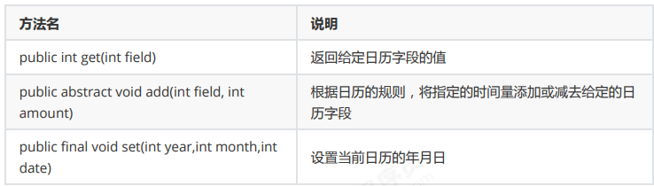
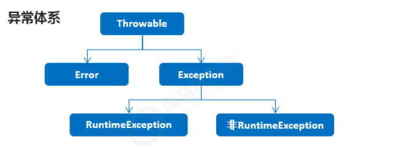
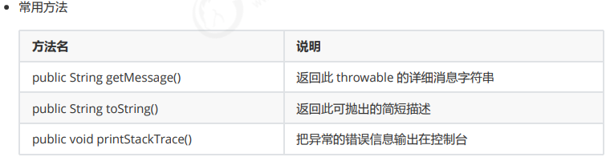
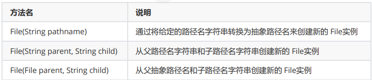
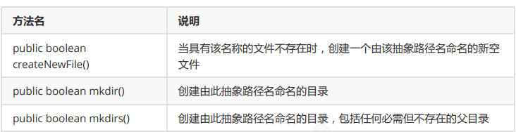
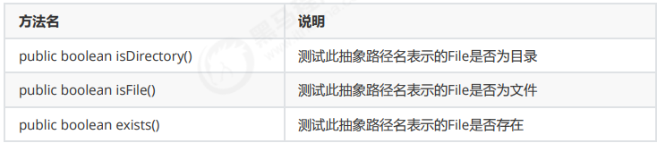
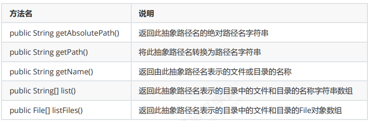
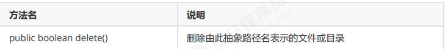
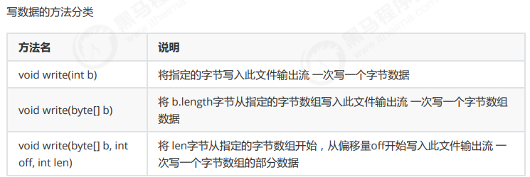

# java基础语法


main+回车

输出：sout+回车    "".sout+回车


## 类型转换

```java
package type;
public class TypeDemo1 {
    public static void main(String[] args) {
        byte a=20;
        int b=a;
        System.out.println(a);
        System.out.println(b);
    }
}
```


## 运算符


能算则算，不能算就在一起


输入：

```java
Scanner sc=new Scanner(System.in);
int age=sc.nextInt();
```

### 案例

```java
package type;
import java.util.Scanner;
public class ScannerDemo {
    public static void main(String[] args) {
        Scanner sc=new Scanner(System.in);
        System.out.println("请输入年龄");
        int age=sc.nextInt();
        System.out.println("年龄是" + age);
        System.out.println("请输入名称");
        String name=sc.next();
        System.out.println("欢迎" + name);
    }
}
```

## 分支结构


## 循环


### Random类使用

```java
package project;
import java.util.Random;

public class RandomDemo {
    public static void main(String[] args) {
//        学会使用java提供的Random类
        Random r=new Random();
        for (int i=0;i<10;i++) {
            int data=r.nextInt(10);
            System.out.println(data);
        }
    }
}
```

### 猜数字

```java
package project;
import java.util.Random;
import java.util.Scanner;
/*
需求：
 随机生成一个1-100之间的数据，提示用户猜测，猜大提示过大，猜小提示过小，直到猜中结束游戏。
分析：
① 随机生成一个1-100之间的数据
② 使用死循环让用户不断提示用户猜测，猜大提示过大，猜小提示过小，猜中结束游戏。
 */
public class caishuzi {
    public static void main(String[] args) {
        Random number=new Random();
        int data=number.nextInt(100)+1;
        Scanner sc=new Scanner(System.in);
        while(true)
        {
            System.out.println("输入数据");
            int num=sc.nextInt();
            if(num>data)
            {
                System.out.println("过大");
            }
            else if(num<data)
            {
                System.out.println("过小");
            }
            else
            {
                System.out.println("正确");
                break;
            }
    }
    }
}
```

## 数组


## 方法


引用类型的数组传递都是实参传的引用

# 面向对象


一个java文件中可以定义多个class类，且只能一个类是public修饰，而且public修饰的类名必须成为代码文件名。实际开发建议一个文件定义一个class类。


this.name=name;

this.price=price;

用于赋值

## API


## 继承：

格式：public class 子类名 extends 父类名（）

class Dog extends Animal{}

好处：类与类之间产生关系，子父类关系，产生子父类后，子类则可以使用父类中非私有的成员

**this代表本类对象的引用**

**super代表父类对象的引用**

this.成员变量 访问本类成员变量

super.成员变量 访问父类成员变量

this.成员方法 访问本类成员方法

super.成员方法 访问本类成员方法

构造方法：

this(...) 访问本类构造方法

super(...)访问父类构造方法

注意：子类所有构造方法默认都会访问父类无参构造方法

如果父类没有无参构造方法，只有带参构造方法

1.通过使用super关键字去显式的调用父类的带参构造方法

2.在父类中自己提供一个无参构造方法

### 方法重写

子类出现了和父类中一模一样的方法声明

方法重写应用场景

当子类需要父类的功能，而功能主体子类有自己特有内容时，可以重写父类的方法

Override注解

用来检测当前方法是否重写了方法

注意：私有方法不能被重写

子类方法访问权限不能更低（声明的时候不能把原来父类的public改为private

### 注意事项

java只支持单继承，不支持多继承

java支持多层继承

## 权限修饰符


## final关键字

可修饰成员方法（方法不能被重写），成员变量（该变量是一个常量，不能再次赋值），类（该类不能被继承，不能有子类，可以有父类）

```java
public final int age=20;//无法修改
```

final修饰指的是引用类型的地址值不能发生改变，但是地址里面的内容是可以发生改变的

```java
public static void main(String[] args){
    final Student s=new Student(23);
    s=new Student(24)//错误
    s.setAge(24);//正确
}
```

## static

静态，可以修饰成员方法，成员变量

特点：被类的所有对象共享，可以通过类名调用，可以通过对象名调用

访问特点：非静态成员方法：能访问静态成员变量，非静态成员变量，静态成员方法，非静态成员方法

静态成员方法：能访问静态成员变量，静态成员方法

## 多态

同一个对象，不同时刻表现出来的不同形态

前提：要有继承或实现关系，要有方法的重写，要有父类引用指向子类对象

```
Animal a = new Cat();
```

多态中成员访问特点：

成员变量：编译看父类，运行看父类

成员方法：编译看父类，运行看子类

### 多态的 转型

向上转型 父类引用指向子类对象就是向上转型 

向下转型 格式：子类型 对象名 = (子类型)父类引用

```java
//向下转型
Cat c = (Cat)a;
c.eat();
c.playGame();
```

## 抽象类

子类共性功能提取的时候，有些方法在父类中并没有具体的体现，这个时候就需要抽象类了

抽象类的特点

```java
//抽象类的定义
public abstract class 类名{}
//抽象方法的定义
public abstract voud eat();
```

抽象类中不一定有抽象方法，有抽象方法的类一定是抽象类

抽象类不能实例化，只能通过子类对象实例化，这叫做抽象类多态

抽象类的子类要么重写抽象类中的所有抽象方法，要么是抽象类

### 抽象类的成员特点

成员特点：成员变量可以是变量也可以是常量，构造方法可以有参可以无参，成员方法可以是抽象方法可以是普通方法

## 接口

接口关键词interface

```java
public interface 接口名{}
//类实现接口用implements
public class 类名 implements 接口名{}
```

接口通过实现类对象实例化

多态的形式：具体类多态，抽象类多态，接口多态

接口的子类：要么重写接口中所有的抽象方法，要么子类也是抽象类

接口的成员特点：

成员变量只能是常量，默认修饰符：public static final

没有构造方法，接口主要是扩展功能的，没有具体存在

成员方法，只能是抽象方法，默认修饰符：public abstract

```java
public class InterImpl extends Object implements Inter {}
```

继承物类，实现接口。

## 参数传递补day3

## 常用api

### math

math类常用方法

求绝对值，向上取整，向下取整，四舍五入，求最大值，求最小值，求a的b次幂，返回随机数

### System

exit，currentTimeMillis

### int和String类型相互转换

int转String

```java
String s1 = number + "";
String s2 = String.valueof(number);
```

String转int

```java
Integer i = Integer.valueOf(s);
int x = i.intValue();

int y=Integer.parseInt(s);
```

### Date类

Date代表了一个特定的时间，精确到毫秒

getTime()

setTime()

### SimpleDateFormat类

### Calendar类



## 异常



Error:严重问题,不需要处理

Exception:成为异常类,他表示程序本身可以处理的问题

RuntimeException:在编译器是不检查的,出现问题后需要我们回来修改代码

非RuntimeException:编译期就必须处理,否则程序不能通过编译,就更不能正常运行了

### JVM默认处理异常的方式

如果程序出现了问题,我们没有做任何处理,最终JVM会做默认的处理,有两个步骤:

把异常的名称,错误的原因及异常出现的位置等信息输出在控制台

程序停止执行

### try-catch方式处理异常

```
try {
可能出现异常的代码;
} catch(异常类名 变量名) {
异常的处理代码;
}
```

执行流程:程序从 try 里面的代码开始执行,出现异常就会跳转到对应的 catch里面去执行,执行完毕之后,程序还可以继续往下执行

### Throwable成员方法



### 编译和运行时的异常区别

编译:都是Exception类及其子类;必须显示处理,否则程序就会发生错误,无法通过编译

运行:都是RuntimeException类及其子类;无需显示处理,也可以和编译时异常一样处理

## 集合


# File

File类:

它是文件和目录路径名的抽象表示,文件和目录是可以通过File封装成对象的,对应File而言,其封装的并不是一个真正存在的文件,仅仅是一个路径而已,它可以是存在的,也可以是不存在的,将来是要通过具体的操作把这个路径的内容转换为具体存在的

构造方法



```java
public class FileDemo01 {
public static void main(String[] args) {
//File(String pathname)：通过将给定的路径名字符串转换为抽象路径名来创建新的 File
实例。
File f1 = new File("E:\\itcast\\java.txt");
System.out.println(f1);
//File(String parent, String child)：从父路径名字符串和子路径名字符串创建新的
File实例。
File f2 = new File("E:\\itcast","java.txt");
System.out.println(f2);
//File(File parent, String child)：从父抽象路径名和子路径名字符串创建新的 File
实例。
File f3 = new File("E:\\itcast");
File f4 = new File(f3,"java.txt");
System.out.println(f4);
}
}
```



```java
public class FileDemo02 {
public static void main(String[] args) throws IOException {
//需求1：我要在E:\\itcast目录下创建一个文件java.txt
File f1 = new File("E:\\itcast\\java.txt");
System.out.println(f1.createNewFile());
System.out.println("--------");
//需求2：我要在E:\\itcast目录下创建一个目录JavaSE
File f2 = new File("E:\\itcast\\JavaSE");
System.out.println(f2.mkdir());
System.out.println("--------");
//需求3：我要在E:\\itcast目录下创建一个多级目录JavaWEB\\HTML
File f3 = new File("E:\\itcast\\JavaWEB\\HTML");
// System.out.println(f3.mkdir());
System.out.println(f3.mkdirs());
System.out.println("--------");
//需求4：我要在E:\\itcast目录下创建一个文件javase.txt
File f4 = new File("E:\\itcast\\javase.txt");
// System.out.println(f4.mkdir());
System.out.println(f4.createNewFile());
}
}
```

## File类判断和获取功能

判断



获取功能



 

```java
public class FileDemo04 {
public static void main(String[] args) {
//创建一个File对象
File f = new File("myFile\\java.txt");
// public boolean isDirectory()：测试此抽象路径名表示的File是否为目录
// public boolean isFile()：测试此抽象路径名表示的File是否为文件
// public boolean exists()：测试此抽象路径名表示的File是否存在
System.out.println(f.isDirectory());
System.out.println(f.isFile());
System.out.println(f.exists());
// public String getAbsolutePath()：返回此抽象路径名的绝对路径名字符串
// public String getPath()：将此抽象路径名转换为路径名字符串
// public String getName()：返回由此抽象路径名表示的文件或目录的名称
System.out.println(f.getAbsolutePath());
System.out.println(f.getPath());
System.out.println(f.getName());
System.out.println("--------");
// public String[] list()：返回此抽象路径名表示的目录中的文件和目录的名称字符串数
组
// public File[] listFiles()：返回此抽象路径名表示的目录中的文件和目录的File对象
数组
File f2 = new File("E:\\itcast");
String[] strArray = f2.list();
for(String str : strArray) {
System.out.println(str);
}
System.out.println("--------");
File[] fileArray = f2.listFiles();
for(File file : fileArray) {
// System.out.println(file);
// System.out.println(file.getName());
if(file.isFile()) {
System.out.println(file.getName());
		}
		}
	}
}

```

## File类删除功能



绝对路径和相对路径的区别 

绝对路径：完整的路径名，不需要任何其他信息就可以定位它所表示的文件。例如：E:\itcast\java.txt 

相对路径：必须使用取自其他路径名的信息进行解释。例如：myFile\java.txt

```java
public class FileDemo03 {
public static void main(String[] args) throws IOException {
// File f1 = new File("E:\\itcast\\java.txt");
//需求1：在当前模块目录下创建java.txt文件
File f1 = new File("myFile\\java.txt");
// System.out.println(f1.createNewFile());
//需求2：删除当前模块目录下的java.txt文件
System.out.println(f1.delete());
System.out.println("--------");
//需求3：在当前模块目录下创建itcast目录
File f2 = new File("myFile\\itcast");
// System.out.println(f2.mkdir());
//需求4：删除当前模块目录下的itcast目录
System.out.println(f2.delete());
System.out.println("--------");
//需求5：在当前模块下创建一个目录itcast,然后在该目录下创建一个文件java.txt
File f3 = new File("myFile\\itcast");
System.out.println(f3.mkdir());
File f4 = new File("myFile\\itcast\\java.txt");
System.out.println(f4.createNewFile());
//需求6：删除当前模块下的目录itcast
System.out.println(f4.delete());
System.out.println(f3.delete());
}
}
```

```java
//应用
import java.io.File;

public class FileDemo3 {
    public static void main(String[] args) {
        File srcFile=new File("E:\\OneDrive - cumt.edu.cn");
        getAllFilePath(srcFile);
    }
    public static void getAllFilePath(File srcFile){
        File[] files = srcFile.listFiles();
        if (files!=null){
            for (File file : files) {
                if(file.isDirectory()){
                    getAllFilePath(file);
                }else{
                    System.out.println(file.getAbsolutePath());
                }
            }
        }
    }
}
```

## IO流

IO流的分类 

按照数据的流向 

输入流：读数据 

输出流：写数据 

按照数据类型来分 

字节流: 字节输入流 字节输出流 

字符流: 字符输入流 字符输出流

如果数据通过Windows自带的记事本软件打开,还能读懂里面的内容,就使用字符流,否则使用字节流,如果不知道那种类型的流,就使用字节流

### 字节流写数据

字节流抽象基类

InputStream：这个抽象类是表示字节输入流的所有类的超类

OutputStream：这个抽象类是表示字节输出流的所有类的超类

子类名特点：子类名称都是以其父类名作为子类名的后缀

字节输出流

FileOutputStream(String name)：创建文件输出流以指定的名称写入文件

使用字节输出流写数据的步骤

1.创建字节输出流对象(调用系统功能创建了文件,创建字节输出流对象,让字节输出流对象指向文件)

2.调用字节输出流对象的写数据方法

3.释放资源(关闭此文件输出流并释放与此流相关联的任何系统资源)

```java
import java.io.FileNotFoundException;
import java.io.FileOutputStream;
import java.io.IOException;

public class FileOutputStreamDemo {
    public static void main(String[] args) throws IOException {
        //创建字节输出流对象
        FileOutputStream fos=new FileOutputStream("fos.txt");
        /*
        * 调用系统功能创建了文件
        * 创建了字节输出流对象
        * 让字节输出流对象指向创建好的文件
        * */
        fos.write(97);
/*        fos.write(57);
        fos.write(55);*/
        //最后都要释放资源
        fos.close();//关闭此文件输出流并释放与此流相关联的任何系统资源
    }
}
```

### 字节流写数据的三种方式



```java
public class FileOutputStreamDemo02 {
public static void main(String[] args) throws IOException {
//FileOutputStream(String name)：创建文件输出流以指定的名称写入文件
FileOutputStream fos = new FileOutputStream("myByteStream\\fos.txt");
//new File(name)
// FileOutputStream fos = new FileOutputStream(new
File("myByteStream\\fos.txt"));
//FileOutputStream(File file)：创建文件输出流以写入由指定的 File对象表示的文件
// File file = new File("myByteStream\\fos.txt");
// FileOutputStream fos2 = new FileOutputStream(file);
// FileOutputStream fos2 = new FileOutputStream(new
File("myByteStream\\fos.txt"));
//void write(int b)：将指定的字节写入此文件输出流
// fos.write(97);
// fos.write(98);
// fos.write(99);
// fos.write(100);
// fos.write(101);
// void write(byte[] b)：将 b.length字节从指定的字节数组写入此文件输出流
// byte[] bys = {97, 98, 99, 100, 101};
//byte[] getBytes()：返回字符串对应的字节数组
byte[] bys = "abcde".getBytes();
// fos.write(bys);
//void write(byte[] b, int off, int len)：将 len字节从指定的字节数组开始，从
偏移量off开始写入此文件输出流
// fos.write(bys,0,bys.length);
fos.write(bys,1,3);
//释放资源
fos.close();
}
}
```

