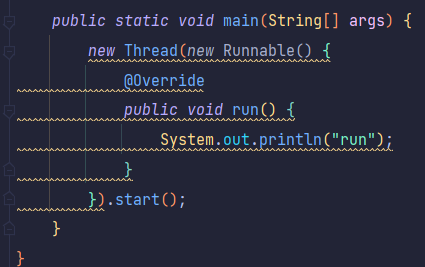

# 函数式编程

## Lambda表达式

基本格式

```java
(参数列表)->{代码}
```




### 省略规则

参数类型可以省略,方法体只有一句代码时大括号return和唯一一句代码的分号可以省略,方法只有一个参数时小括号可以省略,Alt+Enter

## Stream流

Java8的Stream使用的是函数式编程模式，如同它的名字一样，它可以被用来对集合或数组进行链状流式的操作。可以更方便的让我们对集合或数组操作。


ke'yi'kan


### 中间操作

filter:对流中的元素进行条件过滤,符合过滤条件的才能继续留在流中


map:把对流中的元素进行计算或转换


distinct:去除流中的重复元素


sorted:对流中的元素进行排序


limit:设置流的最大长度,超出的部分将被抛弃

skip:跳过流中的前n个元素,返回剩下的元素

flatMap:flatMap可以把一个对象转换成多个对象作为流中的元素

### 终结操作

forEach:对流中的元素进行遍历操作,通过出啊如的参数取指定对遍历到的元素进行什么具体操作

count:获取当前流中元素的个数

max&min:获得流中的最值

collect:把当前流转换成一个集合

anyMatch:用来判断是否有任意符合匹配条件的元素,结果为bollean类型

allMatch:用来判断是否都符合匹配条件,结果为boolean类型,如果都符合为true,否则为false

noneMatch:判断流中的元素是否都不符合匹配条件,如果都不符合结果为true,否则为false

findAny:获取流中的任意一个元素,该方法没有办法保证获取的一定是流中的第一个元素

findFirst:获取流中的第一个元素

reduce归并:对流中的数据按照指定的计算方式计算出一个结果

### 注意

- 惰性求值（如果没有终结操作，没有中间操作是不会得到执行的）
- 流是一次性的（一旦一个流对象经过一个终结操作后。这个流就不能再被使用）
- 不会影响原数据（我们在流中可以多数据做很多处理。但是正常情况下是不会影响原来集合中的元素的。这往往也是我们期望的）

