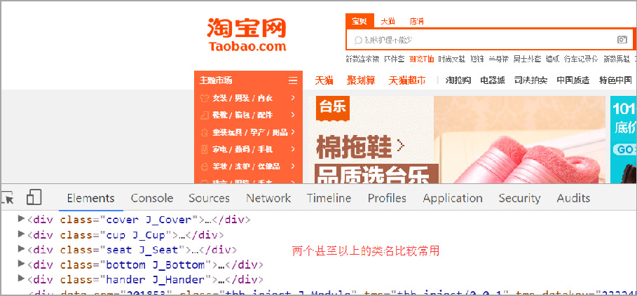
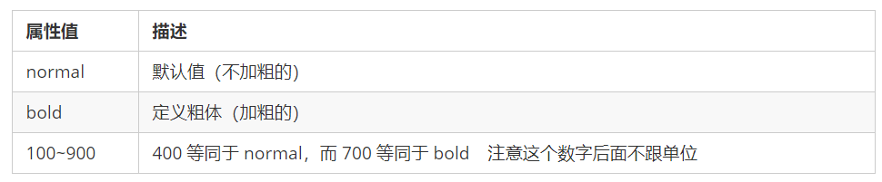

# 前端

HTML 指的是超文本标记语言 (Hyper Text Markup Language) ，它是用来描述网页的一种语言。HTML 不是一种编程语言，而是一种标记语言 (markup language)。 标记语言是一套标记标签 (markup tag)。


# html标签

1. HTML 标签是由尖括号包围的关键词，例如 <html>。
2.  HTML 标签通常是成对出现的，例如  <html>和 </html> ，我们称为双标签。标签对中的第一个标签是 开始标签，第二个标签是结束标签。
3.   有些特殊的标签必须是单个标签（极少情况），例如 <br/>称为单标签。 

双标签关系可以分为两类：包含关系和并列关系。

```html
<head>
    <title></title>
</head>
```

```html
<head></head>
<body></body>
```


```html
<!DOCTYPE html>
<html lang="en">
<head>
    <meta charset="UTF-8">
    <title>第一个页面</title>
</head>
<body>
    lalala
</body>
</html>
```

```
<!DOCTYPE html>
```

1. 声明位于文档中的最前面的位置，处于  标签之前。

2.   不是一个 HTML 标签，它就是 文档类型声明标签。

   ```html
   <html lang="en">
   ```

   

 告诉浏览器或者搜索引擎这是一个英文网站. 本页面采取英文来显示.

标题标签 

### 标题标签< h1 > - < h6 >

```html
<!DOCTYPE html>
<html lang="en">
<head>
    <meta charset="UTF-8">
    <title>Title</title>
</head>
<body>
    <h1>标题标签</h1>
    <h1>标题一共六级选,</h1>
    <h2>文字加粗一行显。</h2>
    <h3>由大到小依次减，</h3>
    <h4>从重到轻随之变。</h4>
    <h5>语法规范书写后，</h5>
    <h6>具体效果刷新见。</h6>
</body>
</html>
```

### 段落和换行

```html
<p>  </p>
<br />
```

### 文本格式化标签

在网页中，有时需要为文字设置粗体、斜体 或下划线等效果，这时就需要用到 HTML 中的文本格式化标签，使文字以特殊的方式显示。


### div和span标签

 <div> 和 <span> 是没有语义的，它们就是一个盒子，用来装内容的。

```
 <div> 和 <span> 是没有语义的，它们就是一个盒子，用来装内容的。
```

```
 1. <div> 标签用来布局，但是现在一行只能放一个<div>。 大盒子
 2. <span> 标签用来布局，一行上可以多个 <span>。小盒子
```

### 图像标签和路径

  在 HTML 标签中， 标签用于定义 HTML 页面中的图像。

```html

```


图像标签注意点：
        1.图像标签可以拥有多个属性，必须写在标签名的后面。
        2.属性之间不分先后顺序，标签名与属性、属性与属性之间均以空格分开。
        3.属性采取键值对的格式，即 key=“value" 的格式，属性 =“属性值”。


绝对路径：
是指目录下的绝对位置，直接到达目标位置，通常是从盘符开始的路径。或完整的网络地址“http://www.itcast.cn/images/logo.gif”。

### 链接标签

```html
<a href="跳转目标" target="目标窗口的弹出方式">文本或图像</a>
```


> 连接分类
>
> 外部链接，内部链接，空连接，下载链接，网页元素链接，锚点链接

### 注释和特殊字符

HTML中的注释以<!--开头，以-->结束。

快捷键: ctrl + /


重点记住：空格 、大于号、 小于号 这三个， 其余的使用很少，如果需要回头查阅即可。

## 综合案例

```html
<!DOCTYPE html>
<html lang="en">
<head>
    <meta charset="UTF-8">
    <title>demo</title>
</head>
<body>
<h1>圣诞节的那些事</h1>
1.圣诞是怎样由来的<br>
2.<a href="#oldman">圣诞老人的由来</a><br>
3.<a href="#tree">圣诞树的由来</a><br>
<h2>圣诞是怎样由来的</h2>

<p>圣诞节是基督教世界最大的节日。一般认为12月25日作为圣诞节可能开始于公元336年的罗马教会。4世纪初，1月6日是罗马帝国东部各教会纪念耶稣降生和受洗的双重节日，即上帝通过耶稣向世人显示自己。 这一天又是罗马历书的冬至节，意味着万物复苏的开始。可能由于这个原因，罗马教会才选择这一天作为圣诞节。后来，因为各地教会使用的历书不同，具体日期不能统一，于是就把12月24日到第二年的1月6日定为圣诞节节期（Christmas Tide），各地教会可以根据当地具体情况在这段节期之内庆祝圣诞节。 在欧美许多国家里，人们非常重视这个节日，把它和新年连在一起，而庆祝活动之热闹与隆重大大超过了新年，成为一个全民的节日。12月24日平安夜、12月25日圣诞节的主要纪念活动都与耶稣降生的传说有关 。
</p>


<h2 id="oldman">圣诞老人的由来</h2>

<p>圣诞节当然少不了<a href="oldman.html" target="_blank">圣诞老人</a>根据圣经记载，书中并没有提起这一号人物。到底他是如何成为圣诞的主角之一呢？</p>


<p>相传在一千六百多年前，荷兰巴里地方有一个老人，名叫尼古拉斯，他一生最爱帮助贫穷的人家。其中有一次他帮助三个贫穷的少女，送她们三袋金子以逃过被卖的不幸。
</p>

<p>到了一八二二年，由荷兰传教士把这位伟大慈善家的故事传到美国，装扮圣诞老人渐渐地流行于世界各国。根据调查，以上故事还有下文；当尼古拉斯偷偷把其中一袋金子送给其中一名女子时，他把金子从其中一个窗户扔进去，恰好掉进晾在壁炉上的一只长袜中。于是，将礼物放在圣诞袜子的送礼方法便传到至今。
</p>


<p>在平安夜里，孩子总会把一双双色彩缤纷的袜子挂在床头，然后在袜子旁边放杯热牛奶让圣诞老人喝，以让劳苦功高的圣诞老人解渴，并送份大礼给自己。?
</p>


<h2 id="tree">圣诞树的由来</h2>

<p>圣诞一直是庆祝圣诞节不可少的装饰物，如果家中没有圣诞树，就大大减少了过节气氛。关于圣诞树的来源有多种不同的传说。
</p>
<p>其中一个是说：大约在十六世纪，圣诞树最先出现在德国，德国人把长青的松柏枝拿到屋中去摆设，将之成为圣诞树。后来，由德国人马丁路德把蜡烛放在树林中的枞树枝，然后点燃蜡烛，使它看起来像是引导人们到伯利恒去。而近今日，人们已经改用粉色的小灯泡了。
</p>


<p>另一个传说记载。在很久以前，曾有一位农民，在圣诞节那天遇到一个穷苦小孩，他热情地接待了这个儿童。儿童临走时折下一根松枝插在地上，松枝立即变成一棵树，上面都挂满礼物，以答谢农民的好意。
</p>
<p>圣诞树真正出现在圣诞节时，首先见于德国，之后又传入欧洲和美国，并以其优美的姿态，成为圣诞节不可缺少的装饰。圣诞树的种类繁多，有天然松柏圣诞树、也有人造圣诞树及白色圣诞树。
</p>


<p>每棵圣诞树上都挂满琳琅满目的装饰品，但每棵树的顶端必定有个特大的星星，象征三博士跟随该星而找到耶稣，而且也只有该家庭的一家之主可以把这棵希望之星挂上。
</p>

<p>更多内容可以<a href="http://www.baidu.com" target="_blank">百度一下</a></p>
</body>
</html>
```

```html
<!DOCTYPE html>
<html lang="en">
<head>
    <meta charset="UTF-8">
    <title>Title</title>
</head>
<body>
<h1>圣诞老人 （西方文化的传说人物）</h1>
<p>圣诞老人（Santa Claus）别称Saint Nick、Kris Kringle、Father Christmas或Santa（爱尔兰英语的Santy），一位专门在圣诞节前夜时悄悄赠送礼物给小孩子的神秘人物，是节日主题的代表角色之一。他普遍被认为是基督教的圣人圣·尼古拉斯（Saint Nicholas）的衍生形象。 传说每到12月24日晚上，有个神秘人会乘驾由9只驯鹿拉的雪橇在天上飞翔，挨家挨户地从烟囱进入屋里，然后偷偷把礼物放在好孩子床头的袜子里，或者堆在壁炉旁的圣诞树下。他在一年中的其他时间里，都是忙于制作礼物和监督孩子们的行为。 虽然没有人真的见过神秘人的样子，但是人们会装扮成他的样子来给孩子送上礼物。他通常被描述为一位老人，头戴红色帽子，大大的白色胡子，一身红色棉衣，脚穿红色靴子的样子，拿着装有礼物的大袋子，因为总在圣诞节前夜出现派发礼物，所以习惯地称他为“圣诞老人”。
</p>

</body>
</html>
```

### 表格标签

表格主要用于显示、展示数据，因为它可以让数据显示的非常的规整，可读性非常好。特别是后台展示数据 的时候，能够熟练运用表格就显得很重要。一个清爽简约的表格能够把繁杂的数据表现得很有条理。

表格的基本语法

```html
<table>
 <tr>
 <td>单元格内的文字</td>
 ...
 </tr>
 ...
</table>
```

一般表头单元格位于表格的第一行或第一列，表头单元格里面的文本内容加粗居中显示.

表头单元格<th></th>内容居中加粗


```html
<!DOCTYPE html>
<html lang="en">
<head>
    <meta charset="UTF-8">
    <title>Title</title>
</head>
<body>
<table align="center">
    <tr>  <td>姓名</td> <td>性别</td> <td>年龄</td> </tr>
    <tr>  <td>111</td> <td>女</td> <td>18</td> </tr>
</table>
</body>
</html>
```

表格结构标签：<thead>标签 表格的头部区域、<tbody>标签 表格的主体区域,表示更好的语义

合并单元格：

跨行合并：rowspan="合并单元格的个数"

跨列合并：colspan="合并单元格的个数"

目标单元格：跨行写在最上方单元格，跨列写在最左侧单元格

```html
<td rowspan="2"></td>
```

### 列表标签

#### 无序列表

-  <ul>标签表示 HTML 页面中项目的无序列表，一般会以项目符号呈现列表项，而列表项使用 <li>

```c++
<ul>
 <li>列表项1</li>
 <li>列表项2</li>
 <li>列表项3</li>
 ...
</ul>
```

1.无序列表的各个列表项之间没有顺序级别之分，是并列的。

2.<ul></ul>只能嵌套<li></li>

3.<li>与</li>之间相当于一个容器，可以容纳所有元素

#### 有序列表

```html
<ol>
 <li>列表项1</li>
 <li>列表项2</li>
 <li>列表项3</li>
 ...
</ol>
```

#### 自定义列表

在html标签中,<dl>标签用于定义描述列表（或定义列表），该标签会与<dt>（定义项目/名字）和<dd>（描述每一个项目/名字）

```html
<dl>
 <dt>名词1</dt>
 <dd>名词1解释1</dd>
 <dd>名词1解释2</dd>
</dl>
```

### 表单标签

#### 表单域

包含表单元素的区域

```html
<form action>="url地址" method="提交方式" name="表单域名称"
    各种表单元素控件
</form>
```

#### 表单

在表单域种可以定义各种表单元素,这些表单元素就是允许用户在表单种输入或者选择的内容控件

#### <input>标签

```html
<input type="属性值" />
```


```html
<!DOCTYPE html>
<html lang="en">
<head>
    <meta charset="UTF-8">
    <title>Title</title>
</head>
<body>
    <form>
        用户名:<input type="text"> <br>
<!--        密码框-->
        密码:<input type="password">
    </form>
</body>
</html>
```

按钮属性

```html
性 别:
<input type="radio" name="sex" value="男" checked="checked" />男
<input type="radio" name="sex" value="女" />女
```

单选按钮有相同的name才可以实现单选

单选按钮和复选按钮可以设置默认checked属性,打开页面就可以默认选中这个按钮


#### <label>标签

 <label>标签为 input 元素定义标注（标签）。<label> 标签用于绑定一个表单元素, 当点击 <label>标签内的文本时，浏览器就会自动将焦点(光标)转到或者 选择对应的表单元素上,用来增加用户体验

```html
<!DOCTYPE html>
<html lang="en">
<head>
    <meta charset="UTF-8">
    <title>Title</title>
</head>
<body>
    <form>
        <label for="text">用户名:</label> <input type="text"id="text">
        <input type="radio" id="nan"> <label for="nan">男</label>
    </form>
</body>
</html>
```

"<select>"标签

```
<body>
    籍贯:
<select>
    <option>1</option>
    <option>2</option>
    <option selected="selected">3</option>
</select>
</body>
```

"<textarea>"标签

```html
<textarea rows="3" cols="20">
 文本内容
</textarea>
```

通过  <textarea>标签可以轻松地创建多行文本输入框。\cols=“每行中的字符数” ，rows=“显示的行数”，我们在实际开发中不会使用，都是用 CSS 来改变大小。

### 综合案例

```html
<!DOCTYPE html>
<html lang="en">
<head>
    <meta charset="UTF-8">
    <meta http-equiv="X-UA-Compatible" content="IE=edge">
    <meta name="viewport" content="width=device-width, initial-scale=1.0">
    <title>Document</title>
</head>
<body>
    <h4>阿巴阿巴</h4>
    <table width="500">
        <!-- 第一行 -->
        <tr>
            <td>性别:</td>
            <td>
                <input type="radio" name="sex" id="nan"><label for="nan"> 男</label>
                <input type="radio"name="sex" id="nv"> <label for="nv"> 女</label>
        
            </td>
        </tr>
        <!-- 第二行 -->
        <tr>
            <td>生日</td>
            <td>
                <select>
                    <option>--请选择年份</option>
                    <option>2001</option>
                    <option>2002</option>
                    <option>2003</option>
                </select>
                <select>
                    <option>--请选择月份</option>
                    <option>1</option>
                    <option>2</option>
                    <option>3</option>
                    <option>4</option>
                    <option>5</option>
                    <option>6</option>
                    <option>7</option>
                    <option>8</option>
                    <option>9</option>
                    <option>10</option>
                    <option>11</option>
                    <option>12</option>
                </select>
                <select>
                    <option>--请选择日</option>
                    <option>1</option>
                    <option>2</option>
                    <option>3</option>
                    <option>4</option>
                    <option>5</option>
                    <option>6</option>
                    <option>7</option>
                    <option>8</option>
                    <option>9</option>
                    <option>10</option>
                    <option>11</option>
                    <option>12</option>
                    <option>13</option>
                    <option>14</option>
                    <option>15</option>
                    <option>16</option>
                    <option>17</option>
                    <option>18</option>
                    <option>19</option>
                    <option>20</option>
                    <option>21</option>
                    <option>22</option>
                    <option>23</option>
                    <option>24</option>
                    <option>25</option>
                    <option>26</option>
                    <option>27</option>
                    <option>28</option>
                    <option>29</option>
                    <option>30</option>
                    <option>31</option>

                </select>
            </td>
        </tr>
        <!-- 第三行 -->
        <tr>
            <td>所在地区</td>
            <td><input type="text" value="请输入地区"></td>
        </tr>
        <!-- 第四行 -->
        <tr>
            <td>
                婚姻状况
            </td>
            <td>
                <input type="radio" name="jiehun" id="weihun" checked="checked"><label for="weihun">未婚</label>
                <input type="radio" name="jiehun" id="yihun"><label for="yihun">已婚</label>
                <input type="radio" name="jiehun" id="lihun"><label for="lihun">离婚</label>
            </td>
        </tr>
        <!-- 第五行 -->
        <tr>
            <td>学历</td>
            <td><input type="text" value="博士后"></td>
        </tr>
        <!-- 第六行 -->
        <tr>
            <td>喜欢的类型:</td>
            <td><input type="checkbox" name="2"> 111 
            <input type="checkbox" name="2"> 222 
            <input type="checkbox" name="2"> 333 
            <input type="checkbox" name="2"> 444 
            <input type="checkbox" name="2"> 555 </td>
        </tr>
        <!-- 第七行 -->
        <tr>
            <td>个人介绍</td>
            <td>
                <textarea>个人简介</textarea>
            </td>
        </tr>
        <!-- 第八行 -->
        <tr>
            <td></td>
            <td>
                <input type="submit" value="免费注册">
            </td>
        </tr>
        <!-- 第九行 -->
        <tr>
            <td></td>
            <td>
                <input type="checkbox" checked="checked">我同意注册条款
            </td>
        </tr>
        <!-- 第十行 -->
        <tr>
            <td></td>
            <td>
                <a herf="#">立刻登录</a>
            </td>
        </tr>
        <!-- 第十一行 -->
        <tr>
            <td></td>
            <td>
                <h5>我承诺</h5>
                <ul>
                    <li>
                        年满十八岁
                    </li>
                    <li>
                        阿巴阿巴
                    </li>
                    <li>
                        1111
                    </li>
                </ul>
            </td>
        </tr>
    </table>
</body>
</html>
```

### 查阅文档

##css第一天总结
###css简介
    CSS 是层叠样式表 ( Cascading Style Sheets ) 的简称.
    有时我们也会称之为 CSS 样式表或级联样式表。
    CSS 是也是一种标记语言
    CSS 主要用于设置 HTML 页面中的文本内容（字体、大小、对齐方式等）、图片的外形（宽高、边框样式、边距等）以及版面的布局和外观显示样式。
    CSS 让我们的网页更加丰富多彩，布局更加灵活自如。简单理解：CSS 可以美化 HTML , 让 HTML 更漂亮， 让页面布局更简单。
    CSS 最大价值: 由 HTML 专注去做结构呈现，样式交给 CSS，即 结构 ( HTML ) 与样式( CSS ) 相分离


# css语法规范

​    1.使用 HTML 时，需要遵从一定的规范，CSS 也是如此。要想熟练地使用 CSS 对网页进行修饰，首先需要了解CSS 样式规则。
​    2.CSS 规则由两个主要的部分构成：选择器以及一条或多条声明。


 1.选择器是用于指定 CSS 样式的 HTML 标签，花括号内是对该对象设置的具体样式
 2.属性和属性值以“键值对”的形式出现
 3.属性是对指定的对象设置的样式属性，例如字体大小、文本颜色等
 4.属性和属性值之间用英文“:”分开
 5.多个“键值对”之间用英文“;”进行区分
 例如：
    所有的样式，都包含在 <style> 标签内，表示是样式表。<style> 一般写到 </head> 上方
    <head>
        <style>
            h4 {
                color: blue;
                font-size: 100px;
            }
        </style>
    </head>

### css代码风格：

    1. 样式格式书写
        1.紧凑格式   
            h3 { color: deeppink;font-size: 20px;}
        2.展开格式   
         h3 {
            color: pink;
            font-size: 20px;    
         }
        强烈推荐第二种格式， 因为更直观。
        2. 样式大小写风格
        1.小写格式
                h3 {
                color: pink;
                }
        2.大写格式
                  H3 {
                COLOR: PINK;   
                }
            强烈推荐样式选择器，属性名，属性值关键字全部使用小写字母，特殊情况除外。
            3. 样式空格风格
        1. h3 {
            color: pink;    
        }
        属性值前面，冒号后面，保留一个空格
        选择器（标签）和大括号中间保留空格
###css选择器的作用
        答：选择器(选择符)就是根据不同需求把不同的标签选出来这就是选择器的作用。  简单来说，就是选择标签用的。
​    
        找到所有的 h1 标签。  选择器（选对人）
        设置这些标签的样式，比如颜色为红色（做对事）。
##css基础选择器

基础选择器又包括：标签选择器、类选择器、id 选择器和通配符选择器

### 标签选择器：

​    标签选择器（元素选择器）是指用 HTML 标签名称作为选择器，按标签名称分类，为页面中某一类标签指定统一的 CSS 样式。
语法：
​    标签选择器{
​        属性：属性值
​        ...
​    }
作用：
​    标签选择器（元素选择器）是指用 HTML 标签名称作为选择器，按标签名称分类，为页面中某一类标签指定统一的 CSS 样式。

### 类选择器

​    如果想要差异化选择不同的标签，单独选一个或者某几个标签，可以使用类选择器.
语法：
​    .类名 {
​        属性1: 属性值1;  
​        ...
​    } 
​    结构需要用class属性来调用  class  类的意思
​     <div class="类名"> 变红色 </div>
​    1.如果想要差异化选择不同的标签，单独选一个或者某几个标签，可以使用类选择器。
​    2.类选择器在 HTML 中以 class 属性表示，在 CSS 中，类选择器以一个点“.”号显示。
​    3.类选择器使用“.”（英文点号）进行标识，后面紧跟类名（自定义，我们自己命名的）。
​    4.可以理解为给这个标签起了一个名字，来表示。
​    5.长名称或词组可以使用中横线来为选择器命名。
​    6.不要使用纯数字、中文等命名，尽量使用英文字母来表示。
​    7.命名要有意义，尽量使别人一眼就知道这个类名的目的。
​    8.命名规范：见附件（ Web 前端开发规范手册.doc）

### 多类名选择器

​    我们可以给一个标签指定多个类名，从而达到更多的选择目的。 这些类名都可以选出这个标签.
​    简单理解就是一个标签有多个名字. 


    多类名的具体使用：
        1. <div class="red font20">亚瑟</div>
    注意：
        1.在标签class 属性中写 多个类名
        2.多个类名中间必须用空格分开
        3.这个标签就可以分别具有这些类名的样式
###id选择器：
    id 选择器可以为标有特定 id 的 HTML 元素指定特定的样式。
    HTML 元素以 id 属性来设置 id 选择器，CSS 中 id 选择器以“#" 来定义。
    语法：
         #id名 {
            属性1: 属性值1;  
            ...
        } 
        注意：id 属性只能在每个 HTML 文档中出现一次

### id选择器和类选择器的区别：

​    1.类选择器（class）好比人的名字，一个人可以有多个名字，同时一个名字也可以被多个人使用。
​    2.id 选择器好比人的身份证号码，全中国是唯一的，不得重复。
​    3.id 选择器和类选择器最大的不同在于使用次数上。
​    4.类选择器在修改样式中用的最多，id 选择器一般用于页面唯一性的元素上，经常和 JavaScript 搭配使用。


### 通配符选择器：

​    语法：
​        * {
​            属性1: 属性值1;  
​            ...
​        }
​    通配符选择器不需要调用， 自动就给所有的元素使用样式
​    特殊情况才使用，后面讲解使用场景(以下是清除所有的元素标签的内外边距,后期讲)
​     * {
​            margin: 0;
​            padding: 0;
​        } 

### 选择器总结


## css字体属性:

### 字体大小：

​    CSS 使用 font-size 属性定义字体大小。 
语法：
​     p {  
​        font-size: 20px; 
​    }
​    1.px（像素）大小是我们网页的最常用的单位
​    2.谷歌浏览器默认的文字大小为16px
​    3.不同浏览器可能默认显示的字号大小不一致，我们尽量给一个明确值大小，不要默认大小
​    4.可以给 body 指定整个页面文字的大小

### 字体粗细：

​    CSS 使用 font-weight 属性设置文本字体的粗细。
语法：
​    p {  
​        font-weight: bold; 
​    }



1.学会让加粗标签（比如 h 和 strong 等) 不加粗，或者其他标签加粗
2.实际开发时，我们更喜欢用数字表示粗细

### 字体样式：

​    CSS 使用 font-style 属性设置文本的风格。
语法：
​    p {  
​        font-style: normal;
​    }


### 字体的综合写法

字体属性可以把以上文字样式综合来写, 这样可以更节约代码:

 body {   font: font-style  font-weight  font-size/line-height  font-family;}

使用 font 属性时，必须按上面语法格式中的顺序书写，不能更换顺序，并且各个属性间以空格隔开 不需要设置的属性可以省略（取默认值），但必须保留 font-size 和 font-family 属性，否则 font 属性将不起作用

### 字体总结：


## css文本属性：

### 文本颜色：

​    color 属性用于定义文本的颜色。
语法：
​    div { 
​        color: red;
​    }


开发中最常用的是十六进制

### 文本对齐：

text-align 属性用于设置元素内文本内容的水平对齐方式。
语法：
    div { 
        text-align: center;
    }


### 修饰文本：

​    语法：
​     div { 
​        text-decoration：underline；
​     }


重点记住如何添加下划线 ? 如何删除下划线 ? 其余了解即可.

### 文本缩进

语法：
    div { 
        text-indent：20px；
    }
    div { 
        text-indent：2em；
    }


    em 是一个相对单位，就是当前元素（font-size) 1 个文字的大小, 如果当前元素没有设置大小，则会按照父元素的 1 个文字大小。

### 行间距：

​    line-height 属性用于设置行间的距离（行高）。可以控制文字行与行之间的距离
语法：
​    p { 
​        line-height: 26px;
​    }
​    行高的文本分为 上间距  文本高度 下间距 = 行间距

## css样式表：

​    按照 CSS 样式书写的位置（或者引入的方式），CSS 样式表可以分为三大类： 

### 行内样式表（行内式）

​        行内样式表（内联样式表）是在元素标签内部的 style 属性中设定 CSS 样式。适合于修改简单样式.
​        语法：
​            <div style="color: red; font-size: 12px;">青春不常在，抓紧谈恋爱</div>
​        1.style 其实就是标签的属性
​        在双引号中间，写法要符合 CSS 规范
​        2.可以控制当前的标签设置样式
​        3.由于书写繁琐，并且没有体现出结构与样式相分离的思想，所以不推荐大量使用，只有对当前元素添加简单样式的时候，可以考虑使用
​        4.使用行内样式表设定 CSS，通常也被称为行内式引入

### 内部样式表（嵌入式）

​        内部样式表（内嵌样式表）是写到html页面内部. 是将所有的 CSS 代码抽取出来，单独放到一个 <style> 标签中
​        语法：
​            <style>
​                div {
​                color: red;
​                font-size: 12px;
​                }
​            </style>
​        1.<style> 标签理论上可以放在 HTML 文档的任何地方，但一般会放在文档的<head>标签中
​        2.通过此种方式，可以方便控制当前整个页面中的元素样式设置
​        3.代码结构清晰，但是并没有实现结构与样式完全分离
​        4.使用内部样式表设定 CSS，通常也被称为嵌入式引入，这种方式是我们练习时常用的方式
###外部样式表（链接式）
​    实际开发都是外部样式表. 适合于样式比较多的情况. 核心是:样式单独写到CSS 文件中，之后把CSS文件引入到 HTML 页面中使用.
​    引入外部样式表分为两步：
​    1. 新建一个后缀名为 .css 的样式文件，把所有 CSS 代码都放入此文件中。
​    2. 在 HTML 页面中，使用<link> 标签引入这个文件。
​    语法：
​        <link rel="stylesheet"  href="css文件路径">


## Chrome调试工具：


 1.Ctrl+滚轮 可以放大开发者工具代码大小。
 2.左边是 HTML 元素结构，右边是 CSS 样式。
 3.右边 CSS 样式可以改动数值（左右箭头或者直接输入）和查看颜色。
 4.Ctrl + 0 复原浏览器大小。
 5.如果点击元素，发现右侧没有样式引入，极有可能是类名或者样式引入错误。
 6.如果有样式，但是样式前面有黄色叹号提示，则是样式属性书写错误。

## emmet语法


Vscode 快速格式化代码: shift+alt+f

### 后代选择器


- 元素1 和 元素2 中间用空格隔开
- 元素1 是父级，元素2 是子级，最终选择的是元素2
- 元素2 可以是儿子，也可以是孙子等，只要是元素1 的后代即可
- 元素1 和 元素2 可以是任意基础选择器

### 子元素选择器


​		上述语法表示选择元素1 里面的所有直接后代(子元素) 元素2。


### 并集选择器

并集选择器可以选择多组标签, 同时为他们定义相同的样式，通常用于集体声明。并集选择器是各选择器通过英文逗号（,）连接而成，任何形式的选择器都可以作为并集选择器的一部分。


- 元素1 和 元素2 中间用逗号隔开
- 逗号可以理解为和的意思
- 并集选择器通常用于集体声明

约定：并集选择器习惯竖着写

最后一个选择器不需要加逗号

### 伪类选择器

伪类选择器用于向某些选择器添加特殊的效果，比如给链接添加特殊效果，或选择第1个，第n个元素。

链接伪类选择器

伪类选择器书写最大的特点是用冒号（:）表示，比如 :hover 、 :first-child 。

​		a:link	没有点击过的(访问过的)链接
​		a:visited	点击过的(访问过的)链接
​		a:hover	鼠标经过的那个链接
​		a:active	鼠标正在按下还没有弹起鼠标的那个链接

注意：为了确保生效，请按照 LVHA 的循顺序声明 :link－:visited－:hover－:active。

因为 a 链接在浏览器中具有默认样式，所以我们实际工作中都需要给链接单独指定样式。

```html
a{
color:gray;
}
a:hover{
color:red;
}
```

### :focus伪类选择器

:focus 伪类选择器用于选取获得焦点的表单元素。

焦点就是光标，一般情况 <input> 类表单元素才能获取


## 元素的显示模式

### 块元素：

```
<h1>~<h6>、<p>、<div>、<ul>、<ol>、<li>
```

<div> 标签是最典型的块元素。

**块级元素的特点**：

- 比较霸道，自己独占一行。
- 高度，宽度、外边距以及内边距都可以控制。
- 宽度默认是容器（父级宽度）的100%。
- 是一个容器及盒子，里面可以放行内或者块级元素。

注意：<p> 标签主要用于存放文字，因此 <p> 里面不能放块级元素，特别是不能放<div> 
同理， <h1>~<h6>等都是文字类块级标签，里面也不能放其他块级元素

### 行内元素

行内元素的特点：**

- 相邻行内元素在一行上，一行可以显示多个。

- 高、宽直接设置是无效的。

- 默认宽度就是它本身内容的宽度。

- 行内元素只能容纳文本或其他行内元素。

​	特殊情况链接 <a> 里面可以放块级元素，但是给 <a> 转换一下块级模式最安全

### 行内块元素

```
、<input />、<td>
```

它们同时具有块元素和行内元素的特点。有些资料称它们为行内块元素。

**行内块元素的特点**：

- 和相邻行内元素（行内块）在一行上，但是他们之间会有空白缝隙。
- 一行可以显示多个（行内元素特点）。
- 默认宽度就是它本身内容的宽度（行内元素特点）。
- 高度，行高、外边距以及内边距都可以控制（块级元素特点）。


### 元素显示模式转化

- 转换为块元素：display:block;
- 转换为行内元素：display:inline;
- 转换为行内块：display: inline-block;

让文字的行高等于盒子的高度  就可以让文字在当前盒子内垂直居中

### 背景颜色

元素背景颜色默认值是 transparent（透明）

### 背景图片

background-image  定义元素的背景图片


### 背景平铺

background-repeat 设置元素背景图像的平铺 


### 背景图片位置

background-position 属性可以改变图片在背景中的位置


1、参数是方位名词

​		如果指定的两个值都是方位名词，则两个值前后顺序无关，比如 left  top 和 top  left 效果一致

​		如果只指定了一个方位名词，另一个值省略，则第二个值默认居中对齐

2、参数是精确单位

​		如果参数值是精确坐标，那么第一个肯定是 x 坐标，第二个一定是 y 坐标

​		如果只指定一个数值，那该数值一定是 x 坐标，另一个默认垂直居中

3、参数是混合单位

​		如果指定的两个值是精确单位和方位名词混合使用，则第一个值是 x 坐标，第二个值是 y 坐标

### 背景图片固定

background-attachment 属性设置背景图像是否固定或者随着页面的其余部分滚动。


### 背景样式合写

​	background: 背景颜色 背景图片地址 背景平铺 背景图像滚动 背景图片位置;

### 背景色半透明

CSS3 提供了背景颜色半透明的效果。 

```
background: rgba(0,0,0,0.3);
```

- 最后一个参数是 alpha 透明度，取值范围在 0~1之间
- 我们习惯把 0.3 的 0 省略掉，写为 background: rgba(0, 0, 0, .3);

- 背景半透明是指盒子背景半透明，盒子里面的内容不受影响
- CSS3 新增属性，是 IE9+ 版本浏览器才支持的，但是现在实际开发,我们不太关注兼容性写法了,可以放心使用

### 

# css三大特性

层叠性

相同选择器给设置相同的样式，此时一个样式就会覆盖（层叠）另一个冲突的样式。层叠性主要解决样式冲突的问题

​		层叠性原则:

- 样式冲突，遵循的原则是就近原则，哪个样式离结构近，就执行哪个样式
- 样式不冲突，不会层叠

继承性

​	CSS中的继承: 子标签会继承父标签的某些样式，如文本颜色和字号。恰当地使用继承可以简化代码，降低 CSS 样式的复杂性。

行高

```css
 body {
   font:12px/1.5 Microsoft YaHei；
 }
```

- 行高可以跟单位也可以不跟单位
- 如果子元素没有设置行高，则会继承父元素的行高为 1.5
- 此时子元素的行高是：当前子元素的文字大小 * 1.5
- body 行高 1.5  这样写法最大的优势就是里面子元素可以根据自己文字大小自动调整行高