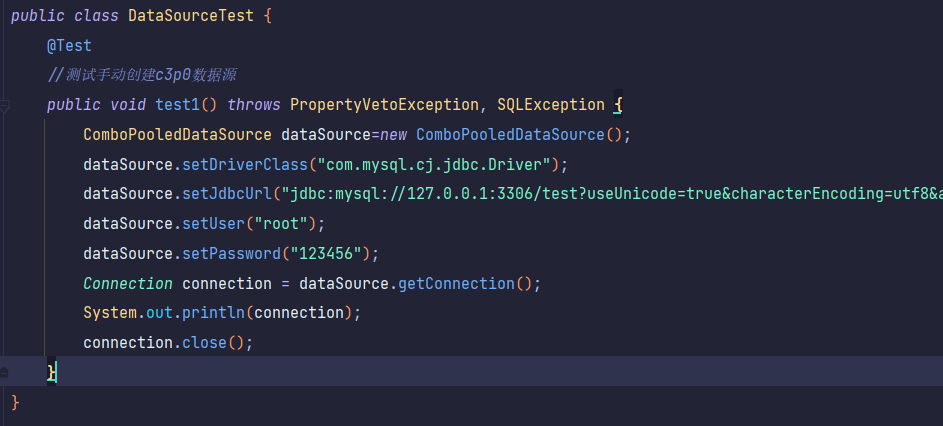
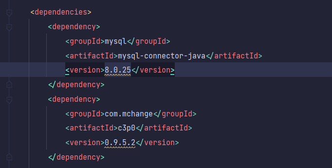
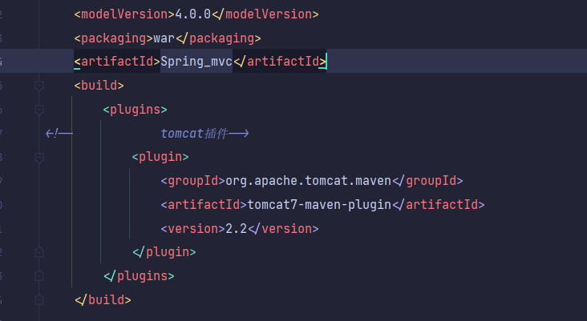
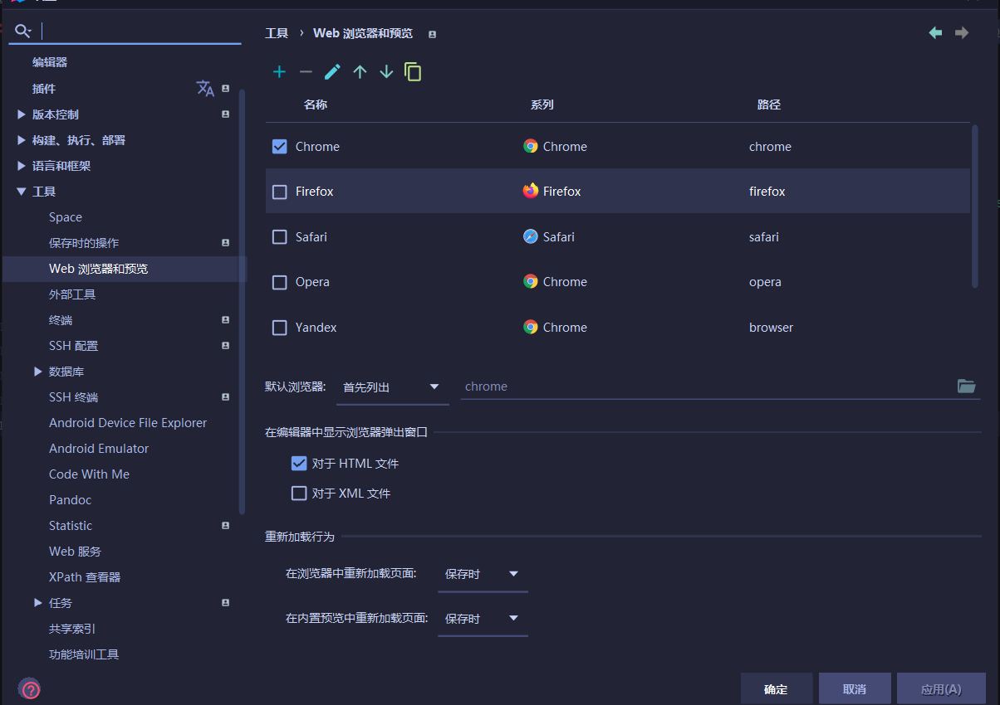
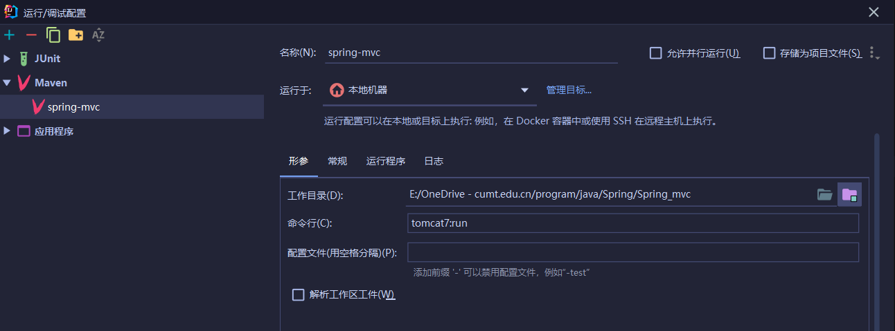

### mysql8数据库连接

```
jdbc:mysql://127.0.0.1:3306/mp?useUnicode=true&characterEncoding=utf8&autoReconnect=true&allowMultiQueries=true&useSSL=false&serverTimezone=UTC
```

### c3p0连接mysql





这样莫名其妙能通过

### tomcat7插件

按alt+insert插件模板,不是导入依赖

把xml的<packaging>改成war形式才是web项目

```xml
    <build>
        <plugins>
<!--            tomcat插件-->
            <plugin>
                <groupId>org.apache.tomcat.maven</groupId>
                <artifactId>tomcat7-maven-plugin</artifactId>
                <version>2.2</version>
            </plugin>
        </plugins>
    </build>
```



idea设置默认浏览器



配置完tomcat7插件后运行配置

