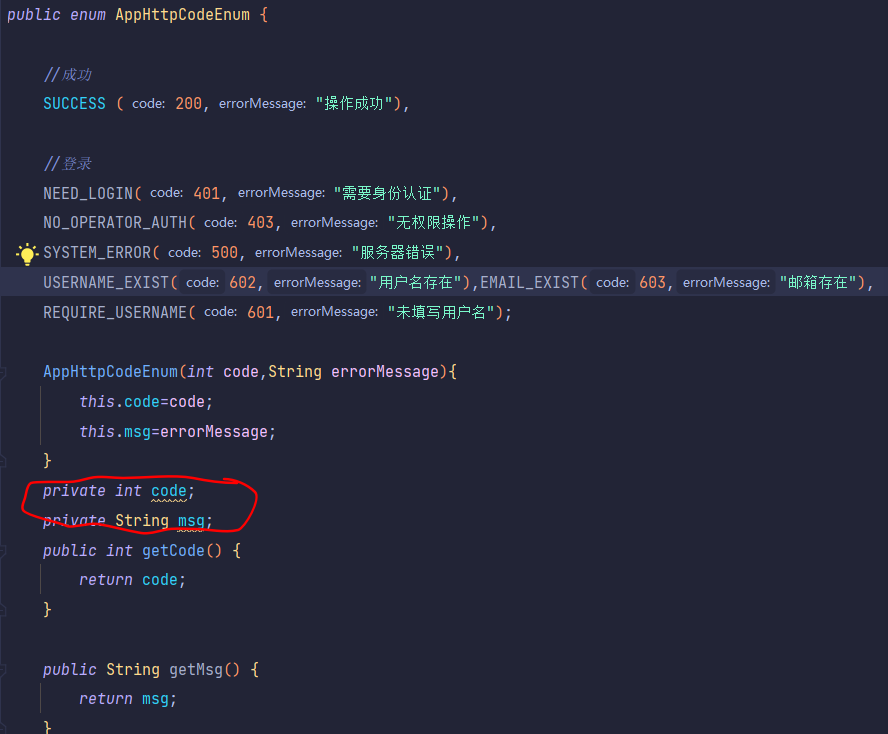
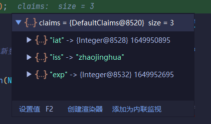
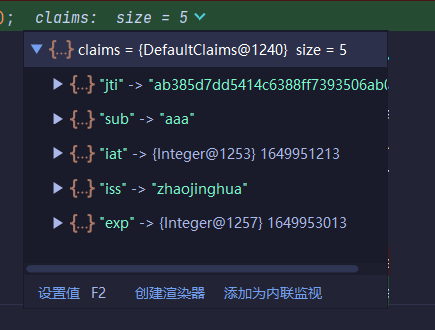
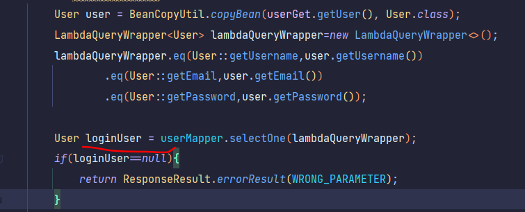
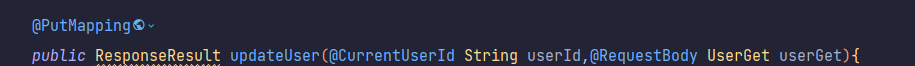

### mysql8数据库连接

```
jdbc:mysql://127.0.0.1:3306/mp?useUnicode=true&characterEncoding=utf8&autoReconnect=true&allowMultiQueries=true&useSSL=false&serverTimezone=UTC
```

### c3p0连接mysql


这样莫名其妙能通过

### tomcat7插件

按alt+insert插件模板,不是导入依赖

把xml的<packaging>改成war形式才是web项目

```xml
    <build>
        <plugins>
<!--            tomcat插件-->
            <plugin>
                <groupId>org.apache.tomcat.maven</groupId>
                <artifactId>tomcat7-maven-plugin</artifactId>
                <version>2.2</version>
            </plugin>
        </plugins>
    </build>
```


idea设置默认浏览器


配置完tomcat7插件后运行配置


### 浏览器查找元素

ctrl+f

### idea结构,查找方法

alt+7,ctrl+o

### maven导坐标未找到坐标原因

<dependencyManagement>时不会自动下载jar包

若想导入,先注释掉

### 枚举类报错



要把成员变量放在后面

### maven打包运行

package

运行jar包

在jar包所在目录执行命令

```
java -jar jar包名称
```

在运行过程中不小心点到变成选择模式可以按ctrl+c恢复

### Token获取不到id(实际是传参错误)

测了特别久Token编码一直得不到id还是觉得Token写错了

图一是错误的,图二是正确的





找了半天发现service传参传错了,user对象里面根本就没有id,无法获取getid方法,应该是通过user对象到数据库里面查找对应的id




### 多个请求参数同时



用个逗号啊啊啊啊啊啊啊

