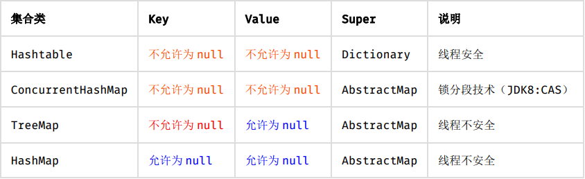
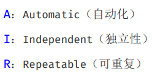
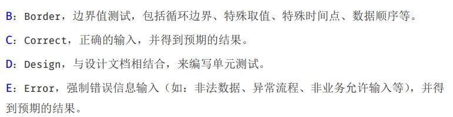
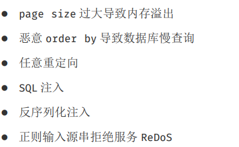
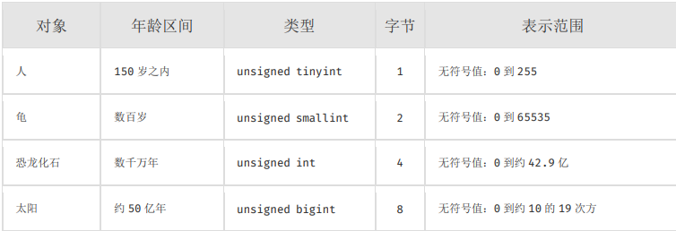
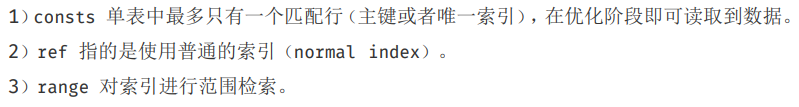
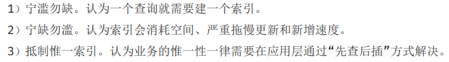

# 方法

## 找函数

1.猜返回值类型,参数个数类型,函数名称

2.idea 文档验证

## java开发规章

### 命名

不能以下划线或美元符号开始结束,不能中英文混用,不能使用中文方式命名

类名驼峰命名,方法名参数名成员变量局部变量首字母小写的驼峰命名

常量命名全部大写,单词下划线隔开

抽象类命名Abstract或Base开头,异常类命名使用 Exception 结尾；测试类 命名以它要测试的类的名称开始，以Test 结尾。

String[] args;

布尔类型变量不要加is

包名小写包名只能由一个英语单词,单数形式

类名可以复数

不要乱缩写,尽量使用完整单词

可以将涉及模式体现在名字中

接口类的方法和属性不要有修饰符,public也不要 void f();

service的实现类加Impl后缀,如果是形容能力的接口名称，取对应的形容词做接口名（通常是–able 的形式）。

枚举类名建议带Enum后缀,枚举成员名称需要全大写,单词下划线隔开


### 常量定义

不能有未经定义的常量出现在代码中

Long赋初值用大写L

缓存相关常量放在类CacheConsts下,系统配置相关常量放在类ConfigConsts

常量的复用层次有五层：跨应用共享常量(放在第二方库)、应用内共享常量(第一方库)、子工程内共享常量(当前子工程)、包内共享常量(当前包下)、类内共享常量(类内部)。

如果变量值仅在一个范围内变化，且带有名称之外的延伸属性，定义为枚举类

### 代码风格

大括号是空{},非空左大括号前不换行,后换行,右大括号前换行,后又else不换,终止的大括号后需换行

左右小括号和字符之间不出现空格

if/for/while/switch/do保留字与括号之间必须加空格

4空格缩进

如果使用 tab 缩进，必须设置 1 个 tab 为 4 个空格。IDEA 设置 tab 为 4 个空格时， 请勿勾选 Use tab character；而在 eclipse 中，必须勾选 insert spaces for tabs。

注释和注释内容一个空格

单行代码换行运算符要一起换

IDE 的 text file encoding 设置为 UTF-8; IDE 中文件的换行符使用 Unix 格式， 不要使用 Windows 格式

不需要刻意插空格

### OOP风格

避免通过一个类的对象引用访问此类的静态变量或静态方法

复写方法必须加上@Override

相同参数类型相同业务含义才可以使用java可变参数,避免Object

接口过时加@Deorecated 说明新接口新服务

不能使用过时类或方法

equals要用常量来掉

所有相同类型的包装类对象之间值的比较全部用equals

POJO类属性必须使用包装数据类型

RPC方法的返回值和参数必须使用包装数据类型

局部变量使用基本数据类型

定义 DO/DTO/VO 等 POJO 类时，不要设定任何属性默认值。

序列化类新增属性时，请不要修改 serialVersionUID 字段，避免反序列失败；如 果完全不兼容升级，避免反序列化混乱，那么请修改 serialVersionUID 值。

构造方法里面禁止加入业务逻辑,初始化逻辑放在init方法中

POJO类必须写totString方法

使用索引访问用 String 的 split 方法得到的数组时，需做最后一个分隔符后有无 内容的检查，否则会有抛 IndexOutOfBoundsException 的风险。

当一个类有多个构造方法或同名方法按顺序放置

类方法定义顺序:共有或保护方法>私有方法>getter/setter

setter方法中,参数名称与类成员变量名保持一致,this.成员名=参数名

getter/setter不要有业务逻辑

循环体内，字符串的连接方式，使用 StringBuilder 的 append 方法进行扩展。

声明final:不许被继承的类,不许修改引用的域对象,不许被重写的方法,不许运行过程中重新赋值的局部变量,避免重复使用同一个变量方便重构

慎用clone拷贝

类成员与方法控制:

​	如果不允许外部直接通过 new 来创建对象，那么构造方法必须是 private

​	工具类不许有public 或 default 构造方法

​	类非 static 成员变量并且与子类共享，必须是 protected

​	类非 static 成员变量并且仅在本类使用，必须是 private

​	类 static 成员变量如果仅在本类使用，必须是 private

​	类 static 成员变量如果仅在本类使用，必须是 private

​	类成员方法只供类内部调用，必须是 private

​	类成员方法只对继承类公开，那么限制为 protected

### 集合处理

重写equals就必须重写hashCode

Set存储不重复的对象所以set存储必须重写equals和hashCode

自定义对象左Map的键必须重写equals和hashCode

ArrayList的subList结果不可强转成ArrayList，否则会抛出ClassCastException 异常

在 subList 场景中，高度注意对原集合元素个数的修改，会导致子列表的遍历、增加、 删除均会产生 ConcurrentModificationException 异常。

使用集合转数组的方法，必须使用集合的 toArray(T[] array)，传入的是类型完全 一样的数组，大小就是 list.size()。

使用工具类 Arrays.asList()把数组转换成集合时，不能使用其修改集合相关的方 法，它的 add/remove/clear 方法会抛出 UnsupportedOperationException 异常。

泛型通配符来接收返回的数据，此写法的泛型集合不能使用 add 方 法，而不能使用 get 方法，做为接口调用赋值时易出错。

不要在 foreach 循环里进行元素的 remove/add 操作。remove 元素请使用 Iterator 方式，如果并发操作，需要对 Iterator 对象加锁。

集合初始化时指定集合的初始值大小

**使用entrySet遍历Map**

注意 Map 类集合 K/V 能不能存储 null 值的情况



### 并发

### 控制语句

一个switch每个case要么通过break/return终止,要么说明执行到哪个case,必须包含default语句放在最后

if/else/for/while/do必须有大括号

表达异常分支少用if-else

不要再条件判断中执行其他复杂的语句

循环体内少定义对象变量获取数据库连接,不必要的try-catch

**接口入参保护**?

参数校验:

调用频次低的方法,执行时间开销很大的方法,需要高稳定性和可用性的方法,对完提供的开放接口,敏感权限入口

不需要参数校验:

被循环调用的方法,底层调用频度比较高的方法,被声明成private值会自己代码所调用的方法

### 注释约归

类类属性类方法的注释,所由抽象方法

```
/**内容*/
```

所有类都必须添加创作者和创建日期

方法内部单行注释方法内部多行注释/* */

所有枚举类型字段必须要有注释,说明数据项具体用途

代码修改注释也要修改尤其是参数,返回值,异常,核心逻辑

谨慎注释掉代码无用删除,注释情况:后续回复此段代码逻辑

**对于注释的要求：第一、能够准确反应设计思想和代码逻辑；第二、能够描述业务含 义，使别的程序员能够迅速了解到代码背后的信息。完全没有注释的大段代码对于阅读者形同 天书，注释是给自己看的，即使隔很长时间，也能清晰理解当时的思路；注释也是给继任者看 的，使其能够快速接替自己的工作。】好的命名、代码结构是自解释的，注释力求精简准确、表达到位。避免出现注释的 一个极端：过多过滥的注释，代码的逻辑一旦修改，修改注释是相当大的负担。**

特殊注释标记请标注人与标记时间,注意及时处理标记,清理标记

### 其他

正则表达式利用预编译功能不要在方法内定义

后台输送给页面的变量必须加$!{var}——中间的感叹号

math.random()获得随机数用random对象的nextInt或nextLong

获取当前毫秒数System.currentTimeMillis()

不要再视图模板加复杂逻辑

数据结构的构造或初始化都应该指定大小

及时清理不要的代码段或配置信息

### 异常处理

Java 类库中定义的一类 RuntimeException 可以通过预先检查进行规避，而不应该 通过 catch 来处理，比如：IndexOutOfBoundsException，NullPointerException 等等

异常不要用来做流程控制，条件控制

对大段代码进行 try-catch，这是不负责任的表现。catch 时请分清稳定代码和非稳 定代码，稳定代码指的是无论如何不会出错的代码。对于非稳定代码的 catch 尽可能进行区分 异常类型，再做对应的异常处理

捕获异常是为了处理它，不要捕获了却什么都不处理而抛弃之，如果不想处理它，请将该异常抛给它的调用者。最外层的业务使用者，必须处理异常，将其转化为用户可以理解的 内容

有 try 块放到了事务代码中，catch 异常后，如果需要回滚事务，一定要注意手动回滚事务

finally 块必须对资源对象、流对象进行关闭，有异常也要做 try-catch

不能在finally块中使用return,finally块中的return返回后方法结束执行，不 会再执行 try 块中的 return 语句

捕获异常抛异常必须完全匹配

方法返回值可以为null,注释说明何时返回null

防止空指针(NPE):

返回类型为基本数据类型,return包装数据类型对象时自动拆箱NPE

数据库查询结果可能为null

元素即使isNotEmpty去除数据元素也可能为null

远程调用返回对象要求判空

Session获取数据建议判空

级联调用obj.getA().getB().getC()一连串调用

<u>**使用Optional类**</u>

定义时区分unchecked/checked异常,避免直接抛出new RuntimeException()

避免重复代码DRY原则

### 日志规约

应用中不可直接使用日志系统（Log4j、Logback）中的 API，而应依赖使用日志框架 SLF4J 中的 API，使用门面模式的日志框架，有利于维护和各个类的日志处理方式统一。

日hi文件推荐保留至少15天

应用中的扩展日志(打点,临时监控,访问日志)命名方式:

appName_logType_logName.log。logType:日志类型，推荐分类有 stats/desc/monitor/visit 等；logName:日志描述。这种命名的好处：通过文件名就可知 道日志文件属于什么应用，什么类型，什么目的，也有利于归类查找

对 trace/debug/info 级别的日志输出，必须使用条件输出形式或者使用占位符的方式

避免重复打印日志，务必在 log4j.xml 中设置 additivity=false

异常信息包括两类信息:案发现场信息和异常堆栈信息,如果不处理，那么通过 关键字 throws 往上抛出

**谨慎地记录日志。生产环境禁止输出 debug 日志；有选择地输出 info 日志；如果使 用 warn 来记录刚上线时的业务行为信息，一定要注意日志输出量的问题，避免把服务器磁盘 撑爆，并记得及时删除这些观察日志,可以使用 warn 日志级别来记录用户输入参数错误的情况，避免用户投诉时，无所适 从。注意日志输出的级别，error 级别只记录系统逻辑出错、异常等重要的错误信息。如非必 要，请不要在此场景打出 error 级别。**

### 单元测试



单元测试应该是全自动执行并非交互式,测试框架定期执行,输出结果assert验证

保持单元测试独立性,用例之间不能相互调用

单元测试可重复执行,不能受外界环境的影响

测试粒度足够小,能够准确定位问题,单测粒度至多是类级别,一般方法级别

核心业务、核心应用、核心模块的增量代码确保单元测试通过。

单元测试代码必须写在如下工程目录：src/test/java，不允许写在业务代码目录下

单元测试的基本目标：语句覆盖率达到 70%；核心模块的语句覆盖率和分支覆盖率都 要达到 100%

编写单元测试代码遵守BCDE



数据库相关查询更新删除操作不能假设数据库里面的数据是粗在的或者直接操作数据库把数据插进去,请使用程序插入或者导入数据的方式来准备数据

数据库单元测试可以设定自动回滚机制

对于不可测的代码建议做必要重构,使代码可测

单元测试作为一种质量保障手段，不建议项目发布后补充单元测试用例，建议在项 目提测前完成单元测试

业务代码避免:

构造方法中做的事情过多,存在过多的外部依赖,过多的全局变量和静态方法,条件语句

单元测试误解:

多余,不许维护,线上故障没有关系

### 安全规约

用户个人页面或者功能必须权限控制校验

用户敏感数据禁止展示

用户输入的SQL使用参数绑定或者METADATA字段值限定,防SQL注入,禁止字符串拼接

用户请求传入的任何参数必须有效性验证,否则可能导致



禁止向HTML页面输出未经安全过滤或未正确转移的用户数据

表单、AJAX 提交必须执行 CSRF 安全过滤

在使用平台资源，譬如短信、邮件、电话、下单、支付，必须实现正确的防重放限制， 如数量限制、疲劳度控制、验证码校验，避免被滥刷、资损

发贴、评论、发送即时消息等用户生成内容的场景必须实现防刷、文本内容违禁词过 滤等风控策略


### MYSQL数据库建表规约

表达是与否概念的字段必须用is_xxx,数据类型是 unsigned tinyint,1是0否

表名字段名必须小写字母或数字,禁止数字开头,禁止两个下划线中间只出现数字

表明不能使用复数名词

禁止使用保留字

主键索引名为pk_字段名

唯一索引名为 uk_字段名

普通索引名则为 idx_字段名

小数类型为decimal

存储的字符串长度几乎相等,shiyongchar定长字符串类型

varchar是可变长字符串,长度不要超过5000,若大则text,独立出来一张表用主键来对应避免影响其他字段索引效率

**表必备三字段：id, gmt_create, gmt_modified**

**其中 id 必为主键，类型为 unsigned bigint、单表时自增、步长为 1。gmt_create,  gmt_modified 的类型均为 date_time 类型，前者现在时表示主动创建，后者过去分词表示被 动更新。**

库名尽量与应用名一致

如果修改字段含义或对字段表示的状态追加时,需要及时更新字段注释

表名最好是业务名称_表的作用

alipay_task / force_project / trade_config

字段允许适当冗余,应当是:不是频繁修改的字段,不是varchar超长字段和text

单表行数超过500万行或者单表容量超过2GB分库分表

合适字符存储长度:



### 索引规约

必须有唯一索引

超过三个表禁止join,多表关联查询保证被关联的字段需要有索引

varchar字段上建立索引必须指定索引长度

页面搜索严谨左模糊全模糊

order by注意有序性

利用覆盖索引进行查询,避免回表

利用延迟关联或者子查询优化超多分页场景

MySQL 并不是跳过 offset 行，而是取 offset+N 行，然后返回放弃前 offset 行，返回 N 行，那当 offset 特别大的时候，效率就非常的低下，要么控制返回的总页数，要么对超过 特定阈值的页数进行 SQL 改写。

SQL 性能优化的目标：至少要达到 range 级别，要求是 ref 级别，如果可以是 consts 最好。



建组合索引的时候，区分度最高的在最左边


防止因字段类型不同造成的隐式转换，导致索引失效

创建索引时避免有如下极端误解



### SQL语句

不要使用 count(列名)或 count(常量)来替代 

```
count(*)，count(*)
```

是 SQL92 定义的 标准统计行数的语法，跟数据库无关，跟 NULL 和非 NULL 无关

count(distinct col)计算该列除NULL之外的不重复行数,注意count(distinct col1, col2)如果其中一列全为NULL时,即使另一列有不同的值,也返回0

当某一列的值全是NULL时,count(col)的返回结果为0,但sum(col)的返回结果为NULL,因此使用sum()时需要注意NPE,可以使用如下方式来避免 sum 的 NPE 问题：SELECT IF(ISNULL(SUM(g)),0,SUM(g)) FROM table;


# 屎山改造

## validation校验

[这么写参数校验(validator)就不会被劝退了~ - 掘金 (juejin.cn)](https://juejin.cn/post/6844903902811275278)

JSR303 是一套JavaBean参数校验的标准，它定义了很多常用的校验注解，我们可以直接将这些注解加在我们JavaBean的属性上面(面向注解编程的时代)，就可以在需要校验的时候进行校验了,在SpringBoot中已经包含在starter-web中,再其他项目中可以引用依赖,并自行调整版本:

```xml
<dependency>
    <groupId>org.hibernate</groupId>
    <artifactId>hibernate-validator</artifactId>
    <version>6.1.5.Final</version>
</dependency>
```


```
   1.@NotNull：不能为null，但可以为empty(""," ","   ")      
   2.@NotEmpty：不能为null，而且长度必须大于0 (" ","  ")
   3.@NotBlank：只能作用在String上，不能为null，而且调用trim()后，长度必须大于0("test")    即：必须有实际字符
```

| 验证注解                                     | 验证的数据类型                                               | 说明                                                         |
| -------------------------------------------- | ------------------------------------------------------------ | ------------------------------------------------------------ |
| @AssertFalse                                 | Boolean,boolean                                              | 验证注解的元素值是false                                      |
| @AssertTrue                                  | Boolean,boolean                                              | 验证注解的元素值是true                                       |
| @NotNull                                     | 任意类型                                                     | 验证注解的元素值不是null                                     |
| @Null                                        | 任意类型                                                     | 验证注解的元素值是null                                       |
| @Min(value=值)                               | BigDecimal，BigInteger, byte,short, int, long，等任何Number或CharSequence（存储的是数字）子类型 | 验证注解的元素值大于等于@Min指定的value值                    |
| @Max（value=值）                             | 和@Min要求一样                                               | 验证注解的元素值小于等于@Max指定的value值                    |
| @DecimalMin(value=值)                        | 和@Min要求一样                                               | 验证注解的元素值大于等于@ DecimalMin指定的value值            |
| @DecimalMax(value=值)                        | 和@Min要求一样                                               | 验证注解的元素值小于等于@ DecimalMax指定的value值            |
| @Digits(integer=整数位数, fraction=小数位数) | 和@Min要求一样                                               | 验证注解的元素值的整数位数和小数位数上限                     |
| @Size(min=下限, max=上限)                    | 字符串、Collection、Map、数组等                              | 验证注解的元素值的在min和max（包含）指定区间之内，如字符长度、集合大小 |
| @Past                                        | java.util.Date,java.util.Calendar;Joda Time类库的日期类型    | 验证注解的元素值（日期类型）比当前时间早                     |
| @Future                                      | 与@Past要求一样                                              | 验证注解的元素值（日期类型）比当前时间晚                     |
| @NotBlank                                    | CharSequence子类型                                           | 验证注解的元素值不为空（不为null、去除首位空格后长度为0），不同于@NotEmpty，@NotBlank只应用于字符串且在比较时会去除字符串的首位空格 |
| @Length(min=下限, max=上限)                  | CharSequence子类型                                           | 验证注解的元素值长度在min和max区间内                         |
| @NotEmpty                                    | CharSequence子类型、Collection、Map、数组                    | 验证注解的元素值不为null且不为空（字符串长度不为0、集合大小不为0） |
| @Range(min=最小值, max=最大值)               | BigDecimal,BigInteger,CharSequence, byte, short, int, long等原子类型和包装类型 | 验证注解的元素值在最小值和最大值之间                         |
| @Email(regexp=正则表达式,flag=标志的模式)    | CharSequence子类型（如String）                               | 验证注解的元素值是Email，也可以通过regexp和flag指定自定义的email格式 |
| @Pattern(regexp=正则表达式,flag=标志的模式)  | String，任何CharSequence的子类型                             | 验证注解的元素值与指定的正则表达式匹配                       |
| @Valid                                       | 任何非原子类型                                               | 指定递归验证关联的对象如用户对象中有个地址对象属性，如果想在验证用户对象时一起验证地址对象的话，在地址对象上加@Valid注解即可级联验证 |

